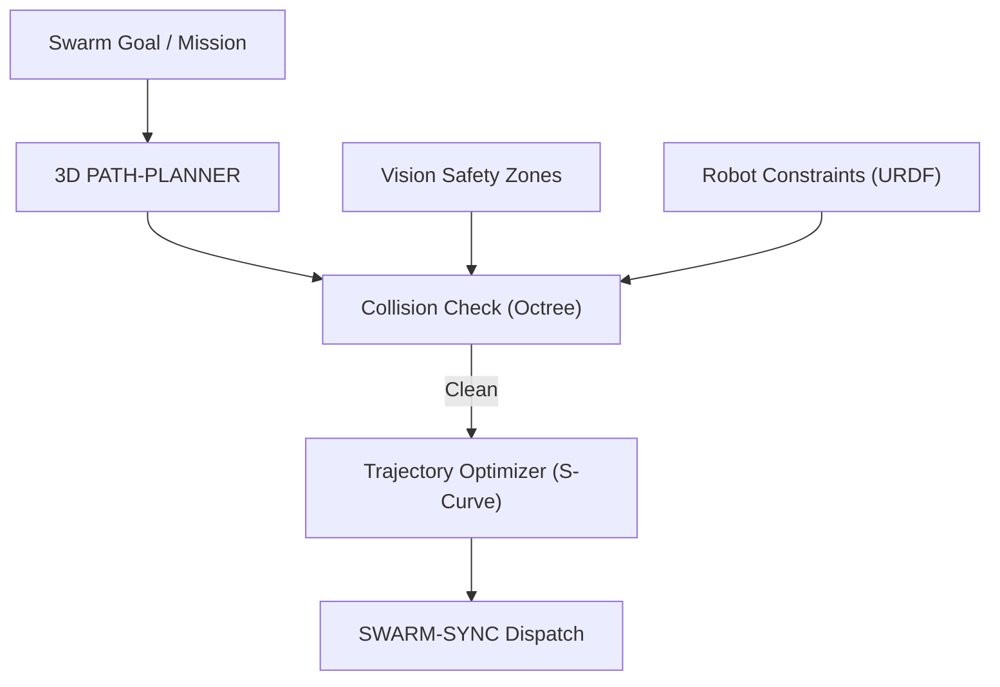

<p align="center">
  
</p>

# 🗺️ HYDRA-UMC-PATH-PLANNER-3D

<p align="center">🇺🇸 <b>English</b> | <a href="README_spa.md">🇪🇸 Español</a> | <a href="README_fra.md">🇫🇷 Français</a> | <a href="README_ita.md">🇮🇹 Italiano</a> | <a href="README_deu.md">🇩🇪 Deutsch</a> | <a href="README_zho.md">🇨🇳 简体中文</a> | <a href="README_jpn.md">🇯🇵 日本語</a></p>

### 📐 Multi-Robot 3D Path Optimizer & Collision Avoidance Engine

<p align="left">
  
  
  
</p>

---

## 1. 🛠️ TECHNICAL OVERVIEW

**HYDRA-UMC-PATH-PLANNER-3D** is the centralized navigation intelligence for the robot swarm. It calculates collision-free trajectories for multiple arms sharing the same workspace, optimizing for speed, energy efficiency, and smooth motion.

It integrates real-time occupancy data from the Vision Nodes and kinematic constraints from the Digital Twin to ensure that planned paths are physically feasible and safe.

### Key Features:
* 📐 **Swarm Path Optimization:** Synchronous planning for up to 32+ robots simultaneously.
* 🛡️ **Dynamic Collision Avoidance:** Real-time re-planning when new obstacles are detected.
* ⚡ **Performance Optimized:** Highly parallelized C++/Rust implementation for sub-50ms path generation.
* 🔄 **G-Code & URDF Native:** Directly parses industrial motion commands and robot models.
* ⏱️ **Real Time Limit & Trajectory Validation (v0):** `PlannerConfig.max_duration_ms` bounds search time by the wall clock, independent of `max_iterations`. A new `validate` subcommand re-checks an already-computed path (cached, replayed, or hand-edited) against the current obstacles/workspace before it is trusted for real execution.

---

## 2. 🔄 PLANNING WORKFLOW



---

## 3. 🧱 ARCHITECTURE & DESIGN DECISIONS

* **Why 3D collision-free planning is its own service.** Path search over a live 3D scene (every robot, tool, and obstacle in the cell) is CPU-heavy and latency-sensitive in a different way than job scheduling itself - isolating it means a slow planning query never blocks HYDRA-UMC-JOB-DISPATCHER from assigning other work.
* **Why it validates against HYDRA-UMC-TWIN before real execution.** A planned route gets checked in the digital twin's own physics simulation first - catching a geometrically-valid-but-physically-unreachable path (torque limits, singularities) before it's ever sent to a real arm.
* **Why the search is a plain RRT today, not RRT\* or a multi-robot coordinator.** `src/rrt.rs` implements a real, tested Rapidly-exploring Random Tree search - a single agent, a static obstacle set, a genuinely collision-free result (every returned path is verified obstacle-clear in tests, not just plausible-looking). RRT\* (an optimality-improving rewiring pass) and true multi-robot synchronized planning (this README's "up to 32+ robots simultaneously") are real, scoped-out future work - see `mejoras_futuras.txt` for why proving one agent's search correct came first, rather than building all three at once and debugging them together.
* **Why obstacles are spheres, not an octree of arbitrary meshes.** A sphere is the simplest 3D collision primitive that is still real and geometrically correct - not a bounding-box stand-in for something more detailed. An octree/BVH only starts to matter once a scene has enough colliders that brute-force checking is the bottleneck; today's swarm cell (a handful of arms and static safety zones) does not.
* **Why this is a CLI over a JSON scenario file today, not a network service.** Choosing HTTP vs. the ecosystem's shared gRPC contract (`hydra.common.v1`, see `HYDRA-UMC-ORCHESTRATOR/proto/`) is a real protocol decision that deserves its own pass once HYDRA-UMC-JOB-DISPATCHER is actually ready to call this service - see `mejoras_futuras.txt`. The CLI is still genuinely usable today (`run.bat scenarios/example.json`), it just isn't wired into the network yet.
* **How this fits the rest of the ecosystem.** A sibling service under HYDRA-UMC-ORCHESTRATOR - plans the routes HYDRA-UMC-JOB-DISPATCHER's assigned jobs actually follow, cross-checked against HYDRA-UMC-TWIN before anything moves for real.
* **Why `max_duration_ms` is a wall-clock check, not just a lower `max_iterations`.** Iteration count alone cannot bound real time: a scene with more/denser obstacles makes each iteration's collision checks proportionally slower, so the same iteration budget can take wildly different real time on a pathological scene versus an open one. A planner call sitting in a real-time control loop needs an actual time budget, not a proxy for one.
* **Why `validate` is a new subcommand instead of changing what `plan()` returns.** `rrt::plan()` already only ever returns paths it built collision-free by construction - there's no gap to close there. `validate_path()`/the `validate` subcommand exists for paths that did NOT come from a fresh `plan()` call in this process: a cached/replayed path, one relayed from another process, a hand-edited scenario - where the obstacle set may have changed since the path was computed. Same pattern used across the ecosystem: a new, safety-gated entry point added alongside an unchanged low-level primitive.

---

## 📂 DIRECTORY STRUCTURE

```text
HYDRA-UMC-PATH-PLANNER-3D/
├── src/
│   ├── main.rs       # CLI entry point: loads a scenario, plans, prints JSON
│   ├── geometry.rs   # Vec3 - the minimal 3D vector math the rest needs
│   ├── obstacle.rs   # Sphere obstacles + segment/point collision checks
│   ├── rng.rs        # Deterministic dependency-free PRNG (xorshift64*)
│   ├── rrt.rs        # The real planner: RRT search, Workspace, PlannerConfig
│   ├── validate.rs   # Real safety re-check of an already-computed path
│   └── corpus.rs     # Test-only: reusable obstacle/workspace scenario fixtures
│                        shared by rrt.rs's and validate.rs's own tests
├── scenarios/        # Example JSON scenarios (see BUILD & RUN below)
├── docs/
│   └── CLI_REFERENCE.md  # Command-line flags reference
├── images/           # Media and diagrams
├── tools/
│   └── ci_validate.py   # Manifest/CHANGELOG/docs validation used by CI
├── build/            # Compiled binaries (build.sh/build.bat output)
├── Cargo.toml        # Rust package manifest (name, version, deps)
├── bump_version.py   # Odometer-style version bump, run by build.sh/.bat
├── bump_manifest_version.py  # Syncs hydra-umc.project.json's version to the native one (--sync)
├── build.sh/.bat     # Bumps version, then `cargo build --release`
├── run.sh/.bat       # Runs the compiled binary
└── README.md
```

Pruned from the original template: `hardware/`, `firmware/` and `os/` —
this is a pure software service (Rust binary) with no dedicated hardware
or firmware of its own and no operating system image to maintain.

---

## 🔧 BUILD & RUN GUIDE

A real collision-free path search, not just a skeleton that compiles: it
plans a route through a JSON scenario file and prints the result.

```bash
# Windows
build.bat
run.bat scenarios/example.json

# Linux / macOS
./build.sh
./run.sh scenarios/example.json
```

`build.sh`/`build.bat` bump the version in `Cargo.toml` (ecosystem-wide
odometer rule, see `bump_version.py`) and then run `cargo build --release`.
`run.sh`/`run.bat` execute the resulting binary directly, forwarding any
arguments (the scenario path) to it.

A scenario is a JSON file with `start`, `goal`, `obstacles` (a list of
`{center, radius}` spheres), a `workspace` (`min`/`max` bounds), and an
optional `seed` (the search is fully deterministic per seed) and `config`
(`max_iterations`, `step_size`, `goal_bias`, `goal_threshold`,
`robot_radius`, `max_duration_ms` - all optional, sane defaults otherwise;
`max_duration_ms` bounds search time by the wall clock, independent of
`max_iterations`). The result is printed as JSON:
`{"status": "ok", "path": [...]}` or
`{"status": "error", "reason": "..."}` (`start_inside_obstacle`,
`goal_outside_workspace`, `no_path_found`, `time_limit_exceeded`, etc. -
see `src/rrt.rs`'s `PlanError` for the full, honest list, including the
case where no path exists at all, not just one the search failed to find
in time).

A second real subcommand re-checks an already-computed path (a bare JSON
array of `{x, y, z}` waypoints) for safety against a scenario's current
obstacles/workspace, without running a new search:

```bash
./run.sh validate scenarios/example.json path.json
# {"status": "safe"}
# or: {"status": "unsafe", "issues": [{"SegmentIntersectsObstacle": {"from_index": 0, "to_index": 1}}]}
```

```bash
cargo test   # geometry + obstacle collision math, the PRNG, the RRT
             # planner (including its real wall-clock time limit), and
             # validate.rs's own safety re-check - 30 tests total
```

---

## 🚀 ROADMAP
* **Phase 1:** Deterministic swarm synchronization over TSN and sub-ms jitter reduction.
* **Phase 2:** 3D Path planning with dynamic obstacle avoidance in multi-robot cells.
* **Phase 3:** Multi-robot job dispatching optimization using real-time resource availability.
* **Phase 4:** Support for non-holonomic mobile base path planning (JuanenBOT) and heterogeneous fleet integration.

---

## 🔗 Related Projects

This project is part of the HYDRA-UMC robotics ecosystem by the same author (JuanenRac / Electro Hobby 3D). Worth knowing about, since a request might actually be about one of these rather than this repository.

**Parent Project**
- **[HYDRA-UMC-ORCHESTRATOR](https://github.com/JuanenRac/HYDRA-UMC-ORCHESTRATOR)** — integration hub with a real gRPC/Protobuf health-report contract and mission state machine; the parent this repo is one specific orchestration service of, within its own swarm-coordination layer.

**Sibling Projects** — the other orchestration services of HYDRA-UMC-ORCHESTRATOR's own swarm-coordination layer
- **[HYDRA-UMC-SWARM-SYNC](https://github.com/JuanenRac/HYDRA-UMC-SWARM-SYNC)** — real CRDT LWW-Element-Map state sync, property-tested for multi-cell convergence.
- **[HYDRA-UMC-JOB-DISPATCHER](https://github.com/JuanenRac/HYDRA-UMC-JOB-DISPATCHER)** — real priority-based job queue with deduplication, over a real HTTP API.
- **[HYDRA-UMC-NODE-HEALING](https://github.com/JuanenRac/HYDRA-UMC-NODE-HEALING)** — real gRPC-based fleet health watchdog with retry/backoff and identity-mismatch detection.

**Directly Related**
- **[HYDRA-UMC-TWIN](https://github.com/JuanenRac/HYDRA-UMC-TWIN)** — integration hub for the digital-twin engine, with a real version-compatibility sync contract — validates this planner's own planned routes in the digital twin before they're executed.

**Also Part of the Ecosystem**

*Core Hardware & Platform*
- **[HYDRA-UMC](https://github.com/JuanenRac/HYDRA-UMC)** — the physical robot-arm motherboard: CM5 host + dual-core STM32H745, orchestrating up to 8 tool arms over CAN-OTA/SPI-OTA.
- **[HYDRA-UMC-OS](https://github.com/JuanenRac/HYDRA-UMC-OS)** — reproducible Raspberry Pi OS product layer for the CM5: read-only agent, validated config/profiles, WiFi first-contact provisioning.
- **[HYDRA-UMC-SDK](https://github.com/JuanenRac/HYDRA-UMC-SDK)** — the shared JSON-Schema contract and safety-gate boundary every bridge validates its commands against.

*Core Backend & Clients*
- **[HYDRA-UMC-SERVER](https://github.com/JuanenRac/HYDRA-UMC-SERVER)** — the real headless backend (REST/WebSocket) every control client actually talks to.
- **[HYDRA-UMC-STUDIO](https://github.com/JuanenRac/HYDRA-UMC-STUDIO)** — web control dashboard with real-time multi-robot 3D visualization.
- **[HYDRA-UMC-SUITE](https://github.com/JuanenRac/HYDRA-UMC-SUITE)** — desktop (PySide6) swarm command center for multiple servers at once, packaged as a standalone executable.
- **[HYDRA-UMC-ANDROID-CONTROL](https://github.com/JuanenRac/HYDRA-UMC-ANDROID-CONTROL)** — native Android control app with biometric login and a paired Wear OS companion.
- **[HYDRA-UMC-IOS-CONTROL](https://github.com/JuanenRac/HYDRA-UMC-IOS-CONTROL)** — iOS/iPadOS control app (Flutter) with real-time WebSocket sync.
- **[HYDRA-UMC-DSI](https://github.com/JuanenRac/HYDRA-UMC-DSI)** — native touch UI for the onboard 7" DSI touchscreen, embedded on the CM5 itself.
- **[HYDRA-UMC-EDITOR-URDF](https://github.com/JuanenRac/HYDRA-UMC-EDITOR-URDF)** — desktop graphical URDF creator/editor that pushes finished models into STUDIO's own catalog.
- **[HYDRA-UMC-BRIDGE-AMR](https://github.com/JuanenRac/HYDRA-UMC-BRIDGE-AMR)** — coordination boundary for AGV/AMR fleets via a real VDA 5050 MQTT publisher.
- **[HYDRA-UMC-BRIDGE-CNC](https://github.com/JuanenRac/HYDRA-UMC-BRIDGE-CNC)** — high-level CNC-cell coordinator with real GRBL status/control-byte access.
- **[HYDRA-UMC-BRIDGE-DROIDS](https://github.com/JuanenRac/HYDRA-UMC-BRIDGE-DROIDS)** — coordination boundary for legged/humanoid droids, with a real Boston Dynamics Spot command sender.
- **[HYDRA-UMC-BRIDGE-LASER](https://github.com/JuanenRac/HYDRA-UMC-BRIDGE-LASER)** — laser-cell safety coordinator reading 3 real key/enclosure/interlock GPIO safeguards.
- **[HYDRA-UMC-BRIDGE-OPENPNP](https://github.com/JuanenRac/HYDRA-UMC-BRIDGE-OPENPNP)** — safe high-level board-flow coordinator for OpenPnP pick-and-place.
- **[HYDRA-UMC-BRIDGE-PRINTER3D](https://github.com/JuanenRac/HYDRA-UMC-BRIDGE-PRINTER3D)** — safe coordination boundary for Moonraker/Klipper 3D printers, with real gated job commands.
- **[HYDRA-UMC-BRIDGE-ROS2](https://github.com/JuanenRac/HYDRA-UMC-BRIDGE-ROS2)** — safety coordinator with a real, lazily-imported rclpy ROS 2 transport.
- **[HYDRA-UMC-BRIDGE-UAV](https://github.com/JuanenRac/HYDRA-UMC-BRIDGE-UAV)** — coordination boundary for camera-equipped UAVs, with a real MAVLink command sender.

*URTC Tool Platform*
- **[URTC](https://github.com/JuanenRac/URTC)** — firmware for the physical Universal Robot Tool Controller PCB, 25+ tool profiles over CAN bus.
- **[URTC-FLASHER](https://github.com/JuanenRac/URTC-FLASHER)** — desktop GUI flashing tool for URTC boards, CAN-OTA plus full-chip SWD/JTAG.
- **[URTC-TESTER](https://github.com/JuanenRac/URTC-TESTER)** — desktop live CAN-bus diagnostic tool for URTC boards, one panel per tool profile.
- **[URTC-WEB-STUDIO](https://github.com/JuanenRac/URTC-WEB-STUDIO)** — browser-based alternative to URTC-TESTER via the Web Serial API, no local install needed.

*Vision AI Node (Hailo-8)*
- **[HYDRA-UMC-VISION-NODE](https://github.com/JuanenRac/HYDRA-UMC-VISION-NODE)** — integration hub for the Hailo-8 vision pipeline, with a real per-stage hardware-readiness check.
- **[HYDRA-UMC-DETECTION-HEF](https://github.com/JuanenRac/HYDRA-UMC-DETECTION-HEF)** — real compiled-model registry with Hailo-architecture/checksum safe-load verification.
- **[HYDRA-UMC-VISION-STREAMER](https://github.com/JuanenRac/HYDRA-UMC-VISION-STREAMER)** — real GStreamer pipeline + MediaMTX config generator with a real HailoRT integration boundary.
- **[HYDRA-UMC-VISUAL-SERVOING-API](https://github.com/JuanenRac/HYDRA-UMC-VISUAL-SERVOING-API)** — real Position-Based Visual Servoing correction law, safety-gated on upstream zone state.
- **[HYDRA-UMC-SAFETY-ZONES](https://github.com/JuanenRac/HYDRA-UMC-SAFETY-ZONES)** — real zone-breach checking and E-STOP requesting, with calibration-freshness enforcement.

*Cognitive AI Node (Hailo-10)*
- **[HYDRA-UMC-COGNITIVE-NODE](https://github.com/JuanenRac/HYDRA-UMC-COGNITIVE-NODE)** — integration hub for the Hailo-10 cognitive pipeline (LLM/VLA/voice orchestration).
- **[HYDRA-UMC-VLA-ENGINE](https://github.com/JuanenRac/HYDRA-UMC-VLA-ENGINE)** — real action-token encoding/decoding and trajectory generation for a Vision-Language-Action model.
- **[HYDRA-UMC-VOICE-UI](https://github.com/JuanenRac/HYDRA-UMC-VOICE-UI)** — real voice front-end (VAD + intent parser) with a bounded, confirmation-gated Watch relay.
- **[HYDRA-UMC-SEMANTIC-PLANNER](https://github.com/JuanenRac/HYDRA-UMC-SEMANTIC-PLANNER)** — real rule-based task decomposition and semantic error recovery over MCU error codes.
- **[HYDRA-UMC-DOCS-QA](https://github.com/JuanenRac/HYDRA-UMC-DOCS-QA)** — real stdlib-only TF-IDF document search over this ecosystem's own Markdown docs.

*Digital Twin & Simulation*
- **[HYDRA-UMC-HIL-BRIDGE](https://github.com/JuanenRac/HYDRA-UMC-HIL-BRIDGE)** — real hardware-in-the-loop safety interlock routing commands between simulation and real hardware.
- **[HYDRA-UMC-PHYSICS-REPLICA](https://github.com/JuanenRac/HYDRA-UMC-PHYSICS-REPLICA)** — real forward kinematics and joint-limit validation over a real URDF subset.
- **[HYDRA-UMC-SYNTHETIC-DATA-GEN](https://github.com/JuanenRac/HYDRA-UMC-SYNTHETIC-DATA-GEN)** — real procedural 2D scene generator with YOLO/COCO annotation export.

*Data & Analytics*
- **[HYDRA-UMC-DATALAKE](https://github.com/JuanenRac/HYDRA-UMC-DATALAKE)** — real sqlite3-backed time-series store with a real ingest/query HTTP API.
- **[HYDRA-UMC-ANOMALY-DETECTOR](https://github.com/JuanenRac/HYDRA-UMC-ANOMALY-DETECTOR)** — real FFT + statistical baseline anomaly detector with drift monitoring.
- **[HYDRA-UMC-PRODUCTION-REPORTS](https://github.com/JuanenRac/HYDRA-UMC-PRODUCTION-REPORTS)** — real OEE/availability calculation over DATALAKE history, with reproducible CSV export.
- **[HYDRA-UMC-TELEMETRY-COLLECTOR](https://github.com/JuanenRac/HYDRA-UMC-TELEMETRY-COLLECTOR)** — real CAN/WebSocket ingestion pipeline into DATALAKE, with sequence deduplication.

*Industrial Gateway*
- **[HYDRA-UMC-GATEWAY-INDUSTRIAL](https://github.com/JuanenRac/HYDRA-UMC-GATEWAY-INDUSTRIAL)** — integration hub relaying to industrial protocols, with a real command allowlist/backpressure layer.
- **[HYDRA-UMC-OPCUA-SERVER](https://github.com/JuanenRac/HYDRA-UMC-OPCUA-SERVER)** — real OPC-UA address space, verified with a real binary-protocol client session.
- **[HYDRA-UMC-MQTT-BROKER](https://github.com/JuanenRac/HYDRA-UMC-MQTT-BROKER)** — real MQTT broker with optional per-client authentication and topic ACLs.
- **[HYDRA-UMC-MTCONNECT-ADAPTER](https://github.com/JuanenRac/HYDRA-UMC-MTCONNECT-ADAPTER)** — real MTConnect `/probe` and `/current` XML endpoints with degraded-mode output.

*Complementary Tools & Ecosystem Operations*
- **[HYDRA-UMC-DASHBOARD-AI](https://github.com/JuanenRac/HYDRA-UMC-DASHBOARD-AI)** — Smart Summaries and Anomaly Highlighting panels over DATALAKE/ANOMALY-DETECTOR, with an honest statistical fallback.
- **[HYDRA-UMC-TOOL-CLI](https://github.com/JuanenRac/HYDRA-UMC-TOOL-CLI)** — fleet CLI with a real, stable exit-code contract, a genuine live client of HYDRA-UMC-SERVER's own API.
- **[HYDRA-UMC-WATCH](https://github.com/JuanenRac/HYDRA-UMC-WATCH)** — WearOS companion app with real haptic alerts and a paired-phone voice relay.
- **[URTC-SMART-RACK](https://github.com/JuanenRac/URTC-SMART-RACK)** — firmware for a board-mounting rack with real tool-ID decoding and Smart Idle pre-heating logic.
- **[URTC-VISION-TOOL](https://github.com/JuanenRac/URTC-VISION-TOOL)** — firmware plus a real Python vision companion for a thermal/RGB inspection tool head.
- **[HYDRA-UMC-UPDATER](https://github.com/JuanenRac/HYDRA-UMC-UPDATER)** — administrative desktop tool that discovers, clones and updates every repo in this ecosystem.


---

## 📚 Documentation & Community

- **[CONTRIBUTING.md](CONTRIBUTING.md)** — tech stack and coding guidelines for a pull request.
- **[CODE_OF_CONDUCT.md](CODE_OF_CONDUCT.md)** — the standards of behavior expected in this community.
- **[SECURITY.md](SECURITY.md)** — how to report a vulnerability, and this project's own real security focus areas.
- **[SUPPORT.md](SUPPORT.md)** — where to ask questions and report bugs.
- **[LICENSE.md](LICENSE.md)** — this project's own license.

## 👤 AUTHOR
**JuanenRac** (Electro Hobby 3D)
📧 electrohobby3d@gmail.com
📺 [youtube.com/@electrohobby3d](https://youtube.com/@electrohobby3d)

## 📜 LICENSE
GPL-3.0 - See LICENSE for details.
