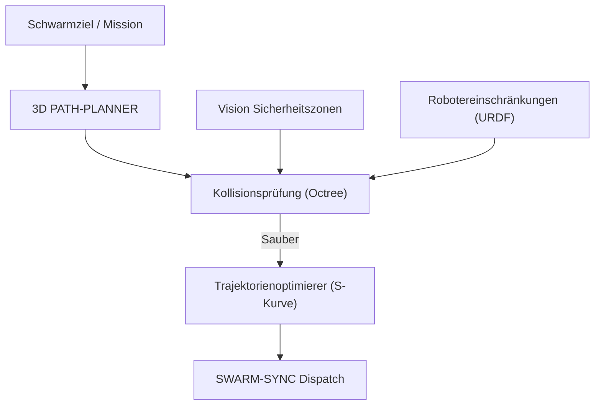

<p align="center">
  
</p>

# 🗺️ HYDRA-UMC-PATH-PLANNER-3D

<p align="center"><a href="README.md">🇺🇸 English</a> | <a href="README_spa.md">🇪🇸 Español</a> | <a href="README_fra.md">🇫🇷 Français</a> | <a href="README_ita.md">🇮🇹 Italiano</a> | 🇩🇪 <b>Deutsch</b> | <a href="README_zho.md">🇨🇳 简体中文</a> | <a href="README_jpn.md">🇯🇵 日本語</a></p>

### 📐 Multi-Roboter 3D-Pfadoptimierer & Kollisionsvermeidung-Engine

<p align="left">
  
  
  
</p>

---

## 1. 🛠️ TECHNISCHER ÜBERBLICK

**HYDRA-UMC-PATH-PLANNER-3D** ist die zentralisierte Navigationsintelligenz für den Roboterschwarm. Es berechnet kollisionsfreie Trajektorien für mehrere Arme, die sich denselben Arbeitsbereich teilen, und optimiert dabei Geschwindigkeit, Energieeffizienz und gleichmäßige Bewegungen.

Es integriert Echtzeit-Belegungsdaten von den Vision-Knoten und kinematische Einschränkungen vom Digital Twin, um sicherzustellen, dass die geplanten Pfade physikalisch machbar und sicher sind.

### Hauptmerkmale:
* 📐 **Schwarm-Pfadoptimierung:** Synchrone Planung für bis zu 32+ Roboter gleichzeitig.
* 🛡️ **Dynamische Kollisionsvermeidung:** Echtzeit-Umplanung, wenn neue Hindernisse erkannt werden.
* ⚡ **Leistungsoptimiert:** Hochgradig parallelisierte C++/Rust-Implementierung für eine Pfadgenerierung in weniger als 50 ms.
* 🔄 **G-Code & URDF Nativ:** Parst direkt industrielle Bewegungsbefehle und Robotermodelle.

---

## 2. 🔄 PLANUNGS-WORKFLOW



---

## 3. 🧱 ARCHITEKTUR & DESIGNENTSCHEIDUNGEN

* **Warum kollisionsfreie 3D-Planung ein eigener Dienst ist.** Die Pfadsuche über eine live 3D-Szene (jeder Roboter, jedes Werkzeug, jedes Hindernis der Zelle) ist CPU-intensiv und latenzsensibel auf eine andere Weise als die Auftragsplanung selbst - sie zu isolieren bedeutet, dass eine langsame Planungsanfrage HYDRA-UMC-JOB-DISPATCHER nie daran hindert, andere Arbeit zuzuweisen.
* **Warum gegen HYDRA-UMC-TWIN validiert wird, bevor real ausgeführt wird.** Eine geplante Route wird zuerst in der eigenen Physiksimulation des digitalen Zwillings geprüft - erkennt eine geometrisch gültige, aber physisch unerreichbare Route (Drehmomentgrenzen, Singularitäten), bevor sie je einen echten Arm erreicht.
* **Warum die Suche heute ein einfacher RRT ist, kein RRT\* und kein Multi-Roboter-Koordinator.** `src/rrt.rs` implementiert eine echte, getestete Rapidly-exploring-Random-Tree-Suche - ein einzelner Agent, eine statische Hindernismenge, ein wirklich kollisionsfreies Ergebnis (jede zurückgegebene Route wird in Tests als tatsächlich hindernisfrei verifiziert, nicht nur plausibel aussehend). RRT\* (ein optimalitätsverbessernder Rewiring-Durchlauf) und echte, synchronisierte Multi-Roboter-Planung (die "bis zu 32+ Roboter gleichzeitig" dieses READMEs) sind echte, bewusst ausgeklammerte künftige Arbeit - siehe `mejoras_futuras.txt`, warum zuerst die Suche für einen einzelnen Agenten als korrekt bewiesen wurde, statt alle drei gleichzeitig zu bauen und gemeinsam zu debuggen.
* **Warum Hindernisse Kugeln sind, kein Octree beliebiger Meshes.** Eine Kugel ist das einfachste 3D-Kollisionsprimitiv, das trotzdem real und geometrisch korrekt ist - kein Bounding-Box-Ersatz für etwas Detaillierteres. Ein Octree/BVH wird erst relevant, wenn eine Szene genug Kollidierer hat, damit die Brute-Force-Prüfung zum Flaschenhals wird - die heutige Schwarmzelle (eine Handvoll Arme und statische Sicherheitszonen) hat das nicht.
* **Warum dies heute eine CLI über eine JSON-Szenariodatei ist, kein Netzwerkdienst.** Die Wahl zwischen HTTP und dem geteilten gRPC-Vertrag des Ökosystems (`hydra.common.v1`, siehe `HYDRA-UMC-ORCHESTRATOR/proto/`) ist eine echte Protokollentscheidung, die einen eigenen Durchgang verdient, sobald HYDRA-UMC-JOB-DISPATCHER wirklich bereit ist, diesen Dienst aufzurufen - siehe `mejoras_futuras.txt`. Die CLI ist schon heute wirklich benutzbar (`run.bat scenarios/example.json`), sie ist nur noch nicht ans Netzwerk angeschlossen.
* **Wie sich das ins restliche Ökosystem einfügt.** Ein Geschwisterdienst unter HYDRA-UMC-ORCHESTRATOR - plant die Routen, denen die von HYDRA-UMC-JOB-DISPATCHER zugewiesenen Aufträge tatsächlich folgen, gegengeprüft mit HYDRA-UMC-TWIN, bevor sich real irgendetwas bewegt.

---

## 📂 VERZEICHNISSTRUKTUR

```text
HYDRA-UMC-PATH-PLANNER-3D/
├── src/
│   ├── main.rs       # CLI-Einstiegspunkt: lädt ein Szenario, plant, gibt JSON aus
│   ├── geometry.rs   # Vec3 - die minimale 3D-Vektormathematik, die es braucht
│   ├── obstacle.rs   # Kugelhindernisse + Kollisionsprüfungen
│   ├── rng.rs        # Deterministischer, abhängigkeitsfreier PRNG (xorshift64*)
│   └── rrt.rs        # Der echte Planer: RRT-Suche, Workspace, PlannerConfig
├── scenarios/        # Beispiel-JSON-Szenarien (siehe BUILD & RUN unten)
├── build/            # Kompilierte Binärdateien (Ausgabe von build.sh/.bat)
├── Cargo.toml        # Rust-Paketmanifest (Name, Version, Abhängigkeiten)
├── bump_version.py   # Versions-Bump nach Kilometerzähler-Prinzip
├── build.sh/.bat     # Erhöht die Version, dann `cargo build --release`
├── run.sh/.bat       # Führt die kompilierte Binärdatei aus
└── README.md
```

Aus der ursprünglichen Vorlage entfernt: `hardware/`, `firmware/`, `os/`,
`docs/`, `images/` und `scripts/` — dies ist ein reiner Softwaredienst
(Rust-Binärdatei) ohne eigene Hardware oder Firmware, ohne zu pflegendes
Betriebssystem-Image, und ohne Dokumentations-/Medien-/Utility-Skript-
Inhalt, der eigene Ordner bislang rechtfertigen würde.

---

## 🔧 BUILD & RUN

Eine echte kollisionsfreie Pfadsuche, nicht nur ein kompilierbares
Skelett: sie plant eine Route anhand einer JSON-Szenariodatei und gibt
das Ergebnis aus.

```bash
# Windows
build.bat
run.bat scenarios/example.json

# Linux / macOS
./build.sh
./run.sh scenarios/example.json
```

`build.sh`/`build.bat` erhöhen die Version in `Cargo.toml` (ökosystemweite
Kilometerzähler-Regel, siehe `bump_version.py`) und führen anschließend
`cargo build --release` aus. `run.sh`/`run.bat` führen die resultierende
Binärdatei direkt aus und reichen jedes Argument (den Szenariopfad)
weiter.

Ein Szenario ist eine JSON-Datei mit `start`, `goal`, `obstacles` (eine
Liste von Kugeln `{center, radius}`), einem `workspace` (`min`/`max`-
Grenzen) und optional `seed` (die Suche ist pro Seed vollständig
deterministisch) und `config` (`max_iterations`, `step_size`,
`goal_bias`, `goal_threshold`, `robot_radius` - alle optional, sonst mit
sinnvollen Standardwerten). Das Ergebnis wird als JSON ausgegeben:
`{"status": "ok", "path": [...]}` oder
`{"status": "error", "reason": "..."}` (`start_inside_obstacle`,
`goal_outside_workspace`, `no_path_found` usw. - siehe `PlanError` in
`src/rrt.rs` für die vollständige, ehrliche Liste, einschließlich des
Falls, dass gar keine Route existiert, nicht nur einer, die die Suche
nicht rechtzeitig fand).

```bash
cargo test   # Geometrie + Hinderniskollision, den PRNG, und den
             # RRT-Planer selbst - einschließlich eines Tests, der
             # verifiziert, dass jedes zurückgegebene Wegsegment
             # tatsächlich hindernisfrei ist, und eines weiteren, der
             # verifiziert, dass ein wirklich unerreichbares Ziel
             # als solches gemeldet wird
```

---

## 🚀 ROADMAP
* **Phase 1:** Deterministische Schwarm-Synchronisation über TSN und Sub-ms-Jitter-Reduzierung.
* **Phase 2:** 3D-Pfadplanung mit dynamischer Hindernisvermeidung in Multi-Roboter-Zellen.
* **Phase 3:** Multi-Roboter-Job-Dispatching-Optimierung unter Berücksichtigung der Ressourcenverfügbarkeit in Echtzeit.
* **Phase 4:** Unterstützung für Pfadplanung mobiler Basen ohne Holonomie (JuanenBOT) und Integration heterogener Flotten.

---

## 🔗 Verwandte Projekte

Dieses Projekt ist Teil eines größeren Robotik-Ökosystems desselben Autors (JuanenRac / Electro Hobby 3D), das Firmware, Steuerungssoftware, KI-Knoten und Flotten-Tools umfasst. Gut zu wissen, denn eine Anfrage könnte tatsächlich eines dieser Projekte betreffen statt dieses Repository.

### Familie

**Elternteil:** **[HYDRA-UMC-ORCHESTRATOR](https://github.com/JuanenRac/HYDRA-UMC-ORCHESTRATOR)** — der Integrations-Elternteil, dem dieser Planer dient.

**Geschwister:**
- **[HYDRA-UMC-SWARM-SYNC](https://github.com/JuanenRac/HYDRA-UMC-SWARM-SYNC)** — Geschwister-Orchestrierungsdienst, gleicher Elternteil.
- **[HYDRA-UMC-JOB-DISPATCHER](https://github.com/JuanenRac/HYDRA-UMC-JOB-DISPATCHER)** — Geschwister-Orchestrierungsdienst, gleicher Elternteil.
- **[HYDRA-UMC-NODE-HEALING](https://github.com/JuanenRac/HYDRA-UMC-NODE-HEALING)** — Geschwister-Orchestrierungsdienst, gleicher Elternteil.

### Direkte Beziehung (außerhalb der Familie)

- **[HYDRA-UMC-TWIN](https://github.com/JuanenRac/HYDRA-UMC-TWIN)** — validiert geplante Routen im digitalen Zwilling, bevor sie ausgeführt werden.

### Restliches Ökosystem

**HYDRA-UMC-Plattform** — die Multi-Roboter-Mikrofabrikzelle
- **[HYDRA-UMC](https://github.com/JuanenRac/HYDRA-UMC)** — das CM5 + STM32H745-Motherboard, das bis zu 8 Roboterarme orchestriert.
- **[HYDRA-UMC-SERVER](https://github.com/JuanenRac/HYDRA-UMC-SERVER)** — das Express/WebSocket-Backend, mit dem jeder Steuerungsclient spricht.
- **[HYDRA-UMC-STUDIO](https://github.com/JuanenRac/HYDRA-UMC-STUDIO)** — webbasiertes Steuerungs-Dashboard, Multi-Roboter-3D-Visualisierung.
- **[HYDRA-UMC-ANDROID-CONTROL](https://github.com/JuanenRac/HYDRA-UMC-ANDROID-CONTROL)** — Android-Steuerungs-App über Wi-Fi/Bluetooth.
- **[HYDRA-UMC-IOS-CONTROL](https://github.com/JuanenRac/HYDRA-UMC-IOS-CONTROL)** — iOS/iPadOS-Steuerungs-App, gebaut in Flutter.
- **[HYDRA-UMC-SUITE](https://github.com/JuanenRac/HYDRA-UMC-SUITE)** — Desktop-Schwarm-Kommandozentrale (Python/PySide6).
- **[HYDRA-UMC-EDITOR-URDF](https://github.com/JuanenRac/HYDRA-UMC-EDITOR-URDF)** — Desktop-URDF-Modelleditor für den Roboterkatalog.
- **[HYDRA-UMC-DSI](https://github.com/JuanenRac/HYDRA-UMC-DSI)** — native Touch-UI für den eingebauten DSI-Touchscreen.

**URTC-Plattform** — der Werkzeugkopf-Controller, den jeder HYDRA-UMC-Roboterarm trägt
- **[URTC](https://github.com/JuanenRac/URTC)** — CAN-Bus-Werkzeugkopf-Controller, 25 Werkzeugprofile.
- **[URTC-FLASHER](https://github.com/JuanenRac/URTC-FLASHER)** — Desktop-Tool für CAN-OTA + SWD/JTAG-Flashing.
- **[URTC-TESTER](https://github.com/JuanenRac/URTC-TESTER)** — Desktop-Tool für Live-CAN-Bus-Diagnose.
- **[URTC-WEB-STUDIO](https://github.com/JuanenRac/URTC-WEB-STUDIO)** — browserbasierte Alternative über die Web-Serial-API.

**🎥 Vision AI Node (Hailo-8)**
- [HYDRA-UMC-VISION-NODE](https://github.com/JuanenRac/HYDRA-UMC-VISION-NODE)
- [HYDRA-UMC-VISION-STREAMER](https://github.com/JuanenRac/HYDRA-UMC-VISION-STREAMER)
- [HYDRA-UMC-DETECTION-HEF](https://github.com/JuanenRac/HYDRA-UMC-DETECTION-HEF)
- [HYDRA-UMC-SAFETY-ZONES](https://github.com/JuanenRac/HYDRA-UMC-SAFETY-ZONES)
- [HYDRA-UMC-VISUAL-SERVOING-API](https://github.com/JuanenRac/HYDRA-UMC-VISUAL-SERVOING-API)

**🧠 Cognitive AI Node (Hailo-10)**
- [HYDRA-UMC-COGNITIVE-NODE](https://github.com/JuanenRac/HYDRA-UMC-COGNITIVE-NODE)
- [HYDRA-UMC-VLA-ENGINE](https://github.com/JuanenRac/HYDRA-UMC-VLA-ENGINE)
- [HYDRA-UMC-VOICE-UI](https://github.com/JuanenRac/HYDRA-UMC-VOICE-UI)
- [HYDRA-UMC-SEMANTIC-PLANNER](https://github.com/JuanenRac/HYDRA-UMC-SEMANTIC-PLANNER)
- [HYDRA-UMC-DOCS-QA](https://github.com/JuanenRac/HYDRA-UMC-DOCS-QA)

**🎮 Digital Twin & Simulation**
- [HYDRA-UMC-TWIN](https://github.com/JuanenRac/HYDRA-UMC-TWIN)
- [HYDRA-UMC-PHYSICS-REPLICA](https://github.com/JuanenRac/HYDRA-UMC-PHYSICS-REPLICA)
- [HYDRA-UMC-HIL-BRIDGE](https://github.com/JuanenRac/HYDRA-UMC-HIL-BRIDGE)
- [HYDRA-UMC-SYNTHETIC-DATA-GEN](https://github.com/JuanenRac/HYDRA-UMC-SYNTHETIC-DATA-GEN)

**📊 Data & Analytics**
- [HYDRA-UMC-DATALAKE](https://github.com/JuanenRac/HYDRA-UMC-DATALAKE)
- [HYDRA-UMC-TELEMETRY-COLLECTOR](https://github.com/JuanenRac/HYDRA-UMC-TELEMETRY-COLLECTOR)
- [HYDRA-UMC-ANOMALY-DETECTOR](https://github.com/JuanenRac/HYDRA-UMC-ANOMALY-DETECTOR)
- [HYDRA-UMC-PRODUCTION-REPORTS](https://github.com/JuanenRac/HYDRA-UMC-PRODUCTION-REPORTS)

**🏭 Industrial Gateway**
- [HYDRA-UMC-GATEWAY-INDUSTRIAL](https://github.com/JuanenRac/HYDRA-UMC-GATEWAY-INDUSTRIAL)
- [HYDRA-UMC-OPCUA-SERVER](https://github.com/JuanenRac/HYDRA-UMC-OPCUA-SERVER)
- [HYDRA-UMC-MQTT-BROKER](https://github.com/JuanenRac/HYDRA-UMC-MQTT-BROKER)
- [HYDRA-UMC-MTCONNECT-ADAPTER](https://github.com/JuanenRac/HYDRA-UMC-MTCONNECT-ADAPTER)

**🛠️ Complementary Tools**
- [URTC-SMART-RACK](https://github.com/JuanenRac/URTC-SMART-RACK)
- [URTC-VISION-TOOL](https://github.com/JuanenRac/URTC-VISION-TOOL)
- [HYDRA-UMC-WATCH](https://github.com/JuanenRac/HYDRA-UMC-WATCH)
- [HYDRA-UMC-TOOL-CLI](https://github.com/JuanenRac/HYDRA-UMC-TOOL-CLI)
- [HYDRA-UMC-DASHBOARD-AI](https://github.com/JuanenRac/HYDRA-UMC-DASHBOARD-AI)


## 👤 AUTOR
**JuanenRac** (Electro Hobby 3D)
📧 electrohobby3d@gmail.com

## 📜 LIZENZ
GPL-3.0 - Siehe LICENSE für Details.
