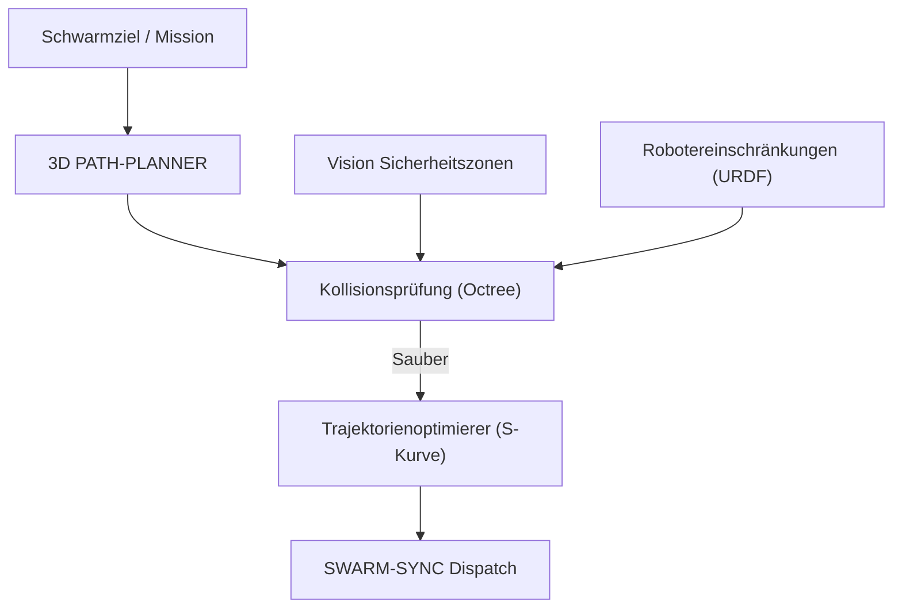

<p align="center">
  
</p>

# 🗺️ HYDRA-UMC-PATH-PLANNER-3D

<p align="center"><a href="README.md">🇺🇸 English</a> | <a href="README_spa.md">🇪🇸 Español</a> | <a href="README_fra.md">🇫🇷 Français</a> | <a href="README_ita.md">🇮🇹 Italiano</a> | 🇩🇪 <b>Deutsch</b> | <a href="README_zho.md">🇨🇳 简体中文</a> | <a href="README_jpn.md">🇯🇵 日本語</a></p>

### 📐 Multi-Roboter 3D-Pfadoptimierer & Kollisionsvermeidung-Engine

<p align="left">
  
  
  
</p>

---

## 1. 🛠️ TECHNISCHER ÜBERBLICK

**HYDRA-UMC-PATH-PLANNER-3D** ist die zentralisierte Navigationsintelligenz für den Roboterschwarm. Es berechnet kollisionsfreie Trajektorien für mehrere Arme, die sich denselben Arbeitsbereich teilen, und optimiert dabei Geschwindigkeit, Energieeffizienz und gleichmäßige Bewegungen.

Es integriert Echtzeit-Belegungsdaten von den Vision-Knoten und kinematische Einschränkungen vom Digital Twin, um sicherzustellen, dass die geplanten Pfade physikalisch machbar und sicher sind.

### Hauptmerkmale:
* 📐 **Schwarm-Pfadoptimierung:** Synchrone Planung für bis zu 32+ Roboter gleichzeitig.
* 🛡️ **Dynamische Kollisionsvermeidung:** Echtzeit-Umplanung, wenn neue Hindernisse erkannt werden.
* ⚡ **Leistungsoptimiert:** Hochgradig parallelisierte C++/Rust-Implementierung für eine Pfadgenerierung in weniger als 50 ms.
* 🔄 **G-Code & URDF Nativ:** Parst direkt industrielle Bewegungsbefehle und Robotermodelle.
* ⏱️ **Echtes Zeitlimit & Trajektorienvalidierung (v0):** `PlannerConfig.max_duration_ms` begrenzt die Suchzeit nach der realen Uhr, unabhängig von `max_iterations`. Ein neuer `validate`-Unterbefehl prüft einen bereits berechneten Pfad (zwischengespeichert, wiedergegeben oder von Hand bearbeitet) erneut gegen die aktuellen Hindernisse/den Arbeitsbereich, bevor ihm für eine echte Ausführung vertraut wird.

---

## 2. 🔄 PLANUNGS-WORKFLOW



---

## 3. 🧱 ARCHITEKTUR & DESIGNENTSCHEIDUNGEN

* **Warum kollisionsfreie 3D-Planung ein eigener Dienst ist.** Die Pfadsuche über eine live 3D-Szene (jeder Roboter, jedes Werkzeug, jedes Hindernis der Zelle) ist CPU-intensiv und latenzsensibel auf eine andere Weise als die Auftragsplanung selbst - sie zu isolieren bedeutet, dass eine langsame Planungsanfrage HYDRA-UMC-JOB-DISPATCHER nie daran hindert, andere Arbeit zuzuweisen.
* **Warum gegen HYDRA-UMC-TWIN validiert wird, bevor real ausgeführt wird.** Eine geplante Route wird zuerst in der eigenen Physiksimulation des digitalen Zwillings geprüft - erkennt eine geometrisch gültige, aber physisch unerreichbare Route (Drehmomentgrenzen, Singularitäten), bevor sie je einen echten Arm erreicht.
* **Warum die Suche heute ein einfacher RRT ist, kein RRT\* und kein Multi-Roboter-Koordinator.** `src/rrt.rs` implementiert eine echte, getestete Rapidly-exploring-Random-Tree-Suche - ein einzelner Agent, eine statische Hindernismenge, ein wirklich kollisionsfreies Ergebnis (jede zurückgegebene Route wird in Tests als tatsächlich hindernisfrei verifiziert, nicht nur plausibel aussehend). RRT\* (ein optimalitätsverbessernder Rewiring-Durchlauf) und echte, synchronisierte Multi-Roboter-Planung (die "bis zu 32+ Roboter gleichzeitig" dieses READMEs) sind echte, bewusst ausgeklammerte künftige Arbeit - siehe `mejoras_futuras.txt`, warum zuerst die Suche für einen einzelnen Agenten als korrekt bewiesen wurde, statt alle drei gleichzeitig zu bauen und gemeinsam zu debuggen.
* **Warum Hindernisse Kugeln sind, kein Octree beliebiger Meshes.** Eine Kugel ist das einfachste 3D-Kollisionsprimitiv, das trotzdem real und geometrisch korrekt ist - kein Bounding-Box-Ersatz für etwas Detaillierteres. Ein Octree/BVH wird erst relevant, wenn eine Szene genug Kollidierer hat, damit die Brute-Force-Prüfung zum Flaschenhals wird - die heutige Schwarmzelle (eine Handvoll Arme und statische Sicherheitszonen) hat das nicht.
* **Warum dies heute eine CLI über eine JSON-Szenariodatei ist, kein Netzwerkdienst.** Die Wahl zwischen HTTP und dem geteilten gRPC-Vertrag des Ökosystems (`hydra.common.v1`, siehe `HYDRA-UMC-ORCHESTRATOR/proto/`) ist eine echte Protokollentscheidung, die einen eigenen Durchgang verdient, sobald HYDRA-UMC-JOB-DISPATCHER wirklich bereit ist, diesen Dienst aufzurufen - siehe `mejoras_futuras.txt`. Die CLI ist schon heute wirklich benutzbar (`run.bat scenarios/example.json`), sie ist nur noch nicht ans Netzwerk angeschlossen.
* **Wie sich das ins restliche Ökosystem einfügt.** Ein Geschwisterdienst unter HYDRA-UMC-ORCHESTRATOR - plant die Routen, denen die von HYDRA-UMC-JOB-DISPATCHER zugewiesenen Aufträge tatsächlich folgen, gegengeprüft mit HYDRA-UMC-TWIN, bevor sich real irgendetwas bewegt.
* **Warum `max_duration_ms` eine Prüfung der realen Uhr ist, nicht nur ein niedrigeres `max_iterations`.** Die Iterationsanzahl allein kann die reale Zeit nicht begrenzen: Eine Szene mit dichteren Hindernissen macht die Kollisionsprüfungen jeder Iteration proportional langsamer, sodass dasselbe Iterationsbudget auf einer pathologischen Szene eine völlig andere reale Zeit benötigen kann als auf einer offenen. Ein Planeraufruf in einer Echtzeit-Regelschleife braucht ein echtes Zeitbudget, kein Ersatz dafür.
* **Warum `validate` ein neuer Unterbefehl ist, statt zu ändern, was `plan()` zurückgibt.** `rrt::plan()` gibt bereits nur Pfade zurück, die konstruktionsbedingt kollisionsfrei sind - dort gibt es keine Lücke zu schließen. `validate_path()`/der `validate`-Unterbefehl existiert für Pfade, die NICHT aus einem frischen `plan()`-Aufruf in diesem Prozess stammen: ein zwischengespeicherter/wiedergegebener Pfad, einer, der von einem anderen Prozess weitergeleitet wurde, ein von Hand bearbeitetes Szenario - bei denen sich die Hindernismenge seit der Berechnung des Pfades geändert haben könnte. Dasselbe Muster, das im gesamten Ökosystem verwendet wird: ein neuer, abgesicherter Einstiegspunkt neben einer unveränderten Low-Level-Primitive.

---

## 📂 VERZEICHNISSTRUKTUR

```text
HYDRA-UMC-PATH-PLANNER-3D/
├── src/
│   ├── main.rs       # CLI-Einstiegspunkt: lädt ein Szenario, plant, gibt JSON aus
│   ├── geometry.rs   # Vec3 - die minimale 3D-Vektormathematik, die es braucht
│   ├── obstacle.rs   # Kugelhindernisse + Kollisionsprüfungen
│   ├── rng.rs        # Deterministischer, abhängigkeitsfreier PRNG (xorshift64*)
│   ├── rrt.rs        # Der echte Planer: RRT-Suche, Workspace, PlannerConfig
│   ├── validate.rs   # Echte Sicherheitsnachprüfung eines bereits berechneten Pfades
│   └── corpus.rs     # Nur für Tests: wiederverwendbare Hindernis-/Workspace-Szenario-
│                        Fixtures, gemeinsam genutzt von den Tests von rrt.rs und validate.rs
├── scenarios/        # Beispiel-JSON-Szenarien (siehe BUILD UND AUSFÜHRUNG unten)
├── docs/
│   └── CLI_REFERENCE.md  # Referenz der Kommandozeilen-Flags
├── images/           # Medien und Diagramme
├── tools/
│   └── ci_validate.py   # Manifest-/CHANGELOG-/Doku-Validierung, von der CI genutzt
├── build/            # Kompilierte Binärdateien (Ausgabe von build.sh/.bat)
├── Cargo.toml        # Rust-Paketmanifest (Name, Version, Abhängigkeiten)
├── bump_version.py   # Versions-Bump nach Kilometerzähler-Prinzip
├── bump_manifest_version.py  # Synchronisiert die Version von hydra-umc.project.json mit der nativen (--sync)
├── build.sh/.bat     # Erhöht die Version, dann `cargo build --release`
├── run.sh/.bat       # Führt die kompilierte Binärdatei aus
└── README.md
```

Aus der ursprünglichen Vorlage entfernt: `hardware/`, `firmware/` und
`os/` — dies ist ein reiner Softwaredienst (Rust-Binärdatei) ohne eigene
Hardware oder Firmware und ohne zu pflegendes Betriebssystem-Image.

---

## 🔧 BUILD UND AUSFÜHRUNG

Eine echte kollisionsfreie Pfadsuche, nicht nur ein kompilierbares
Skelett: sie plant eine Route anhand einer JSON-Szenariodatei und gibt
das Ergebnis aus.

```bash
# Windows
build.bat
run.bat scenarios/example.json

# Linux / macOS
./build.sh
./run.sh scenarios/example.json
```

`build.sh`/`build.bat` erhöhen die Version in `Cargo.toml` (ökosystemweite
Kilometerzähler-Regel, siehe `bump_version.py`) und führen anschließend
`cargo build --release` aus. `run.sh`/`run.bat` führen die resultierende
Binärdatei direkt aus und reichen jedes Argument (den Szenariopfad)
weiter.

Ein Szenario ist eine JSON-Datei mit `start`, `goal`, `obstacles` (eine
Liste von Kugeln `{center, radius}`), einem `workspace` (`min`/`max`-
Grenzen) und optional `seed` (die Suche ist pro Seed vollständig
deterministisch) und `config` (`max_iterations`, `step_size`,
`goal_bias`, `goal_threshold`, `robot_radius`, `max_duration_ms` - alle
optional, sonst mit sinnvollen Standardwerten; `max_duration_ms` begrenzt
die Suchzeit nach der realen Uhr, unabhängig von `max_iterations`). Das
Ergebnis wird als JSON ausgegeben:
`{"status": "ok", "path": [...]}` oder
`{"status": "error", "reason": "..."}` (`start_inside_obstacle`,
`goal_outside_workspace`, `no_path_found`, `time_limit_exceeded` usw. -
siehe `PlanError` in `src/rrt.rs` für die vollständige, ehrliche Liste,
einschließlich des Falls, dass gar keine Route existiert, nicht nur
einer, die die Suche nicht rechtzeitig fand).

Ein zweiter echter Unterbefehl prüft einen bereits berechneten Pfad (ein
einfaches JSON-Array von `{x, y, z}`-Wegpunkten) erneut gegen die
aktuellen Hindernisse/den Arbeitsbereich eines Szenarios, ohne eine neue
Suche auszuführen:

```bash
./run.sh validate scenarios/example.json path.json
# {"status": "safe"}
# oder: {"status": "unsafe", "issues": [{"SegmentIntersectsObstacle": {"from_index": 0, "to_index": 1}}]}
```

```bash
cargo test   # Geometrie + Hinderniskollision, den PRNG, den RRT-Planer
             # (einschließlich seines echten Zeitlimits nach der Uhr)
             # und die Sicherheitsnachprüfung von validate.rs -
             # 28 Tests insgesamt
```

---

## 🚀 FAHRPLAN
* **Phase 1:** Deterministische Schwarm-Synchronisation über TSN und Sub-ms-Jitter-Reduzierung.
* **Phase 2:** 3D-Pfadplanung mit dynamischer Hindernisvermeidung in Multi-Roboter-Zellen.
* **Phase 3:** Multi-Roboter-Job-Dispatching-Optimierung unter Berücksichtigung der Ressourcenverfügbarkeit in Echtzeit.
* **Phase 4:** Unterstützung für Pfadplanung mobiler Basen ohne Holonomie (JuanenBOT) und Integration heterogener Flotten.

---

## 🔗 Verwandte Projekte

Dieses Projekt ist Teil des HYDRA-UMC-Robotik-Ökosystems desselben Autors (JuanenRac / Electro Hobby 3D). Gut zu wissen, da eine Anfrage eigentlich eines dieser Projekte betreffen könnte statt dieses Repositorys.

**Übergeordnetes Projekt**
- **[HYDRA-UMC-ORCHESTRATOR](https://github.com/JuanenRac/HYDRA-UMC-ORCHESTRATOR)** — Integrationsknoten mit einem echten gRPC/Protobuf-Health-Report-Vertrag und einer Missions-Zustandsmaschine; das übergeordnete Projekt, dessen spezifischer Orchestrierungsdienst dieses Repository innerhalb seiner eigenen Schwarmkoordinationsschicht ist.

**Geschwisterprojekte** — die übrigen Orchestrierungsdienste der eigenen Schwarmkoordinationsschicht von HYDRA-UMC-ORCHESTRATOR
- **[HYDRA-UMC-SWARM-SYNC](https://github.com/JuanenRac/HYDRA-UMC-SWARM-SYNC)** — echte CRDT-LWW-Element-Map-Zustandssynchronisation, eigenschaftsgetestet auf Multi-Zellen-Konvergenz.
- **[HYDRA-UMC-JOB-DISPATCHER](https://github.com/JuanenRac/HYDRA-UMC-JOB-DISPATCHER)** — echte prioritätsbasierte Job-Queue mit Deduplizierung, über eine echte HTTP-API.
- **[HYDRA-UMC-NODE-HEALING](https://github.com/JuanenRac/HYDRA-UMC-NODE-HEALING)** — echter gRPC-basierter Flotten-Health-Watchdog mit Retry/Backoff und Identitäts-Mismatch-Erkennung.

**Direkt verwandt**
- **[HYDRA-UMC-TWIN](https://github.com/JuanenRac/HYDRA-UMC-TWIN)** — Integrationsknoten für die Digital-Twin-Engine, mit einem echten Versionskompatibilitäts-Sync-Vertrag — validiert die eigenen geplanten Routen dieses Planers im digitalen Zwilling, bevor sie ausgeführt werden.

**Ebenfalls Teil des Ökosystems**

*Kern-Hardware & Plattform*
- **[HYDRA-UMC](https://github.com/JuanenRac/HYDRA-UMC)** — das physische Motherboard des Roboterarms: CM5-Host + Dual-Core-STM32H745, koordiniert bis zu 8 Werkzeugarme über CAN-OTA/SPI-OTA.
- **[HYDRA-UMC-OS](https://github.com/JuanenRac/HYDRA-UMC-OS)** — reproduzierbare Raspberry-Pi-OS-Produktschicht für den CM5: schreibgeschützter Agent, validierte Konfiguration/Profile, WiFi-Ersteinrichtung.
- **[HYDRA-UMC-SDK](https://github.com/JuanenRac/HYDRA-UMC-SDK)** — der gemeinsame JSON-Schema-Vertrag und die Sicherheitsschranke, gegen die jede Bridge ihre Befehle validiert.

*Kern-Backend & Clients*
- **[HYDRA-UMC-SERVER](https://github.com/JuanenRac/HYDRA-UMC-SERVER)** — das reale Headless-Backend (REST/WebSocket), mit dem jeder Steuerungsclient tatsächlich spricht.
- **[HYDRA-UMC-STUDIO](https://github.com/JuanenRac/HYDRA-UMC-STUDIO)** — Web-Steuerungs-Dashboard mit Echtzeit-3D-Visualisierung mehrerer Roboter.
- **[HYDRA-UMC-SUITE](https://github.com/JuanenRac/HYDRA-UMC-SUITE)** — Desktop-Schwarmleitstand (PySide6) für mehrere Server gleichzeitig, verpackt als eigenständige ausführbare Datei.
- **[HYDRA-UMC-ANDROID-CONTROL](https://github.com/JuanenRac/HYDRA-UMC-ANDROID-CONTROL)** — native Android-Steuerungs-App mit biometrischem Login und einer gekoppelten Wear-OS-Begleit-App.
- **[HYDRA-UMC-IOS-CONTROL](https://github.com/JuanenRac/HYDRA-UMC-IOS-CONTROL)** — iOS/iPadOS-Steuerungs-App (Flutter) mit Echtzeit-WebSocket-Synchronisierung.
- **[HYDRA-UMC-DSI](https://github.com/JuanenRac/HYDRA-UMC-DSI)** — native Touch-UI für das eingebaute 7"-DSI-Touchscreen, direkt auf dem CM5 eingebettet.
- **[HYDRA-UMC-EDITOR-URDF](https://github.com/JuanenRac/HYDRA-UMC-EDITOR-URDF)** — grafischer Desktop-URDF-Ersteller/-Editor, der fertige Modelle in STUDIOs eigenen Katalog überträgt.
- **[HYDRA-UMC-BRIDGE-AMR](https://github.com/JuanenRac/HYDRA-UMC-BRIDGE-AMR)** — Koordinationsschranke für AGV-/AMR-Flotten über einen echten VDA-5050-MQTT-Publisher.
- **[HYDRA-UMC-BRIDGE-CNC](https://github.com/JuanenRac/HYDRA-UMC-BRIDGE-CNC)** — High-Level-Koordinator für CNC-Zellen mit echtem GRBL-Status-/Steuerbyte-Zugriff.
- **[HYDRA-UMC-BRIDGE-DROIDS](https://github.com/JuanenRac/HYDRA-UMC-BRIDGE-DROIDS)** — Koordinationsschranke für laufende/humanoide Droiden, mit einem echten Boston-Dynamics-Spot-Befehlssender.
- **[HYDRA-UMC-BRIDGE-LASER](https://github.com/JuanenRac/HYDRA-UMC-BRIDGE-LASER)** — Sicherheitskoordinator für Laserzellen, liest 3 echte Schlüssel-/Gehäuse-/Verriegelungs-GPIO-Sicherungen.
- **[HYDRA-UMC-BRIDGE-OPENPNP](https://github.com/JuanenRac/HYDRA-UMC-BRIDGE-OPENPNP)** — sicherer High-Level-Koordinator für den Leiterplattenfluss von OpenPnP Pick-and-Place.
- **[HYDRA-UMC-BRIDGE-PRINTER3D](https://github.com/JuanenRac/HYDRA-UMC-BRIDGE-PRINTER3D)** — sichere Koordinationsschranke für Moonraker/Klipper-3D-Drucker, mit echten gesicherten Job-Befehlen.
- **[HYDRA-UMC-BRIDGE-ROS2](https://github.com/JuanenRac/HYDRA-UMC-BRIDGE-ROS2)** — Sicherheitskoordinator mit einem echten, träge importierten rclpy-ROS-2-Transport.
- **[HYDRA-UMC-BRIDGE-UAV](https://github.com/JuanenRac/HYDRA-UMC-BRIDGE-UAV)** — Koordinationsschranke für kameraausgestattete UAVs, mit einem echten MAVLink-Befehlssender.

*URTC-Werkzeugplattform*
- **[URTC](https://github.com/JuanenRac/URTC)** — Firmware für die physische Universal-Robot-Tool-Controller-Platine, 25+ Werkzeugprofile über CAN-Bus.
- **[URTC-FLASHER](https://github.com/JuanenRac/URTC-FLASHER)** — Desktop-GUI-Flash-Tool für URTC-Platinen, CAN-OTA plus Full-Chip-SWD/JTAG.
- **[URTC-TESTER](https://github.com/JuanenRac/URTC-TESTER)** — Desktop-Live-CAN-Bus-Diagnosetool für URTC-Platinen, ein Panel pro Werkzeugprofil.
- **[URTC-WEB-STUDIO](https://github.com/JuanenRac/URTC-WEB-STUDIO)** — browserbasierte Alternative zu URTC-TESTER über die Web-Serial-API, ohne lokale Installation.

*Vision-KI-Knoten (Hailo-8)*
- **[HYDRA-UMC-VISION-NODE](https://github.com/JuanenRac/HYDRA-UMC-VISION-NODE)** — Integrationsknoten für die Hailo-8-Vision-Pipeline, mit einer echten stufenweisen Hardware-Bereitschaftsprüfung.
- **[HYDRA-UMC-DETECTION-HEF](https://github.com/JuanenRac/HYDRA-UMC-DETECTION-HEF)** — echte Registry für kompilierte Modelle mit Hailo-Architektur-/Prüfsummen-Safe-Load-Verifizierung.
- **[HYDRA-UMC-VISION-STREAMER](https://github.com/JuanenRac/HYDRA-UMC-VISION-STREAMER)** — echter GStreamer-Pipeline- + MediaMTX-Konfigurationsgenerator mit einer echten HailoRT-Integrationsschranke.
- **[HYDRA-UMC-VISUAL-SERVOING-API](https://github.com/JuanenRac/HYDRA-UMC-VISUAL-SERVOING-API)** — echtes Position-Based-Visual-Servoing-Korrekturgesetz, sicherheitsgesteuert nach vorgelagertem Zonenstatus.
- **[HYDRA-UMC-SAFETY-ZONES](https://github.com/JuanenRac/HYDRA-UMC-SAFETY-ZONES)** — echte Zonenverletzungsprüfung und E-STOP-Anforderung, mit erzwungener Kalibrierungsaktualität.

*Kognitiver KI-Knoten (Hailo-10)*
- **[HYDRA-UMC-COGNITIVE-NODE](https://github.com/JuanenRac/HYDRA-UMC-COGNITIVE-NODE)** — Integrationsknoten für die Hailo-10-Cognitive-Pipeline (LLM-/VLA-/Sprach-Orchestrierung).
- **[HYDRA-UMC-VLA-ENGINE](https://github.com/JuanenRac/HYDRA-UMC-VLA-ENGINE)** — echte Aktions-Token-Kodierung/-Dekodierung und Trajektoriengenerierung für ein Vision-Language-Action-Modell.
- **[HYDRA-UMC-VOICE-UI](https://github.com/JuanenRac/HYDRA-UMC-VOICE-UI)** — echtes Sprach-Frontend (VAD + Intent-Parser) mit einem begrenzten, bestätigungsgesicherten Watch-Relay.
- **[HYDRA-UMC-SEMANTIC-PLANNER](https://github.com/JuanenRac/HYDRA-UMC-SEMANTIC-PLANNER)** — echte regelbasierte Aufgabenzerlegung und semantische Fehlerbehebung über MCU-Fehlercodes.
- **[HYDRA-UMC-DOCS-QA](https://github.com/JuanenRac/HYDRA-UMC-DOCS-QA)** — echte, nur auf der Standardbibliothek basierende TF-IDF-Dokumentensuche über die eigenen Markdown-Dokumente dieses Ökosystems.

*Digitaler Zwilling & Simulation*
- **[HYDRA-UMC-HIL-BRIDGE](https://github.com/JuanenRac/HYDRA-UMC-HIL-BRIDGE)** — echte Hardware-in-the-Loop-Sicherheitsverriegelung, die Befehle zwischen Simulation und echter Hardware routet.
- **[HYDRA-UMC-PHYSICS-REPLICA](https://github.com/JuanenRac/HYDRA-UMC-PHYSICS-REPLICA)** — echte Vorwärtskinematik und Gelenkgrenzenvalidierung über eine echte URDF-Teilmenge.
- **[HYDRA-UMC-SYNTHETIC-DATA-GEN](https://github.com/JuanenRac/HYDRA-UMC-SYNTHETIC-DATA-GEN)** — echter prozeduraler 2D-Szenengenerator mit YOLO/COCO-Annotationsexport.

*Daten & Analytik*
- **[HYDRA-UMC-DATALAKE](https://github.com/JuanenRac/HYDRA-UMC-DATALAKE)** — echter sqlite3-gestützter Zeitreihenspeicher mit einer echten Ingest-/Abfrage-HTTP-API.
- **[HYDRA-UMC-ANOMALY-DETECTOR](https://github.com/JuanenRac/HYDRA-UMC-ANOMALY-DETECTOR)** — echter FFT- + statistischer Basislinien-Anomaliedetektor mit Drift-Überwachung.
- **[HYDRA-UMC-PRODUCTION-REPORTS](https://github.com/JuanenRac/HYDRA-UMC-PRODUCTION-REPORTS)** — echte OEE-/Verfügbarkeitsberechnung über den DATALAKE-Verlauf, mit reproduzierbarem CSV-Export.
- **[HYDRA-UMC-TELEMETRY-COLLECTOR](https://github.com/JuanenRac/HYDRA-UMC-TELEMETRY-COLLECTOR)** — echte CAN/WebSocket-Ingestion-Pipeline in DATALAKE, mit Sequenz-Deduplizierung.

*Industrie-Gateway*
- **[HYDRA-UMC-GATEWAY-INDUSTRIAL](https://github.com/JuanenRac/HYDRA-UMC-GATEWAY-INDUSTRIAL)** — Integrationsknoten, der zu Industrieprotokollen weiterleitet, mit einer echten Befehls-Allowlist-/Backpressure-Schicht.
- **[HYDRA-UMC-OPCUA-SERVER](https://github.com/JuanenRac/HYDRA-UMC-OPCUA-SERVER)** — echter OPC-UA-Adressraum, verifiziert mit einer echten Binärprotokoll-Client-Session.
- **[HYDRA-UMC-MQTT-BROKER](https://github.com/JuanenRac/HYDRA-UMC-MQTT-BROKER)** — echter MQTT-Broker mit optionaler Pro-Client-Authentifizierung und Topic-ACLs.
- **[HYDRA-UMC-MTCONNECT-ADAPTER](https://github.com/JuanenRac/HYDRA-UMC-MTCONNECT-ADAPTER)** — echte MTConnect-`/probe`- und `/current`-XML-Endpunkte mit Degraded-Mode-Ausgabe.

*Ergänzende Tools & Ökosystembetrieb*
- **[HYDRA-UMC-DASHBOARD-AI](https://github.com/JuanenRac/HYDRA-UMC-DASHBOARD-AI)** — Smart-Summaries- und Anomaly-Highlighting-Panels über DATALAKE/ANOMALY-DETECTOR, mit einem ehrlichen statistischen Fallback.
- **[HYDRA-UMC-TOOL-CLI](https://github.com/JuanenRac/HYDRA-UMC-TOOL-CLI)** — Flotten-CLI mit einem echten, stabilen Exit-Code-Vertrag, ein echter Live-Client der eigenen API von HYDRA-UMC-SERVER.
- **[HYDRA-UMC-WATCH](https://github.com/JuanenRac/HYDRA-UMC-WATCH)** — WearOS-Begleit-App mit echten haptischen Alarmen und einem Sprach-Relay zum gekoppelten Telefon.
- **[URTC-SMART-RACK](https://github.com/JuanenRac/URTC-SMART-RACK)** — Firmware für ein Platinenmontagegestell mit echter Werkzeug-ID-Dekodierung und Smart-Idle-Vorheizlogik.
- **[URTC-VISION-TOOL](https://github.com/JuanenRac/URTC-VISION-TOOL)** — Firmware plus ein echter Python-Vision-Begleiter für einen Thermal-/RGB-Inspektionswerkzeugkopf.
- **[HYDRA-UMC-UPDATER](https://github.com/JuanenRac/HYDRA-UMC-UPDATER)** — administratives Desktop-Tool, das jedes Repository in diesem Ökosystem entdeckt, klont und aktualisiert.
- **[HYDRA-UMC-OS-REBUILDER](https://github.com/JuanenRac/HYDRA-UMC-OS-REBUILDER)** — Windows/Linux-Desktop-Tool, das ein flashbereites CM5-Image baut, vorgeladen mit den aktuellsten Versionen des Ökosystems, mit Ersteinrichtungs-Konfiguration für WLAN/Benutzer/SSH im Stil von Raspberry Pi Imager.


---

## 📚 Dokumentation & Community

- **[CONTRIBUTING.md](CONTRIBUTING.md)** — Technologie-Stack und Coding-Richtlinien für einen Pull Request.
- **[CODE_OF_CONDUCT.md](CODE_OF_CONDUCT.md)** — die in dieser Community erwarteten Verhaltensstandards.
- **[SECURITY.md](SECURITY.md)** — wie man eine Schwachstelle meldet, und die echten Sicherheitsschwerpunkte dieses Projekts.
- **[SUPPORT.md](SUPPORT.md)** — wo man Fragen stellt und Fehler meldet.
- **[LICENSE.md](LICENSE.md)** — die eigene Lizenz dieses Projekts.

## 👤 AUTOR
**JuanenRac** (Electro Hobby 3D)
📧 electrohobby3d@gmail.com
📺 [youtube.com/@electrohobby3d](https://youtube.com/@electrohobby3d)

## 📜 LIZENZ
GPL-3.0 - Siehe LICENSE für Details.
