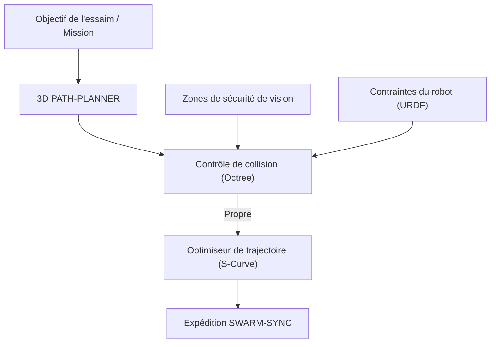

<p align="center">
  
</p>

# 🗺️ HYDRA-UMC-PATH-PLANNER-3D

<p align="center"><a href="README.md">🇺🇸 English</a> | <a href="README_spa.md">🇪🇸 Español</a> | 🇫🇷 <b>Français</b> | <a href="README_ita.md">🇮🇹 Italiano</a> | <a href="README_deu.md">🇩🇪 Deutsch</a> | <a href="README_zho.md">🇨🇳 简体中文</a> | <a href="README_jpn.md">🇯🇵 日本語</a></p>

### 📐 Optimiseur de trajectoire 3D multi-robot et moteur d'évitement de collision

<p align="left">
  
  
  
</p>

---

## 1. 🛠️ APERÇU TECHNIQUE

**HYDRA-UMC-PATH-PLANNER-3D** est l'intelligence de navigation centralisée pour l'essaim de robots. Il calcule des trajectoires sans collision pour plusieurs bras partageant le même espace de travail, en optimisant la vitesse, l'efficacité énergétique et la fluidité du mouvement.

Il intègre les données d'occupation en temps réel des nœuds de vision et les contraintes cinématiques du jumeau numérique (Digital Twin) pour garantir que les trajectoires planifiées sont physiquement réalisables et sûres.

### Caractéristiques principales :
* 📐 **Optimisation de la trajectoire de l'essaim :** Planification synchrone pour jusqu'à plus de 32 robots simultanément.
* 🛡️ **Évitement dynamique des collisions :** Reprogrammation en temps réel lorsque de nouveaux obstacles sont détectés.
* ⚡ **Performance optimisée :** Implémentation C++/Rust hautement parallélisée pour une génération de trajectoire en moins de 50 ms.
* 🔄 **G-Code & URDF natifs :** Analyse directement les commandes de mouvement industrielles et les modèles de robots.
* ⏱️ **Limite de temps réelle et validation de trajectoire (v0) :** `PlannerConfig.max_duration_ms` borne le temps de recherche par l'horloge réelle, indépendamment de `max_iterations`. Une nouvelle sous-commande `validate` revérifie une trajectoire déjà calculée (mise en cache, rejouée ou modifiée à la main) par rapport aux obstacles/à l'espace de travail actuels avant qu'elle ne soit fiable pour une exécution réelle.

---

## 2. 🔄 FLUX DE TRAVAIL DE PLANIFICATION



---

## 3. 🧱 ARCHITECTURE & DÉCISIONS DE CONCEPTION

* **Pourquoi la planification 3D sans collision est un service à part.** La recherche de trajectoire sur une scène 3D en direct (chaque robot, outil et obstacle de la cellule) est gourmande en CPU et sensible à la latence d'une manière différente de la planification de tâches elle-même - l'isoler signifie qu'une requête de planification lente ne bloque jamais HYDRA-UMC-JOB-DISPATCHER dans l'attribution d'un autre travail.
* **Pourquoi elle valide contre HYDRA-UMC-TWIN avant l'exécution réelle.** Une trajectoire planifiée est d'abord vérifiée dans la propre simulation physique du jumeau numérique - détectant une trajectoire géométriquement valide mais physiquement inatteignable (limites de couple, singularités) avant qu'elle n'atteigne jamais un bras réel.
* **Pourquoi la recherche est un RRT simple aujourd'hui, pas un RRT\* ni un coordinateur multi-robot.** `src/rrt.rs` implémente une véritable recherche Rapidly-exploring Random Tree, testée - un seul agent, un ensemble d'obstacles statique, un résultat véritablement sans collision (chaque trajectoire retournée est vérifiée dégagée dans les tests, pas seulement plausible). Le RRT\* (une passe de recâblage améliorant l'optimalité) et la vraie planification multi-robot synchronisée (les « jusqu'à 32+ robots simultanément » de ce README) sont un vrai travail futur, délibérément hors périmètre - voir `mejoras_futuras.txt` pour la raison de prouver d'abord la recherche à un seul agent, plutôt que de construire les trois à la fois et de les déboguer ensemble.
* **Pourquoi les obstacles sont des sphères, pas un octree de maillages arbitraires.** Une sphère est le primitif de collision 3D le plus simple qui reste réel et géométriquement correct - pas un substitut de type boîte englobante pour quelque chose de plus détaillé. Un octree/BVH ne commence à compter que lorsqu'une scène a assez de collisionneurs pour que la vérification par force brute devienne le goulot d'étranglement - la cellule d'essaim d'aujourd'hui (une poignée de bras et de zones de sécurité statiques) n'en est pas là.
* **Pourquoi ceci est une CLI sur un fichier de scénario JSON aujourd'hui, pas un service réseau.** Choisir entre HTTP et le contrat gRPC partagé de l'écosystème (`hydra.common.v1`, voir `HYDRA-UMC-ORCHESTRATOR/proto/`) est une vraie décision de protocole qui mérite sa propre passe une fois que HYDRA-UMC-JOB-DISPATCHER sera réellement prêt à appeler ce service - voir `mejoras_futuras.txt`. La CLI est déjà réellement utilisable aujourd'hui (`run.bat scenarios/example.json`), elle n'est simplement pas encore connectée au réseau.
* **Comment cela s'intègre dans le reste de l'écosystème.** Un service frère sous HYDRA-UMC-ORCHESTRATOR - planifie les trajectoires que les tâches assignées par HYDRA-UMC-JOB-DISPATCHER suivent réellement, contre-vérifiées avec HYDRA-UMC-TWIN avant que quoi que ce soit ne bouge pour de vrai.
* **Pourquoi `max_duration_ms` est une vérification de l'horloge réelle, pas juste un `max_iterations` plus bas.** Le nombre d'itérations seul ne peut pas borner le temps réel : une scène avec des obstacles plus denses rend les vérifications de collision de chaque itération proportionnellement plus lentes, donc le même budget d'itérations peut prendre un temps réel très différent sur une scène pathologique par rapport à une scène ouverte. Un appel au planificateur dans une boucle de contrôle temps réel a besoin d'un vrai budget de temps, pas d'un substitut.
* **Pourquoi `validate` est une nouvelle sous-commande plutôt qu'un changement de ce que renvoie `plan()`.** `rrt::plan()` ne renvoie déjà que des trajectoires construites sans collision - il n'y a rien à corriger là. `validate_path()`/la sous-commande `validate` existe pour des trajectoires qui NE proviennent PAS d'un appel `plan()` frais dans ce processus : une trajectoire mise en cache/rejouée, une relayée par un autre processus, un scénario modifié à la main - où l'ensemble d'obstacles a pu changer depuis le calcul de la trajectoire. Le même motif utilisé dans tout l'écosystème : un nouveau point d'entrée protégé ajouté à côté d'une primitive de bas niveau inchangée.

---

## 📂 STRUCTURE DES RÉPERTOIRES

```text
HYDRA-UMC-PATH-PLANNER-3D/
├── src/
│   ├── main.rs       # Point d'entrée CLI : charge un scénario, planifie, imprime le JSON
│   ├── geometry.rs   # Vec3 - l'algèbre vectorielle 3D minimale nécessaire
│   ├── obstacle.rs   # Obstacles sphériques + vérifications de collision
│   ├── rng.rs        # PRNG déterministe sans dépendance (xorshift64*)
│   ├── rrt.rs        # Le véritable planificateur : recherche RRT, Workspace, PlannerConfig
│   └── validate.rs   # Revérification réelle de sécurité d'une trajectoire déjà calculée
├── scenarios/        # Scénarios JSON d'exemple (voir BUILD & RUN ci-dessous)
├── build/            # Binaires compilés (sortie de build.sh/build.bat)
├── Cargo.toml        # Manifeste du paquet Rust (nom, version, dépendances)
├── bump_version.py   # Incrément de version type compteur kilométrique
├── build.sh/.bat     # Incrémente la version puis `cargo build --release`
├── run.sh/.bat       # Exécute le binaire compilé
└── README.md
```

Élagué du modèle original : `hardware/`, `firmware/`, `os/`, `docs/`,
`images/` et `scripts/` — il s'agit d'un service purement logiciel
(binaire Rust) sans matériel ni firmware propres, sans image de système
d'exploitation à maintenir, et sans contenu de documentation/médias/
scripts utilitaires encore suffisant pour justifier leurs propres
dossiers.

---

## 🔧 BUILD & RUN

Une véritable recherche de trajectoire sans collision, pas seulement un
squelette qui compile : elle planifie une route à partir d'un fichier de
scénario JSON et affiche le résultat.

```bash
# Windows
build.bat
run.bat scenarios/example.json

# Linux / macOS
./build.sh
./run.sh scenarios/example.json
```

`build.sh`/`build.bat` incrémentent la version dans `Cargo.toml` (règle du
compteur kilométrique de l'écosystème, voir `bump_version.py`) puis exécutent
`cargo build --release`. `run.sh`/`run.bat` exécutent directement le binaire
résultant, en transmettant tout argument (le chemin du scénario).

Un scénario est un fichier JSON avec `start`, `goal`, `obstacles` (une
liste de sphères `{center, radius}`), un `workspace` (bornes
`min`/`max`), et optionnellement `seed` (la recherche est entièrement
déterministe par graine) et `config` (`max_iterations`, `step_size`,
`goal_bias`, `goal_threshold`, `robot_radius`, `max_duration_ms` - tous
optionnels, avec des valeurs par défaut raisonnables sinon ;
`max_duration_ms` borne le temps de recherche par l'horloge réelle,
indépendamment de `max_iterations`). Le résultat est affiché en JSON :
`{"status": "ok", "path": [...]}` ou
`{"status": "error", "reason": "..."}` (`start_inside_obstacle`,
`goal_outside_workspace`, `no_path_found`, `time_limit_exceeded`, etc. -
voir le `PlanError` de `src/rrt.rs` pour la liste complète et honnête, y
compris le cas où aucune trajectoire n'existe du tout, pas seulement une
que la recherche n'a pas trouvée à temps).

Une seconde sous-commande réelle revérifie une trajectoire déjà calculée
(un simple tableau JSON de points `{x, y, z}`) par rapport aux
obstacles/à l'espace de travail actuels d'un scénario, sans relancer de
recherche :

```bash
./run.sh validate scenarios/example.json path.json
# {"status": "safe"}
# ou : {"status": "unsafe", "issues": [{"SegmentIntersectsObstacle": {"from_index": 0, "to_index": 1}}]}
```

```bash
cargo test   # geometrie + collision d'obstacles, le PRNG, le
             # planificateur RRT (y compris sa vraie limite de temps par
             # horloge) et la revérification de sécurité de validate.rs -
             # 28 tests au total
```

---

## 🚀 ROADMAP
* **Phase 1 :** Synchronisation déterministe d'essaim sur TSN et réduction de la gigue sub-ms.
* **Phase 2 :** Planification de trajectoires 3D avec évitement dynamique d'obstacles dans les cellules multi-robots.
* **Phase 3 :** Optimisation de la répartition des tâches multi-robots à l'aide de la disponibilité des ressources en temps réel.
* **Phase 4 :** Prise en charge de la planification de trajectoire de base mobile non holonome (JuanenBOT) et intégration de flotte hétérogène.

---

## 🔗 Projets Liés

Ce projet fait partie d'un écosystème robotique plus large du même auteur (JuanenRac / Electro Hobby 3D), couvrant firmware, logiciel de contrôle, nœuds IA et outillage de flotte. Bon à savoir, car une demande pourrait en réalité concerner l'un de ces projets plutôt que ce dépôt.

### Famille

**Parent :** **[HYDRA-UMC-ORCHESTRATOR](https://github.com/JuanenRac/HYDRA-UMC-ORCHESTRATOR)** — le parent d'intégration que sert ce planificateur.

**Frères et sœurs :**
- **[HYDRA-UMC-SWARM-SYNC](https://github.com/JuanenRac/HYDRA-UMC-SWARM-SYNC)** — service d'orchestration frère, même parent.
- **[HYDRA-UMC-JOB-DISPATCHER](https://github.com/JuanenRac/HYDRA-UMC-JOB-DISPATCHER)** — service d'orchestration frère, même parent.
- **[HYDRA-UMC-NODE-HEALING](https://github.com/JuanenRac/HYDRA-UMC-NODE-HEALING)** — service d'orchestration frère, même parent.

### Relation Directe (hors de la famille)

- **[HYDRA-UMC-TWIN](https://github.com/JuanenRac/HYDRA-UMC-TWIN)** — valide les trajectoires planifiées dans le jumeau numérique avant de les exécuter.

### Reste de l'Écosystème

**Plateforme HYDRA-UMC** — la cellule de micro-usine multi-robot
- **[HYDRA-UMC](https://github.com/JuanenRac/HYDRA-UMC)** — la carte mère CM5 + STM32H745 orchestrant jusqu'à 8 bras robotiques.
- **[HYDRA-UMC-SERVER](https://github.com/JuanenRac/HYDRA-UMC-SERVER)** — le backend Express/WebSocket auquel parle chaque client de contrôle.
- **[HYDRA-UMC-STUDIO](https://github.com/JuanenRac/HYDRA-UMC-STUDIO)** — tableau de bord de contrôle web, visualisation 3D multi-robot.
- **[HYDRA-UMC-ANDROID-CONTROL](https://github.com/JuanenRac/HYDRA-UMC-ANDROID-CONTROL)** — application de contrôle Android via Wi-Fi/Bluetooth.
- **[HYDRA-UMC-IOS-CONTROL](https://github.com/JuanenRac/HYDRA-UMC-IOS-CONTROL)** — application de contrôle iOS/iPadOS construite en Flutter.
- **[HYDRA-UMC-SUITE](https://github.com/JuanenRac/HYDRA-UMC-SUITE)** — centre de commande d'essaim de bureau (Python/PySide6).
- **[HYDRA-UMC-EDITOR-URDF](https://github.com/JuanenRac/HYDRA-UMC-EDITOR-URDF)** — éditeur de modèles URDF de bureau pour le catalogue de robots.
- **[HYDRA-UMC-DSI](https://github.com/JuanenRac/HYDRA-UMC-DSI)** — interface tactile native pour l'écran DSI embarqué.

**Plateforme URTC** — le contrôleur de tête d'outil que porte chaque bras HYDRA-UMC
- **[URTC](https://github.com/JuanenRac/URTC)** — contrôleur de tête d'outil sur bus CAN, 25 profils d'outil.
- **[URTC-FLASHER](https://github.com/JuanenRac/URTC-FLASHER)** — outil de bureau de flashage CAN-OTA + SWD/JTAG.
- **[URTC-TESTER](https://github.com/JuanenRac/URTC-TESTER)** — outil de bureau de diagnostic CAN en direct.
- **[URTC-WEB-STUDIO](https://github.com/JuanenRac/URTC-WEB-STUDIO)** — alternative basée navigateur via l'API Web Serial.

**🎥 Vision AI Node (Hailo-8)**
- [HYDRA-UMC-VISION-NODE](https://github.com/JuanenRac/HYDRA-UMC-VISION-NODE)
- [HYDRA-UMC-VISION-STREAMER](https://github.com/JuanenRac/HYDRA-UMC-VISION-STREAMER)
- [HYDRA-UMC-DETECTION-HEF](https://github.com/JuanenRac/HYDRA-UMC-DETECTION-HEF)
- [HYDRA-UMC-SAFETY-ZONES](https://github.com/JuanenRac/HYDRA-UMC-SAFETY-ZONES)
- [HYDRA-UMC-VISUAL-SERVOING-API](https://github.com/JuanenRac/HYDRA-UMC-VISUAL-SERVOING-API)

**🧠 Cognitive AI Node (Hailo-10)**
- [HYDRA-UMC-COGNITIVE-NODE](https://github.com/JuanenRac/HYDRA-UMC-COGNITIVE-NODE)
- [HYDRA-UMC-VLA-ENGINE](https://github.com/JuanenRac/HYDRA-UMC-VLA-ENGINE)
- [HYDRA-UMC-VOICE-UI](https://github.com/JuanenRac/HYDRA-UMC-VOICE-UI)
- [HYDRA-UMC-SEMANTIC-PLANNER](https://github.com/JuanenRac/HYDRA-UMC-SEMANTIC-PLANNER)
- [HYDRA-UMC-DOCS-QA](https://github.com/JuanenRac/HYDRA-UMC-DOCS-QA)

**🎮 Digital Twin & Simulation**
- [HYDRA-UMC-TWIN](https://github.com/JuanenRac/HYDRA-UMC-TWIN)
- [HYDRA-UMC-PHYSICS-REPLICA](https://github.com/JuanenRac/HYDRA-UMC-PHYSICS-REPLICA)
- [HYDRA-UMC-HIL-BRIDGE](https://github.com/JuanenRac/HYDRA-UMC-HIL-BRIDGE)
- [HYDRA-UMC-SYNTHETIC-DATA-GEN](https://github.com/JuanenRac/HYDRA-UMC-SYNTHETIC-DATA-GEN)

**📊 Data & Analytics**
- [HYDRA-UMC-DATALAKE](https://github.com/JuanenRac/HYDRA-UMC-DATALAKE)
- [HYDRA-UMC-TELEMETRY-COLLECTOR](https://github.com/JuanenRac/HYDRA-UMC-TELEMETRY-COLLECTOR)
- [HYDRA-UMC-ANOMALY-DETECTOR](https://github.com/JuanenRac/HYDRA-UMC-ANOMALY-DETECTOR)
- [HYDRA-UMC-PRODUCTION-REPORTS](https://github.com/JuanenRac/HYDRA-UMC-PRODUCTION-REPORTS)

**🏭 Industrial Gateway**
- [HYDRA-UMC-GATEWAY-INDUSTRIAL](https://github.com/JuanenRac/HYDRA-UMC-GATEWAY-INDUSTRIAL)
- [HYDRA-UMC-OPCUA-SERVER](https://github.com/JuanenRac/HYDRA-UMC-OPCUA-SERVER)
- [HYDRA-UMC-MQTT-BROKER](https://github.com/JuanenRac/HYDRA-UMC-MQTT-BROKER)
- [HYDRA-UMC-MTCONNECT-ADAPTER](https://github.com/JuanenRac/HYDRA-UMC-MTCONNECT-ADAPTER)

**🛠️ Complementary Tools**
- [URTC-SMART-RACK](https://github.com/JuanenRac/URTC-SMART-RACK)
- [URTC-VISION-TOOL](https://github.com/JuanenRac/URTC-VISION-TOOL)
- [HYDRA-UMC-WATCH](https://github.com/JuanenRac/HYDRA-UMC-WATCH)
- [HYDRA-UMC-TOOL-CLI](https://github.com/JuanenRac/HYDRA-UMC-TOOL-CLI)
- [HYDRA-UMC-DASHBOARD-AI](https://github.com/JuanenRac/HYDRA-UMC-DASHBOARD-AI)


## 👤 AUTEUR
**JuanenRac** (Electro Hobby 3D)
📧 electrohobby3d@gmail.com

## 📜 LICENCE
GPL-3.0 - Voir le fichier LICENSE pour plus de détails.
