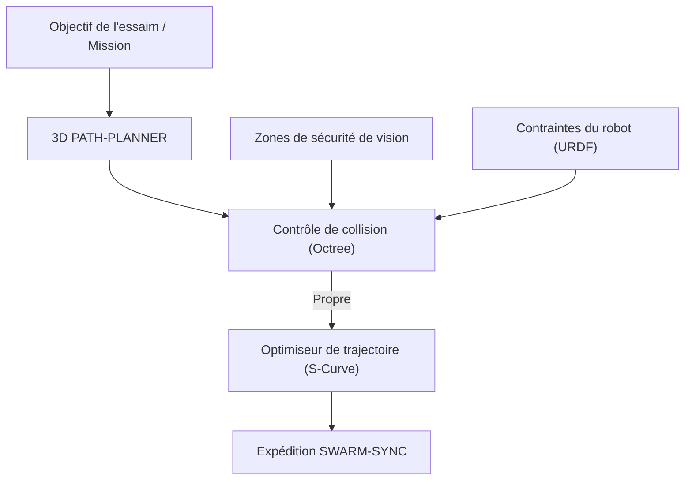

<p align="center">
  
</p>

# 🗺️ HYDRA-UMC-PATH-PLANNER-3D

<p align="center"><a href="README.md">🇺🇸 English</a> | <a href="README_spa.md">🇪🇸 Español</a> | 🇫🇷 <b>Français</b> | <a href="README_ita.md">🇮🇹 Italiano</a> | <a href="README_deu.md">🇩🇪 Deutsch</a> | <a href="README_zho.md">🇨🇳 简体中文</a> | <a href="README_jpn.md">🇯🇵 日本語</a></p>

### 📐 Optimiseur de trajectoire 3D multi-robot et moteur d'évitement de collision

<p align="left">
  
  
  
</p>

---

## 1. 🛠️ APERÇU TECHNIQUE

**HYDRA-UMC-PATH-PLANNER-3D** est l'intelligence de navigation centralisée pour l'essaim de robots. Il calcule des trajectoires sans collision pour plusieurs bras partageant le même espace de travail, en optimisant la vitesse, l'efficacité énergétique et la fluidité du mouvement.

Il intègre les données d'occupation en temps réel des nœuds de vision et les contraintes cinématiques du jumeau numérique (Digital Twin) pour garantir que les trajectoires planifiées sont physiquement réalisables et sûres.

### Caractéristiques principales :
* 📐 **Optimisation de la trajectoire de l'essaim :** Planification synchrone pour jusqu'à plus de 32 robots simultanément.
* 🛡️ **Évitement dynamique des collisions :** Reprogrammation en temps réel lorsque de nouveaux obstacles sont détectés.
* ⚡ **Performance optimisée :** Implémentation C++/Rust hautement parallélisée pour une génération de trajectoire en moins de 50 ms.
* 🔄 **G-Code & URDF natifs :** Analyse directement les commandes de mouvement industrielles et les modèles de robots.
* ⏱️ **Limite de temps réelle et validation de trajectoire (v0) :** `PlannerConfig.max_duration_ms` borne le temps de recherche par l'horloge réelle, indépendamment de `max_iterations`. Une nouvelle sous-commande `validate` revérifie une trajectoire déjà calculée (mise en cache, rejouée ou modifiée à la main) par rapport aux obstacles/à l'espace de travail actuels avant qu'elle ne soit fiable pour une exécution réelle.

---

## 2. 🔄 FLUX DE TRAVAIL DE PLANIFICATION



---

## 3. 🧱 ARCHITECTURE & DÉCISIONS DE CONCEPTION

* **Pourquoi la planification 3D sans collision est un service à part.** La recherche de trajectoire sur une scène 3D en direct (chaque robot, outil et obstacle de la cellule) est gourmande en CPU et sensible à la latence d'une manière différente de la planification de tâches elle-même - l'isoler signifie qu'une requête de planification lente ne bloque jamais HYDRA-UMC-JOB-DISPATCHER dans l'attribution d'un autre travail.
* **Pourquoi elle valide contre HYDRA-UMC-TWIN avant l'exécution réelle.** Une trajectoire planifiée est d'abord vérifiée dans la propre simulation physique du jumeau numérique - détectant une trajectoire géométriquement valide mais physiquement inatteignable (limites de couple, singularités) avant qu'elle n'atteigne jamais un bras réel.
* **Pourquoi la recherche est un RRT simple aujourd'hui, pas un RRT\* ni un coordinateur multi-robot.** `src/rrt.rs` implémente une véritable recherche Rapidly-exploring Random Tree, testée - un seul agent, un ensemble d'obstacles statique, un résultat véritablement sans collision (chaque trajectoire retournée est vérifiée dégagée dans les tests, pas seulement plausible). Le RRT\* (une passe de recâblage améliorant l'optimalité) et la vraie planification multi-robot synchronisée (les « jusqu'à 32+ robots simultanément » de ce README) sont un vrai travail futur, délibérément hors périmètre - voir `mejoras_futuras.txt` pour la raison de prouver d'abord la recherche à un seul agent, plutôt que de construire les trois à la fois et de les déboguer ensemble.
* **Pourquoi les obstacles sont des sphères, pas un octree de maillages arbitraires.** Une sphère est le primitif de collision 3D le plus simple qui reste réel et géométriquement correct - pas un substitut de type boîte englobante pour quelque chose de plus détaillé. Un octree/BVH ne commence à compter que lorsqu'une scène a assez de collisionneurs pour que la vérification par force brute devienne le goulot d'étranglement - la cellule d'essaim d'aujourd'hui (une poignée de bras et de zones de sécurité statiques) n'en est pas là.
* **Pourquoi ceci est une CLI sur un fichier de scénario JSON aujourd'hui, pas un service réseau.** Choisir entre HTTP et le contrat gRPC partagé de l'écosystème (`hydra.common.v1`, voir `HYDRA-UMC-ORCHESTRATOR/proto/`) est une vraie décision de protocole qui mérite sa propre passe une fois que HYDRA-UMC-JOB-DISPATCHER sera réellement prêt à appeler ce service - voir `mejoras_futuras.txt`. La CLI est déjà réellement utilisable aujourd'hui (`run.bat scenarios/example.json`), elle n'est simplement pas encore connectée au réseau.
* **Comment cela s'intègre dans le reste de l'écosystème.** Un service frère sous HYDRA-UMC-ORCHESTRATOR - planifie les trajectoires que les tâches assignées par HYDRA-UMC-JOB-DISPATCHER suivent réellement, contre-vérifiées avec HYDRA-UMC-TWIN avant que quoi que ce soit ne bouge pour de vrai.
* **Pourquoi `max_duration_ms` est une vérification de l'horloge réelle, pas juste un `max_iterations` plus bas.** Le nombre d'itérations seul ne peut pas borner le temps réel : une scène avec des obstacles plus denses rend les vérifications de collision de chaque itération proportionnellement plus lentes, donc le même budget d'itérations peut prendre un temps réel très différent sur une scène pathologique par rapport à une scène ouverte. Un appel au planificateur dans une boucle de contrôle temps réel a besoin d'un vrai budget de temps, pas d'un substitut.
* **Pourquoi `validate` est une nouvelle sous-commande plutôt qu'un changement de ce que renvoie `plan()`.** `rrt::plan()` ne renvoie déjà que des trajectoires construites sans collision - il n'y a rien à corriger là. `validate_path()`/la sous-commande `validate` existe pour des trajectoires qui NE proviennent PAS d'un appel `plan()` frais dans ce processus : une trajectoire mise en cache/rejouée, une relayée par un autre processus, un scénario modifié à la main - où l'ensemble d'obstacles a pu changer depuis le calcul de la trajectoire. Le même motif utilisé dans tout l'écosystème : un nouveau point d'entrée protégé ajouté à côté d'une primitive de bas niveau inchangée.

---

## 📂 STRUCTURE DES RÉPERTOIRES

```text
HYDRA-UMC-PATH-PLANNER-3D/
├── src/
│   ├── main.rs       # Point d'entrée CLI : charge un scénario, planifie, imprime le JSON
│   ├── geometry.rs   # Vec3 - l'algèbre vectorielle 3D minimale nécessaire
│   ├── obstacle.rs   # Obstacles sphériques + vérifications de collision
│   ├── rng.rs        # PRNG déterministe sans dépendance (xorshift64*)
│   ├── rrt.rs        # Le véritable planificateur : recherche RRT, Workspace, PlannerConfig
│   ├── validate.rs   # Revérification réelle de sécurité d'une trajectoire déjà calculée
│   └── corpus.rs     # Tests uniquement : jeux de scénarios obstacle/workspace
│                        réutilisables, partagés par les tests de rrt.rs et validate.rs
├── scenarios/        # Scénarios JSON d'exemple (voir BUILD ET EXÉCUTION ci-dessous)
├── docs/
│   └── CLI_REFERENCE.md  # Référence des options de ligne de commande
├── images/           # Médias et diagrammes
├── tools/
│   └── ci_validate.py   # Validation manifest/CHANGELOG/docs utilisée par la CI
├── build/            # Binaires compilés (sortie de build.sh/build.bat)
├── Cargo.toml        # Manifeste du paquet Rust (nom, version, dépendances)
├── bump_version.py   # Incrément de version type compteur kilométrique
├── bump_manifest_version.py  # Synchronise la version de hydra-umc.project.json avec la version native (--sync)
├── build.sh/.bat     # Incrémente la version puis `cargo build --release`
├── run.sh/.bat       # Exécute le binaire compilé
└── README.md
```

Élagué du modèle original : `hardware/`, `firmware/` et `os/` — il
s'agit d'un service purement logiciel (binaire Rust) sans matériel ni
firmware propres et sans image de système d'exploitation à maintenir.

---

## 🔧 BUILD ET EXÉCUTION

Une véritable recherche de trajectoire sans collision, pas seulement un
squelette qui compile : elle planifie une route à partir d'un fichier de
scénario JSON et affiche le résultat.

```bash
# Windows
build.bat
run.bat scenarios/example.json

# Linux / macOS
./build.sh
./run.sh scenarios/example.json
```

`build.sh`/`build.bat` incrémentent la version dans `Cargo.toml` (règle du
compteur kilométrique de l'écosystème, voir `bump_version.py`) puis exécutent
`cargo build --release`. `run.sh`/`run.bat` exécutent directement le binaire
résultant, en transmettant tout argument (le chemin du scénario).

Un scénario est un fichier JSON avec `start`, `goal`, `obstacles` (une
liste de sphères `{center, radius}`), un `workspace` (bornes
`min`/`max`), et optionnellement `seed` (la recherche est entièrement
déterministe par graine) et `config` (`max_iterations`, `step_size`,
`goal_bias`, `goal_threshold`, `robot_radius`, `max_duration_ms` - tous
optionnels, avec des valeurs par défaut raisonnables sinon ;
`max_duration_ms` borne le temps de recherche par l'horloge réelle,
indépendamment de `max_iterations`). Le résultat est affiché en JSON :
`{"status": "ok", "path": [...]}` ou
`{"status": "error", "reason": "..."}` (`start_inside_obstacle`,
`goal_outside_workspace`, `no_path_found`, `time_limit_exceeded`, etc. -
voir le `PlanError` de `src/rrt.rs` pour la liste complète et honnête, y
compris le cas où aucune trajectoire n'existe du tout, pas seulement une
que la recherche n'a pas trouvée à temps).

Une seconde sous-commande réelle revérifie une trajectoire déjà calculée
(un simple tableau JSON de points `{x, y, z}`) par rapport aux
obstacles/à l'espace de travail actuels d'un scénario, sans relancer de
recherche :

```bash
./run.sh validate scenarios/example.json path.json
# {"status": "safe"}
# ou : {"status": "unsafe", "issues": [{"SegmentIntersectsObstacle": {"from_index": 0, "to_index": 1}}]}
```

```bash
cargo test   # geometrie + collision d'obstacles, le PRNG, le
             # planificateur RRT (y compris sa vraie limite de temps par
             # horloge) et la revérification de sécurité de validate.rs -
             # 28 tests au total
```

---

## 🚀 FEUILLE DE ROUTE
* **Phase 1 :** Synchronisation déterministe d'essaim sur TSN et réduction de la gigue sub-ms.
* **Phase 2 :** Planification de trajectoires 3D avec évitement dynamique d'obstacles dans les cellules multi-robots.
* **Phase 3 :** Optimisation de la répartition des tâches multi-robots à l'aide de la disponibilité des ressources en temps réel.
* **Phase 4 :** Prise en charge de la planification de trajectoire de base mobile non holonome (JuanenBOT) et intégration de flotte hétérogène.

---

## 🔗 Projets Liés

Ce projet fait partie de l'écosystème robotique HYDRA-UMC du même auteur (JuanenRac / Electro Hobby 3D). Bon à savoir, car une demande pourrait en réalité concerner l'un de ceux-ci plutôt que ce dépôt.

**Projet Parent**
- **[HYDRA-UMC-ORCHESTRATOR](https://github.com/JuanenRac/HYDRA-UMC-ORCHESTRATOR)** — hub d'intégration avec un vrai contrat de rapport de santé gRPC/Protobuf et une machine à états de mission ; le parent dont ce dépôt est un service d'orchestration spécifique, au sein de sa propre couche de coordination d'essaim.

**Projets Frères** — les autres services d'orchestration de la propre couche de coordination d'essaim de HYDRA-UMC-ORCHESTRATOR
- **[HYDRA-UMC-SWARM-SYNC](https://github.com/JuanenRac/HYDRA-UMC-SWARM-SYNC)** — vraie synchronisation d'état CRDT LWW-Element-Map, testée par propriétés pour la convergence multi-cellule.
- **[HYDRA-UMC-JOB-DISPATCHER](https://github.com/JuanenRac/HYDRA-UMC-JOB-DISPATCHER)** — vraie file de tâches basée sur la priorité avec déduplication, via une vraie API HTTP.
- **[HYDRA-UMC-NODE-HEALING](https://github.com/JuanenRac/HYDRA-UMC-NODE-HEALING)** — vrai chien de garde de santé de flotte basé sur gRPC, avec retry/backoff et détection d'incohérence d'identité.

**Directement Liés**
- **[HYDRA-UMC-TWIN](https://github.com/JuanenRac/HYDRA-UMC-TWIN)** — hub d'intégration pour le moteur de jumeau numérique, avec un vrai contrat de synchronisation par compatibilité de version — valide les propres itinéraires planifiés par ce planificateur dans le jumeau numérique avant leur exécution.

**Fait Également Partie de l'Écosystème**

*Matériel & Plateforme de Base*
- **[HYDRA-UMC](https://github.com/JuanenRac/HYDRA-UMC)** — la carte mère physique du bras robotique : hôte CM5 + coprocesseur STM32H745 double cœur, coordonnant jusqu'à 8 bras-outils via CAN-OTA/SPI-OTA.
- **[HYDRA-UMC-OS](https://github.com/JuanenRac/HYDRA-UMC-OS)** — couche produit reproductible sur Raspberry Pi OS pour le CM5 : agent en lecture seule, config/profils validés, provisionnement WiFi de premier contact.
- **[HYDRA-UMC-SDK](https://github.com/JuanenRac/HYDRA-UMC-SDK)** — le contrat JSON-Schema partagé et la barrière de sécurité contre laquelle chaque bridge valide ses commandes.

*Backend Central & Clients*
- **[HYDRA-UMC-SERVER](https://github.com/JuanenRac/HYDRA-UMC-SERVER)** — le vrai backend headless (REST/WebSocket) auquel parle réellement chaque client de contrôle.
- **[HYDRA-UMC-STUDIO](https://github.com/JuanenRac/HYDRA-UMC-STUDIO)** — tableau de bord de contrôle web avec visualisation 3D multi-robot en temps réel.
- **[HYDRA-UMC-SUITE](https://github.com/JuanenRac/HYDRA-UMC-SUITE)** — centre de commande d'essaim de bureau (PySide6) pour plusieurs serveurs à la fois, empaqueté en exécutable autonome.
- **[HYDRA-UMC-ANDROID-CONTROL](https://github.com/JuanenRac/HYDRA-UMC-ANDROID-CONTROL)** — application de contrôle Android native avec connexion biométrique et un compagnon Wear OS jumelé.
- **[HYDRA-UMC-IOS-CONTROL](https://github.com/JuanenRac/HYDRA-UMC-IOS-CONTROL)** — application de contrôle iOS/iPadOS (Flutter) avec synchronisation WebSocket en temps réel.
- **[HYDRA-UMC-DSI](https://github.com/JuanenRac/HYDRA-UMC-DSI)** — interface tactile native pour l'écran tactile DSI 7" embarqué, intégrée directement sur le CM5.
- **[HYDRA-UMC-EDITOR-URDF](https://github.com/JuanenRac/HYDRA-UMC-EDITOR-URDF)** — créateur/éditeur graphique de bureau pour URDF qui envoie les modèles terminés vers le propre catalogue de STUDIO.
- **[HYDRA-UMC-BRIDGE-AMR](https://github.com/JuanenRac/HYDRA-UMC-BRIDGE-AMR)** — frontière de coordination pour les flottes AGV/AMR via un éditeur MQTT VDA 5050 réel.
- **[HYDRA-UMC-BRIDGE-CNC](https://github.com/JuanenRac/HYDRA-UMC-BRIDGE-CNC)** — coordinateur haut niveau pour cellules CNC avec accès réel au statut/octets de contrôle GRBL.
- **[HYDRA-UMC-BRIDGE-DROIDS](https://github.com/JuanenRac/HYDRA-UMC-BRIDGE-DROIDS)** — frontière de coordination pour droïdes à pattes/humanoïdes, avec un véritable émetteur de commandes Boston Dynamics Spot.
- **[HYDRA-UMC-BRIDGE-LASER](https://github.com/JuanenRac/HYDRA-UMC-BRIDGE-LASER)** — coordinateur de sécurité pour cellules laser lisant 3 vraies sécurités GPIO de clé/enceinte/verrouillage.
- **[HYDRA-UMC-BRIDGE-OPENPNP](https://github.com/JuanenRac/HYDRA-UMC-BRIDGE-OPENPNP)** — coordinateur haut niveau sûr pour le flux de cartes du pick-and-place OpenPnP.
- **[HYDRA-UMC-BRIDGE-PRINTER3D](https://github.com/JuanenRac/HYDRA-UMC-BRIDGE-PRINTER3D)** — frontière de coordination sûre pour imprimantes 3D Moonraker/Klipper, avec de vraies commandes de tâche contrôlées.
- **[HYDRA-UMC-BRIDGE-ROS2](https://github.com/JuanenRac/HYDRA-UMC-BRIDGE-ROS2)** — coordinateur de sécurité avec un vrai transport ROS 2 rclpy à importation paresseuse.
- **[HYDRA-UMC-BRIDGE-UAV](https://github.com/JuanenRac/HYDRA-UMC-BRIDGE-UAV)** — frontière de coordination pour UAV équipés de caméra, avec un véritable émetteur de commandes MAVLink.

*Plateforme d'Outils URTC*
- **[URTC](https://github.com/JuanenRac/URTC)** — firmware pour la carte physique Universal Robot Tool Controller, plus de 25 profils d'outil sur bus CAN.
- **[URTC-FLASHER](https://github.com/JuanenRac/URTC-FLASHER)** — outil de bureau à interface graphique pour flasher les cartes URTC, CAN-OTA plus SWD/JTAG puce complète.
- **[URTC-TESTER](https://github.com/JuanenRac/URTC-TESTER)** — outil de bureau de diagnostic CAN-bus en direct pour cartes URTC, un panneau par profil d'outil.
- **[URTC-WEB-STUDIO](https://github.com/JuanenRac/URTC-WEB-STUDIO)** — alternative basée navigateur à URTC-TESTER via la Web Serial API, sans installation locale.

*Nœud IA de Vision (Hailo-8)*
- **[HYDRA-UMC-VISION-NODE](https://github.com/JuanenRac/HYDRA-UMC-VISION-NODE)** — hub d'intégration pour le pipeline de vision Hailo-8, avec une vraie vérification de disponibilité matérielle par étape.
- **[HYDRA-UMC-DETECTION-HEF](https://github.com/JuanenRac/HYDRA-UMC-DETECTION-HEF)** — registre réel de modèles compilés avec vérification de chargement sécurisé par architecture Hailo/checksum.
- **[HYDRA-UMC-VISION-STREAMER](https://github.com/JuanenRac/HYDRA-UMC-VISION-STREAMER)** — générateur réel de pipeline GStreamer + config MediaMTX, avec une vraie frontière d'intégration HailoRT.
- **[HYDRA-UMC-VISUAL-SERVOING-API](https://github.com/JuanenRac/HYDRA-UMC-VISUAL-SERVOING-API)** — vraie loi de correction Position-Based Visual Servoing, verrouillée sur l'état de zone en amont.
- **[HYDRA-UMC-SAFETY-ZONES](https://github.com/JuanenRac/HYDRA-UMC-SAFETY-ZONES)** — vraie vérification de violation de zone et demande d'E-STOP, avec application de la fraîcheur de calibration.

*Nœud IA Cognitif (Hailo-10)*
- **[HYDRA-UMC-COGNITIVE-NODE](https://github.com/JuanenRac/HYDRA-UMC-COGNITIVE-NODE)** — hub d'intégration pour le pipeline cognitif Hailo-10 (orchestration LLM/VLA/voix).
- **[HYDRA-UMC-VLA-ENGINE](https://github.com/JuanenRac/HYDRA-UMC-VLA-ENGINE)** — vrai encodage/décodage de jetons d'action et génération de trajectoire pour un modèle Vision-Language-Action.
- **[HYDRA-UMC-VOICE-UI](https://github.com/JuanenRac/HYDRA-UMC-VOICE-UI)** — vrai front-end vocal (VAD + analyseur d'intention) avec un relais Watch borné et soumis à confirmation.
- **[HYDRA-UMC-SEMANTIC-PLANNER](https://github.com/JuanenRac/HYDRA-UMC-SEMANTIC-PLANNER)** — vraie décomposition de tâches basée sur des règles et récupération sémantique d'erreurs sur les codes d'erreur MCU.
- **[HYDRA-UMC-DOCS-QA](https://github.com/JuanenRac/HYDRA-UMC-DOCS-QA)** — vraie recherche documentaire TF-IDF (bibliothèque standard uniquement) sur les propres documents Markdown de cet écosystème.

*Jumeau Numérique & Simulation*
- **[HYDRA-UMC-HIL-BRIDGE](https://github.com/JuanenRac/HYDRA-UMC-HIL-BRIDGE)** — vrai verrouillage de sécurité hardware-in-the-loop routant les commandes entre simulation et matériel réel.
- **[HYDRA-UMC-PHYSICS-REPLICA](https://github.com/JuanenRac/HYDRA-UMC-PHYSICS-REPLICA)** — vraie cinématique directe et validation des limites articulaires sur un vrai sous-ensemble URDF.
- **[HYDRA-UMC-SYNTHETIC-DATA-GEN](https://github.com/JuanenRac/HYDRA-UMC-SYNTHETIC-DATA-GEN)** — vrai générateur procédural de scènes 2D avec export d'annotations YOLO/COCO.

*Données & Analytique*
- **[HYDRA-UMC-DATALAKE](https://github.com/JuanenRac/HYDRA-UMC-DATALAKE)** — vrai magasin de séries temporelles basé sur sqlite3, avec une vraie API HTTP d'ingestion/requête.
- **[HYDRA-UMC-ANOMALY-DETECTOR](https://github.com/JuanenRac/HYDRA-UMC-ANOMALY-DETECTOR)** — vrai détecteur d'anomalies FFT + ligne de base statistique, avec surveillance de dérive.
- **[HYDRA-UMC-PRODUCTION-REPORTS](https://github.com/JuanenRac/HYDRA-UMC-PRODUCTION-REPORTS)** — vrai calcul OEE/disponibilité sur l'historique de DATALAKE, avec export CSV reproductible.
- **[HYDRA-UMC-TELEMETRY-COLLECTOR](https://github.com/JuanenRac/HYDRA-UMC-TELEMETRY-COLLECTOR)** — vrai pipeline d'ingestion CAN/WebSocket vers DATALAKE, avec déduplication par séquence.

*Passerelle Industrielle*
- **[HYDRA-UMC-GATEWAY-INDUSTRIAL](https://github.com/JuanenRac/HYDRA-UMC-GATEWAY-INDUSTRIAL)** — hub d'intégration relayant vers les protocoles industriels, avec une vraie couche de liste blanche de commandes/contre-pression.
- **[HYDRA-UMC-OPCUA-SERVER](https://github.com/JuanenRac/HYDRA-UMC-OPCUA-SERVER)** — vrai espace d'adressage OPC-UA, vérifié avec une vraie session client du protocole binaire.
- **[HYDRA-UMC-MQTT-BROKER](https://github.com/JuanenRac/HYDRA-UMC-MQTT-BROKER)** — vrai broker MQTT avec authentification par client optionnelle et ACL de sujets.
- **[HYDRA-UMC-MTCONNECT-ADAPTER](https://github.com/JuanenRac/HYDRA-UMC-MTCONNECT-ADAPTER)** — vrais points de terminaison XML MTConnect `/probe` et `/current`, avec sortie en mode dégradé.

*Outils Complémentaires & Opérations de l'Écosystème*
- **[HYDRA-UMC-DASHBOARD-AI](https://github.com/JuanenRac/HYDRA-UMC-DASHBOARD-AI)** — panneaux Smart Summaries et Anomaly Highlighting sur DATALAKE/ANOMALY-DETECTOR, avec un repli statistique honnête.
- **[HYDRA-UMC-TOOL-CLI](https://github.com/JuanenRac/HYDRA-UMC-TOOL-CLI)** — CLI de flotte avec un vrai contrat de codes de sortie stable, un vrai client en direct de la propre API de HYDRA-UMC-SERVER.
- **[HYDRA-UMC-WATCH](https://github.com/JuanenRac/HYDRA-UMC-WATCH)** — application compagnon WearOS avec de vraies alertes haptiques et un relais vocal vers le téléphone jumelé.
- **[URTC-SMART-RACK](https://github.com/JuanenRac/URTC-SMART-RACK)** — firmware pour un rack de montage de cartes avec décodage réel d'ID d'outil et logique de préchauffage Smart Idle.
- **[URTC-VISION-TOOL](https://github.com/JuanenRac/URTC-VISION-TOOL)** — firmware plus un vrai compagnon de vision Python pour une tête d'outil d'inspection thermique/RGB.
- **[HYDRA-UMC-UPDATER](https://github.com/JuanenRac/HYDRA-UMC-UPDATER)** — outil administratif de bureau qui découvre, clone et met à jour chaque dépôt de cet écosystème.
- **[HYDRA-UMC-OS-REBUILDER](https://github.com/JuanenRac/HYDRA-UMC-OS-REBUILDER)** — outil de bureau Windows/Linux qui construit une image de la CM5 prête à graver, préchargée avec les versions les plus actuelles de l'écosystème, avec une configuration de premier démarrage Wi-Fi/utilisateur/SSH façon Raspberry Pi Imager.


---

## 📚 Documentation & Communauté

- **[CONTRIBUTING.md](CONTRIBUTING.md)** — pile technologique et lignes directrices de codage pour une pull request.
- **[CODE_OF_CONDUCT.md](CODE_OF_CONDUCT.md)** — les normes de comportement attendues dans cette communauté.
- **[SECURITY.md](SECURITY.md)** — comment signaler une vulnérabilité, et les véritables axes de sécurité de ce projet.
- **[SUPPORT.md](SUPPORT.md)** — où poser des questions et signaler des bugs.
- **[LICENSE.md](LICENSE.md)** — la licence propre de ce projet.

## 👤 AUTEUR
**JuanenRac** (Electro Hobby 3D)
📧 electrohobby3d@gmail.com
📺 [youtube.com/@electrohobby3d](https://youtube.com/@electrohobby3d)

## 📜 LICENCE
GPL-3.0 - Voir le fichier LICENSE pour plus de détails.
