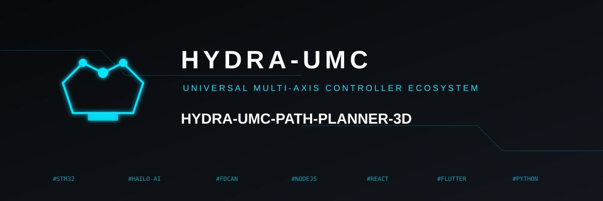
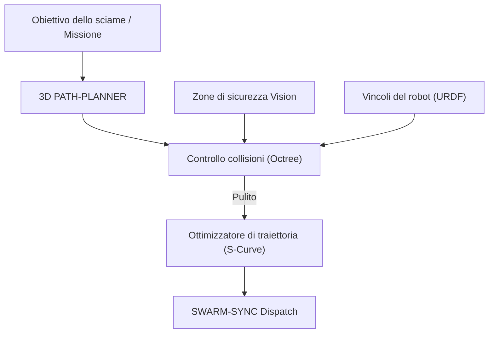

<p align="center">
  
</p>

# 🗺️ HYDRA-UMC-PATH-PLANNER-3D

<p align="center"><a href="README.md">🇺🇸 English</a> | <a href="README_spa.md">🇪🇸 Español</a> | <a href="README_fra.md">🇫🇷 Français</a> | 🇮🇹 <b>Italiano</b> | <a href="README_deu.md">🇩🇪 Deutsch</a> | <a href="README_zho.md">🇨🇳 简体中文</a> | <a href="README_jpn.md">🇯🇵 日本語</a></p>

### 📐 Ottimizzatore di percorsi 3D multi-robot e motore per l'evitamento delle collisioni

<p align="left">
  
  
  
</p>

---

## 1. 🛠️ PANORAMICA TECNICA

**HYDRA-UMC-PATH-PLANNER-3D** è l'intelligenza di navigazione centralizzata per lo sciame di robot. Calcola traiettorie prive di collisioni per più bracci che condividono lo stesso spazio di lavoro, ottimizzando velocità, efficienza energetica e fluidità di movimento.

Integra i dati di occupazione in tempo reale dai Vision Node e i vincoli cinematici dal Digital Twin per garantire che i percorsi pianificati siano fisicamente fattibili e sicuri.

### Caratteristiche principali:
* 📐 **Ottimizzazione del percorso dello sciame:** Pianificazione sincrona per un massimo di oltre 32 robot contemporaneamente.
* 🛡️ **Evitamento dinamico delle collisioni:** Rianificazione in tempo reale quando vengono rilevati nuovi ostacoli.
* ⚡ **Prestazioni ottimizzate:** Implementazione C++/Rust altamente parallelizzata per la generazione di percorsi in meno di 50 ms.
* 🔄 **G-Code e URDF nativi:** Analizza direttamente i comandi di movimento industriali e i modelli di robot.
* ⏱️ **Limite di Tempo Reale e Validazione della Traiettoria (v0):** `PlannerConfig.max_duration_ms` limita il tempo di ricerca in base all'orologio reale, indipendentemente da `max_iterations`. Un nuovo sottocomando `validate` riverifica una traiettoria già calcolata (in cache, riprodotta o modificata a mano) rispetto agli ostacoli/workspace attuali prima che venga considerata affidabile per l'esecuzione reale.

---

## 2. 🔄 WORKFLOW DI PIANIFICAZIONE



---

## 3. 🧱 ARCHITETTURA E DECISIONI DI PROGETTAZIONE

* **Perché la pianificazione 3D senza collisioni è un servizio a sé.** La ricerca di percorsi su una scena 3D dal vivo (ogni robot, utensile e ostacolo della cella) è intensiva di CPU e sensibile alla latenza in modo diverso dalla pianificazione dei lavori stessa - isolarla significa che una query di pianificazione lenta non blocca mai HYDRA-UMC-JOB-DISPATCHER nell'assegnare altro lavoro.
* **Perché valida contro HYDRA-UMC-TWIN prima dell'esecuzione reale.** Un percorso pianificato viene prima controllato nella simulazione fisica del gemello digitale - individuando un percorso geometricamente valido ma fisicamente irraggiungibile (limiti di coppia, singolarità) prima che raggiunga mai un braccio reale.
* **Perché la ricerca è un RRT semplice oggi, non RRT\* né un coordinatore multi-robot.** `src/rrt.rs` implementa una vera ricerca Rapidly-exploring Random Tree, testata - un solo agente, un insieme statico di ostacoli, un risultato genuinamente privo di collisioni (ogni percorso restituito viene verificato libero da ostacoli nei test, non solo plausibile). RRT\* (un passaggio di rewiring che migliora l'ottimalità) e la vera pianificazione multi-robot sincronizzata (i "fino a 32+ robot simultaneamente" di questo README) sono vero lavoro futuro, deliberatamente fuori ambito - vedi `mejoras_futuras.txt` per il motivo per cui dimostrare corretta prima la ricerca a singolo agente è venuto prima, invece di costruire tutte e tre le cose insieme e fare debug insieme.
* **Perché gli ostacoli sono sfere, non un octree di mesh arbitrarie.** Una sfera è il primitivo di collisione 3D più semplice che resta reale e geometricamente corretto - non un sostituto tipo bounding-box di qualcosa di più dettagliato. Un octree/BVH inizia a contare solo quando una scena ha abbastanza collisori da rendere il controllo a forza bruta il collo di bottiglia - la cella dello sciame di oggi (una manciata di bracci e zone di sicurezza statiche) non ce li ha.
* **Perché questa è una CLI su un file di scenario JSON oggi, non un servizio di rete.** Scegliere tra HTTP e il contratto gRPC condiviso dell'ecosistema (`hydra.common.v1`, vedi `HYDRA-UMC-ORCHESTRATOR/proto/`) è una vera decisione di protocollo che merita un proprio passaggio quando HYDRA-UMC-JOB-DISPATCHER sarà realmente pronto a chiamare questo servizio - vedi `mejoras_futuras.txt`. La CLI è già genuinamente utilizzabile oggi (`run.bat scenarios/example.json`), semplicemente non è ancora collegata alla rete.
* **Come si inserisce nel resto dell'ecosistema.** Un servizio fratello sotto HYDRA-UMC-ORCHESTRATOR - pianifica i percorsi che i lavori assegnati da HYDRA-UMC-JOB-DISPATCHER seguono realmente, verificati incrociando con HYDRA-UMC-TWIN prima che qualcosa si muova per davvero.
* **Perché `max_duration_ms` è un controllo sull'orologio reale, non solo un `max_iterations` più basso.** Il solo numero di iterazioni non può limitare il tempo reale: una scena con ostacoli più densi rende i controlli di collisione di ogni iterazione proporzionalmente più lenti, quindi lo stesso budget di iterazioni può richiedere un tempo reale molto diverso su una scena patologica rispetto a una aperta. Una chiamata al pianificatore all'interno di un ciclo di controllo in tempo reale ha bisogno di un vero budget di tempo, non di un suo sostituto.
* **Perché `validate` è un nuovo sottocomando invece di cambiare ciò che restituisce `plan()`.** `rrt::plan()` restituisce già solo percorsi costruiti privi di collisioni - non c'è nessun divario da colmare li'. `validate_path()`/il sottocomando `validate` esiste per percorsi che NON provengono da una chiamata `plan()` fresca in questo processo: un percorso in cache/riprodotto, uno inoltrato da un altro processo, uno scenario modificato a mano - dove l'insieme di ostacoli potrebbe essere cambiato da quando il percorso è stato calcolato. Lo stesso schema usato in tutto l'ecosistema: un nuovo punto di ingresso con verifica aggiunto accanto a una primitiva di basso livello invariata.

---

## 📂 STRUTTURA DELLE CARTELLE

```text
HYDRA-UMC-PATH-PLANNER-3D/
├── src/
│   ├── main.rs       # Punto di ingresso CLI: carica uno scenario, pianifica, stampa JSON
│   ├── geometry.rs   # Vec3 - l'algebra vettoriale 3D minima necessaria
│   ├── obstacle.rs   # Ostacoli sferici + controlli di collisione
│   ├── rng.rs        # PRNG deterministico senza dipendenze (xorshift64*)
│   ├── rrt.rs        # Il vero pianificatore: ricerca RRT, Workspace, PlannerConfig
│   └── validate.rs   # Riverifica reale di sicurezza di un percorso già calcolato
├── scenarios/        # Scenari JSON di esempio (vedi BUILD ED ESECUZIONE sotto)
├── build/            # Binari compilati (output di build.sh/build.bat)
├── Cargo.toml        # Manifesto del pacchetto Rust (nome, versione, dep)
├── bump_version.py   # Bump di versione stile contachilometri
├── build.sh/.bat     # Aggiorna la versione, poi `cargo build --release`
├── run.sh/.bat       # Esegue il binario compilato
└── README.md
```

Rimossi dal template originale: `hardware/`, `firmware/`, `os/`, `docs/`,
`images/` e `scripts/` — è un servizio puramente software (binario Rust)
senza hardware o firmware propri, senza un'immagine del sistema operativo
da mantenere, e senza contenuto di documentazione/media/script di utilità
ancora sufficiente da giustificare cartelle proprie.

---

## 🔧 BUILD ED ESECUZIONE

Una vera ricerca di percorsi privi di collisioni, non solo uno scheletro
che compila: pianifica un percorso a partire da un file di scenario JSON
e stampa il risultato.

```bash
# Windows
build.bat
run.bat scenarios/example.json

# Linux / macOS
./build.sh
./run.sh scenarios/example.json
```

`build.sh`/`build.bat` aggiornano la versione in `Cargo.toml` (regola
contachilometri dell'ecosistema, vedi `bump_version.py`) e poi eseguono
`cargo build --release`. `run.sh`/`run.bat` eseguono direttamente il binario
risultante, inoltrando qualsiasi argomento (il percorso dello scenario).

Uno scenario è un file JSON con `start`, `goal`, `obstacles` (una lista
di sfere `{center, radius}`), un `workspace` (limiti `min`/`max`), e
opzionalmente `seed` (la ricerca è totalmente deterministica per seme) e
`config` (`max_iterations`, `step_size`, `goal_bias`, `goal_threshold`,
`robot_radius`, `max_duration_ms` - tutti opzionali, con valori
predefiniti ragionevoli; `max_duration_ms` limita il tempo di ricerca
in base all'orologio reale, indipendentemente da `max_iterations`). Il
risultato viene stampato come JSON: `{"status": "ok", "path": [...]}`
oppure `{"status": "error", "reason": "..."}` (`start_inside_obstacle`,
`goal_outside_workspace`, `no_path_found`, `time_limit_exceeded`, ecc. -
vedi il `PlanError` di `src/rrt.rs` per l'elenco completo e onesto,
incluso il caso in cui semplicemente non esiste alcun percorso, non solo
uno che la ricerca non ha trovato in tempo).

Un secondo sottocomando reale riverifica un percorso già calcolato (un
semplice array JSON di waypoint `{x, y, z}`) rispetto agli
ostacoli/workspace attuali di uno scenario, senza eseguire una nuova
ricerca:

```bash
./run.sh validate scenarios/example.json path.json
# {"status": "safe"}
# oppure: {"status": "unsafe", "issues": [{"SegmentIntersectsObstacle": {"from_index": 0, "to_index": 1}}]}
```

```bash
cargo test   # geometria + collisione ostacoli, il PRNG, il
             # pianificatore RRT (incluso il suo vero limite di tempo
             # sull'orologio) e la riverifica di sicurezza di validate.rs -
             # 28 test in totale
```

---

## 🚀 TABELLA DI MARCIA
* **Fase 1:** Sincronizzazione deterministica dello sciame su TSN e riduzione del jitter sub-ms.
* **Fase 2:** Pianificazione dei percorsi 3D con evitamento dinamico degli ostacoli in celle multi-robot.
* **Fase 3:** Ottimizzazione del dispacciamento dei lavori multi-robot utilizzando la disponibilità delle risorse in tempo reale.
* **Fase 4:** Supporto per la pianificazione del percorso della base mobile non olonoma (JuanenBOT) e integrazione della flotta eterogenea.

---

## 🔗 Progetti Correlati

Questo progetto fa parte di un ecosistema robotico più ampio dello stesso autore (JuanenRac / Electro Hobby 3D), che copre firmware, software di controllo, nodi IA e strumenti di flotta. Utile saperlo, perché una richiesta potrebbe in realtà riguardare uno di questi progetti anziché questo repository.

### Famiglia

**Genitore:** **[HYDRA-UMC-ORCHESTRATOR](https://github.com/JuanenRac/HYDRA-UMC-ORCHESTRATOR)** — il genitore di integrazione servito da questo pianificatore.

**Fratelli:**
- **[HYDRA-UMC-SWARM-SYNC](https://github.com/JuanenRac/HYDRA-UMC-SWARM-SYNC)** — servizio di orchestrazione fratello, stesso genitore.
- **[HYDRA-UMC-JOB-DISPATCHER](https://github.com/JuanenRac/HYDRA-UMC-JOB-DISPATCHER)** — servizio di orchestrazione fratello, stesso genitore.
- **[HYDRA-UMC-NODE-HEALING](https://github.com/JuanenRac/HYDRA-UMC-NODE-HEALING)** — servizio di orchestrazione fratello, stesso genitore.

### Relazione Diretta (fuori dalla famiglia)

- **[HYDRA-UMC-TWIN](https://github.com/JuanenRac/HYDRA-UMC-TWIN)** — convalida i percorsi pianificati nel gemello digitale prima di eseguirli.

### Resto dell'Ecosistema

**Piattaforma HYDRA-UMC** — la cella di micro-fabbrica multi-robot
- **[HYDRA-UMC](https://github.com/JuanenRac/HYDRA-UMC)** — la scheda madre CM5 + STM32H745 che orchestra fino a 8 bracci robotici.
- **[HYDRA-UMC-SERVER](https://github.com/JuanenRac/HYDRA-UMC-SERVER)** — il backend Express/WebSocket con cui parla ogni client di controllo.
- **[HYDRA-UMC-STUDIO](https://github.com/JuanenRac/HYDRA-UMC-STUDIO)** — dashboard di controllo web, visualizzazione 3D multi-robot.
- **[HYDRA-UMC-ANDROID-CONTROL](https://github.com/JuanenRac/HYDRA-UMC-ANDROID-CONTROL)** — app di controllo Android via Wi-Fi/Bluetooth.
- **[HYDRA-UMC-IOS-CONTROL](https://github.com/JuanenRac/HYDRA-UMC-IOS-CONTROL)** — app di controllo iOS/iPadOS costruita in Flutter.
- **[HYDRA-UMC-SUITE](https://github.com/JuanenRac/HYDRA-UMC-SUITE)** — centro di comando sciame desktop (Python/PySide6).
- **[HYDRA-UMC-EDITOR-URDF](https://github.com/JuanenRac/HYDRA-UMC-EDITOR-URDF)** — editor desktop di modelli URDF per il catalogo robot.
- **[HYDRA-UMC-DSI](https://github.com/JuanenRac/HYDRA-UMC-DSI)** — interfaccia touch nativa per lo schermo DSI a bordo.

**Piattaforma URTC** — il controller della testa utensile che ogni braccio HYDRA-UMC porta con sé
- **[URTC](https://github.com/JuanenRac/URTC)** — controller testa utensile su bus CAN, 25 profili utensile.
- **[URTC-FLASHER](https://github.com/JuanenRac/URTC-FLASHER)** — strumento desktop di flashing CAN-OTA + SWD/JTAG.
- **[URTC-TESTER](https://github.com/JuanenRac/URTC-TESTER)** — strumento desktop di diagnostica CAN live.
- **[URTC-WEB-STUDIO](https://github.com/JuanenRac/URTC-WEB-STUDIO)** — alternativa basata su browser via Web Serial API.

**🎥 Nodo di Visione IA (Hailo-8)**
- [HYDRA-UMC-VISION-NODE](https://github.com/JuanenRac/HYDRA-UMC-VISION-NODE)
- [HYDRA-UMC-VISION-STREAMER](https://github.com/JuanenRac/HYDRA-UMC-VISION-STREAMER)
- [HYDRA-UMC-DETECTION-HEF](https://github.com/JuanenRac/HYDRA-UMC-DETECTION-HEF)
- [HYDRA-UMC-SAFETY-ZONES](https://github.com/JuanenRac/HYDRA-UMC-SAFETY-ZONES)
- [HYDRA-UMC-VISUAL-SERVOING-API](https://github.com/JuanenRac/HYDRA-UMC-VISUAL-SERVOING-API)

**🧠 Nodo IA Cognitiva (Hailo-10)**
- [HYDRA-UMC-COGNITIVE-NODE](https://github.com/JuanenRac/HYDRA-UMC-COGNITIVE-NODE)
- [HYDRA-UMC-VLA-ENGINE](https://github.com/JuanenRac/HYDRA-UMC-VLA-ENGINE)
- [HYDRA-UMC-VOICE-UI](https://github.com/JuanenRac/HYDRA-UMC-VOICE-UI)
- [HYDRA-UMC-SEMANTIC-PLANNER](https://github.com/JuanenRac/HYDRA-UMC-SEMANTIC-PLANNER)
- [HYDRA-UMC-DOCS-QA](https://github.com/JuanenRac/HYDRA-UMC-DOCS-QA)

**🎮 Gemello Digitale e Simulazione**
- [HYDRA-UMC-TWIN](https://github.com/JuanenRac/HYDRA-UMC-TWIN)
- [HYDRA-UMC-PHYSICS-REPLICA](https://github.com/JuanenRac/HYDRA-UMC-PHYSICS-REPLICA)
- [HYDRA-UMC-HIL-BRIDGE](https://github.com/JuanenRac/HYDRA-UMC-HIL-BRIDGE)
- [HYDRA-UMC-SYNTHETIC-DATA-GEN](https://github.com/JuanenRac/HYDRA-UMC-SYNTHETIC-DATA-GEN)

**📊 Dati e Analisi**
- [HYDRA-UMC-DATALAKE](https://github.com/JuanenRac/HYDRA-UMC-DATALAKE)
- [HYDRA-UMC-TELEMETRY-COLLECTOR](https://github.com/JuanenRac/HYDRA-UMC-TELEMETRY-COLLECTOR)
- [HYDRA-UMC-ANOMALY-DETECTOR](https://github.com/JuanenRac/HYDRA-UMC-ANOMALY-DETECTOR)
- [HYDRA-UMC-PRODUCTION-REPORTS](https://github.com/JuanenRac/HYDRA-UMC-PRODUCTION-REPORTS)

**🏭 Gateway Industriale**
- [HYDRA-UMC-GATEWAY-INDUSTRIAL](https://github.com/JuanenRac/HYDRA-UMC-GATEWAY-INDUSTRIAL)
- [HYDRA-UMC-OPCUA-SERVER](https://github.com/JuanenRac/HYDRA-UMC-OPCUA-SERVER)
- [HYDRA-UMC-MQTT-BROKER](https://github.com/JuanenRac/HYDRA-UMC-MQTT-BROKER)
- [HYDRA-UMC-MTCONNECT-ADAPTER](https://github.com/JuanenRac/HYDRA-UMC-MTCONNECT-ADAPTER)

**🛠️ Strumenti Complementari**
- [URTC-SMART-RACK](https://github.com/JuanenRac/URTC-SMART-RACK)
- [URTC-VISION-TOOL](https://github.com/JuanenRac/URTC-VISION-TOOL)
- [HYDRA-UMC-WATCH](https://github.com/JuanenRac/HYDRA-UMC-WATCH)
- [HYDRA-UMC-TOOL-CLI](https://github.com/JuanenRac/HYDRA-UMC-TOOL-CLI)
- [HYDRA-UMC-DASHBOARD-AI](https://github.com/JuanenRac/HYDRA-UMC-DASHBOARD-AI)


## 👤 AUTORE
**JuanenRac** (Electro Hobby 3D)
📧 electrohobby3d@gmail.com

## 📜 LICENZA
GPL-3.0 - Vedere LICENSE per i dettagli.
