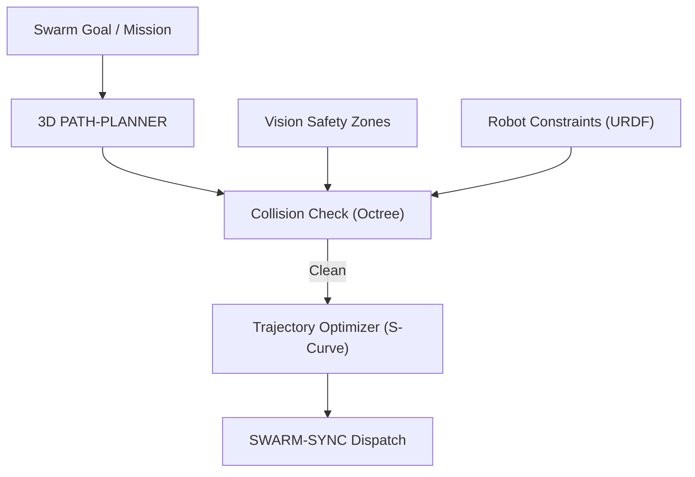

<p align="center">
  
</p>

# 🗺️ HYDRA-UMC-PATH-PLANNER-3D

<p align="center"><a href="README.md">🇺🇸 English</a> | <a href="README_spa.md">🇪🇸 Español</a> | <a href="README_fra.md">🇫🇷 Français</a> | <a href="README_ita.md">🇮🇹 Italiano</a> | <a href="README_deu.md">🇩🇪 Deutsch</a> | <a href="README_zho.md">🇨🇳 简体中文</a> | 🇯🇵 <b>日本語</b></p>

### 📐 マルチロボット 3D パスオプティマイザー & 衝突回避エンジン

<p align="left">
  
  
  
</p>

---

## 1. 🛠️ 技術概要

**HYDRA-UMC-PATH-PLANNER-3D** は、ロボットスウォームのための集中型
ナビゲーションインテリジェンスです。同一の作業空間を共有する複数の
アーム向けに衝突のない軌道を計算し、速度、エネルギー効率、そして
スムーズな動作のために最適化します。

ビジョンノードからのリアルタイム占有データと、デジタルツインからの
運動学的制約を統合し、計画されたパスが物理的に実現可能で安全であること
を保証します。

### 主な機能：
* 📐 **スウォームパス最適化：** 最大 32 台以上のロボットを同時に同期計画。
* 🛡️ **動的衝突回避：** 新しい障害物が検知された際のリアルタイム再計画。
* ⚡ **パフォーマンス最適化：** 高度に並列化された C++/Rust 実装により、サブ 50ms でのパス生成。
* 🔄 **G-Code と URDF のネイティブ対応：** 産業用モーションコマンドとロボットモデルを直接解析。
* ⏱️ **実際の時間制限と経路検証（v0）：** `PlannerConfig.max_duration_ms` は `max_iterations` とは独立に、実時間の壁時計で探索時間を制限します。新しい `validate` サブコマンドは、既に計算済みの経路（キャッシュされた、再生された、あるいは手で編集されたもの）を、実際の実行で信頼される前に現在の障害物/ワークスペースに対して再チェックします。

---

## 2. 🔄 プランニングワークフロー



---

## 3. 🧱 アーキテクチャと設計上の決定

* **3D の衝突のないプランニングが独自のサービスである理由。** ライブの 3D シーン（セル内のすべてのロボット、工具、障害物）に対するパス探索は、ジョブスケジューリング自体とは異なる形で CPU 負荷が高く遅延に敏感です——これを分離することで、遅いプランニングクエリが HYDRA-UMC-JOB-DISPATCHER による他の作業の割当てをブロックすることは決してありません。
* **実際の実行の前に HYDRA-UMC-TWIN に対して検証する理由。** 計画されたルートは、まずデジタルツイン自身の物理シミュレーションでチェックされます——幾何学的には有効だが物理的には到達不可能なパス（トルク制限、特異点）を、実際のアームに送信される前に捕捉します。
* **探索が今日は単純な RRT であり、RRT* でもマルチロボットコーディネーターでもない理由。** `src/rrt.rs` は実際の、テスト済みの Rapidly-exploring Random Tree 探索を実装しています——単一エージェント、静的障害物集合、本当に衝突のない結果（返されるすべてのパスは、単にもっともらしく見えるだけではなく、テストで実際に障害物がないことが検証されています）。RRT*（最適性を向上させる再接続パス）と、本当の同期されたマルチロボットプランニング（この README の「最大 32+ ロボットを同時に」）は、実際の、意図的に範囲外とした将来の作業です——単一エージェントの探索を正しいと証明することを先に行った理由は `mejoras_futuras.txt` を参照してください。
* **障害物が任意のメッシュのオクツリーではなく球体である理由。** 球体は、本当で幾何学的に正しい最も単純な 3D 衝突プリミティブです——より詳細な何かの代わりのバウンディングボックスではありません。オクツリー/BVH が重要になるのは、シーン内の衝突体が十分に多くなり、総総當たり的なチェックがボトルネックになった時だけです——今日のスワームセル（一採りのアームと静的な安全ゾーン）はそこまでには至っていません。
* **これが今日はネットワークサービスではなく JSON シナリオファイル上の CLI である理由。** HTTP とエコシステム共通の gRPC 契約（`hydra.common.v1`、`HYDRA-UMC-ORCHESTRATOR/proto/` 参照）のどちらを選ぶかは、HYDRA-UMC-JOB-DISPATCHER が実際にこのサービスを呼び出す準備ができた時点で独自の検討に値する本当のプロトコル決定です——`mejoras_futuras.txt` を参照してください。CLI は今日すでに本当に使えます（`run.bat scenarios/example.json`）。単にまだネットワークに接続されていないだけです。
* **エコシステムの他の部分との関係。** HYDRA-UMC-ORCHESTRATOR の下の兄弟サービスです——HYDRA-UMC-JOB-DISPATCHER が割り当てたジョブが実際に従うルートを計画し、実際に何かが動く前に HYDRA-UMC-TWIN と照合されます。
* **`max_duration_ms` が単に低い `max_iterations` ではなく実時間の壁時計チェックである理由。** イテレーション数だけでは実時間を制限できません——障害物がより密集したシーンでは各イテレーションの衝突判定が比例して遅くなるため、同じイテレーション予算でも病的なシーンと開けたシーンでは実時間が大きく異なる可能性があります。リアルタイム制御ループの中にあるプランナー呼び出しには、その代替物ではなく本物の時間予算が必要です。
* **`validate` が `plan()` の戻り値を変更するのではなく新しいサブコマンドである理由。** `rrt::plan()` はすでに構造上衝突のない経路のみを返します——そこに埋めるべき隙間はありません。`validate_path()`/`validate` サブコマンドは、このプロセス内での新しい `plan()` 呼び出しに由来しない経路——キャッシュされた/再生された経路、別プロセスから中継された経路、手で編集されたシナリオ——のために存在します。これらの場合、経路が計算されて以降に障害物の集合が変わっている可能性があります。エコシステム全体で使われているのと同じパターンです：変更されない低レベルのプリミティブの隣に安全策付きの新しいエントリポイントを追加する。

---

## 📂 リポジトリ構成

```text
HYDRA-UMC-PATH-PLANNER-3D/
├── src/
│   ├── main.rs       # CLI エントリポイント：シナリオを読み込み、計画し、JSON を出力
│   ├── geometry.rs   # Vec3 - 必要最小限の 3D ベクトル演算
│   ├── obstacle.rs   # 球形障害物 + 衝突判定
│   ├── rng.rs        # 依存関係のない決定論的 PRNG(xorshift64*)
│   ├── rrt.rs        # 実際のプランナー：RRT 探索、Workspace、PlannerConfig
│   ├── validate.rs   # 既に計算済みの経路に対する実際の安全性再チェック
│   └── corpus.rs     # テスト専用：rrt.rs と validate.rs 自身のテストが共有する
│                        再利用可能な障害物/ワークスペースのシナリオ集
├── scenarios/        # サンプル JSON シナリオ(下記「ビルドと実行」参照)
├── docs/
│   └── CLI_REFERENCE.md  # コマンドラインフラグのリファレンス
├── images/           # メディアと図版
├── tools/
│   └── ci_validate.py   # CI が使用する manifest/CHANGELOG/docs の検証
├── build/            # コンパイル済みバイナリ（build.sh/build.bat の出力）
├── Cargo.toml        # Rust パッケージマニフェスト（名前、バージョン、依存関係）
├── bump_version.py   # オドメーター式バージョンインクリメント、build.sh/.bat が実行
├── bump_manifest_version.py  # hydra-umc.project.json のバージョンをネイティブ側と同期（--sync）
├── build.sh/.bat     # バージョンを増加させ、その後 `cargo build --release` を実行
├── run.sh/.bat       # コンパイル済みバイナリを実行
└── README.md
```

元のテンプレートから省略：`hardware/`、`firmware/`、`os/` —— これは
純粋なソフトウェアサービス(Rust バイナリ)であり、専用のハードウェアや
ファームウェア、維持すべきオペレーティングシステムイメージもありません。

---

## 🔧 ビルドと実行

コンパイルできるだけの骨組みではなく、本物の衝突のないパス探索です：
JSON シナリオファイルからルートを計画し、結果を出力します。

```bash
# Windows
build.bat
run.bat scenarios/example.json

# Linux / macOS
./build.sh
./run.sh scenarios/example.json
```

`build.sh`/`build.bat` は `Cargo.toml` のバージョンを増加させ（エコ
システム全体で統一されたオドメーター規則、`bump_version.py` を参照）、
その後 `cargo build --release` を実行します。`run.sh`/`run.bat` は
生成されたバイナリを直接実行し、引数（シナリオのパス）をそのまま
渡します。

シナリオは `start`、`goal`、`obstacles`(`{center, radius}` の球体の
リスト)、`workspace`(`min`/`max` の境界)を持つ JSON ファイルで、
オプションで `seed`(探索はシード値ごとに完全に決定論的)と
`config`(`max_iterations`、`step_size`、`goal_bias`、
`goal_threshold`、`robot_radius`、`max_duration_ms` - すべて省略可能で、
省略時は妥当なデフォルト値が使われます。`max_duration_ms` は
`max_iterations` とは独立に、実時間の壁時計で探索時間を制限します)を
指定できます。結果は JSON として出力されます：
`{"status": "ok", "path": [...]}` または
`{"status": "error", "reason": "..."}`(`start_inside_obstacle`、
`goal_outside_workspace`、`no_path_found`、`time_limit_exceeded` など -
完全で正直な一覧は `src/rrt.rs` の `PlanError` を参照。探索が時間内に
見つけられなかっただけでなく、そもそも経路が存在しないケースも
含まれます)。

2つ目の実際のサブコマンドは、既に計算済みの経路(`{x, y, z}` の
単純な JSON 配列)を、新しい探索を実行せずに、シナリオの現在の
障害物/ワークスペースに対して再チェックします：

```bash
./run.sh validate scenarios/example.json path.json
# {"status": "safe"}
# または: {"status": "unsafe", "issues": [{"SegmentIntersectsObstacle": {"from_index": 0, "to_index": 1}}]}
```

```bash
cargo test   # 幾何学 + 障害物の衝突判定、PRNG、RRT プランナー自体
             #(その実際の壁時計時間制限を含む)、そして validate.rs の
             # 安全性再チェック - 合計 28 個のテスト
```

---

## 🚀 ロードマップ
* **フェーズ 1：** TSN による決定論的スウォーム同期とサブミリ秒ジッタの低減。
* **フェーズ 2：** マルチロボットセルにおける動的障害物回避を伴う 3D パスプランニング。
* **フェーズ 3：** リアルタイムのリソース可用性を用いたマルチロボットジョブディスパッチの最適化。
* **フェーズ 4：** 非ホロノミック移動ベース（JuanenBOT）のパスプランニングのサポートと異種フリートの統合。

---

## 🔗 関連プロジェクト

本プロジェクトは、同じ作者(JuanenRac / Electro Hobby 3D)による HYDRA-UMC ロボティクスエコシステムの一部です。リクエストが実はこの中のどれかについてのものである可能性があるため、知っておく価値があります。

**親プロジェクト**
- **[HYDRA-UMC-ORCHESTRATOR](https://github.com/JuanenRac/HYDRA-UMC-ORCHESTRATOR)** — 実際の gRPC/Protobuf ヘルスレポート契約とミッションステートマシンを持つ統合ハブ。本リポジトリは、その自身のスウォーム調整レイヤー内における特定のオーケストレーションサービスとして、この親の一部を成す。

**兄弟プロジェクト** —— HYDRA-UMC-ORCHESTRATOR 自身のスウォーム調整レイヤーにおける他のオーケストレーションサービス
- **[HYDRA-UMC-SWARM-SYNC](https://github.com/JuanenRac/HYDRA-UMC-SWARM-SYNC)** — 複数セルの収束についてプロパティテストされた、実際の CRDT LWW-Element-Map 状態同期。
- **[HYDRA-UMC-JOB-DISPATCHER](https://github.com/JuanenRac/HYDRA-UMC-JOB-DISPATCHER)** — 実際の HTTP API 上に構築された、優先度ベースの実際のジョブキュー(重複排除付き)。
- **[HYDRA-UMC-NODE-HEALING](https://github.com/JuanenRac/HYDRA-UMC-NODE-HEALING)** — リトライ/バックオフとアイデンティティ不一致検出を備えた、実際の gRPC ベースのフリートヘルスウォッチドッグ。

**直接関連**
- **[HYDRA-UMC-TWIN](https://github.com/JuanenRac/HYDRA-UMC-TWIN)** — 実際のバージョン互換性同期契約を持つ、デジタルツインエンジンの統合ハブ ——このプランナー自身が計画したルートを、実行前にデジタルツイン内で検証する。

**エコシステムの他のプロジェクト**

*コアハードウェア&プラットフォーム*
- **[HYDRA-UMC](https://github.com/JuanenRac/HYDRA-UMC)** — 実際のロボットアームのマザーボード——CM5 ホスト + デュアルコア STM32H745、CAN-OTA/SPI-OTA 経由で最大 8 本のツールアームを統括。
- **[HYDRA-UMC-OS](https://github.com/JuanenRac/HYDRA-UMC-OS)** — CM5 向けの再現可能な Raspberry Pi OS プロダクト層——読み取り専用エージェント、検証済み設定/プロファイル、WiFi 初回接続プロビジョニング。
- **[HYDRA-UMC-SDK](https://github.com/JuanenRac/HYDRA-UMC-SDK)** — すべてのブリッジが自身のコマンドを検証する共有 JSON-Schema 契約と安全ゲートの境界。

*コアバックエンド&クライアント*
- **[HYDRA-UMC-SERVER](https://github.com/JuanenRac/HYDRA-UMC-SERVER)** — すべての制御クライアントが実際に通信する、本物のヘッドレスバックエンド(REST/WebSocket)。
- **[HYDRA-UMC-STUDIO](https://github.com/JuanenRac/HYDRA-UMC-STUDIO)** — リアルタイムのマルチロボット 3D 可視化を備えたウェブ制御ダッシュボード。
- **[HYDRA-UMC-SUITE](https://github.com/JuanenRac/HYDRA-UMC-SUITE)** — 複数のサーバーを同時に扱えるデスクトップ(PySide6)スウォームコマンドセンター、スタンドアロン実行ファイルとしてパッケージ化。
- **[HYDRA-UMC-ANDROID-CONTROL](https://github.com/JuanenRac/HYDRA-UMC-ANDROID-CONTROL)** — 生体認証ログインとペアリングされた Wear OS コンパニオンを備えたネイティブ Android 制御アプリ。
- **[HYDRA-UMC-IOS-CONTROL](https://github.com/JuanenRac/HYDRA-UMC-IOS-CONTROL)** — リアルタイム WebSocket 同期を備えた iOS/iPadOS 制御アプリ(Flutter)。
- **[HYDRA-UMC-DSI](https://github.com/JuanenRac/HYDRA-UMC-DSI)** — 本体搭載の 7 インチ DSI タッチスクリーン向けネイティブタッチ UI、CM5 自体に組み込み。
- **[HYDRA-UMC-EDITOR-URDF](https://github.com/JuanenRac/HYDRA-UMC-EDITOR-URDF)** — 完成したモデルを STUDIO 自身のカタログへ送信するデスクトップ用グラフィカル URDF 作成/編集ツール。
- **[HYDRA-UMC-BRIDGE-AMR](https://github.com/JuanenRac/HYDRA-UMC-BRIDGE-AMR)** — 実際の VDA 5050 MQTT パブリッシャーによる AGV/AMR フリートの調整境界。
- **[HYDRA-UMC-BRIDGE-CNC](https://github.com/JuanenRac/HYDRA-UMC-BRIDGE-CNC)** — 実際の GRBL ステータス/制御バイトへのアクセスを持つ、CNC セルの高レベルコーディネーター。
- **[HYDRA-UMC-BRIDGE-DROIDS](https://github.com/JuanenRac/HYDRA-UMC-BRIDGE-DROIDS)** — 実際の Boston Dynamics Spot コマンド送信機能を持つ、脚型/ヒューマノイドドロイドの調整境界。
- **[HYDRA-UMC-BRIDGE-LASER](https://github.com/JuanenRac/HYDRA-UMC-BRIDGE-LASER)** — 実際のキー/筐体/インターロック GPIO セーフガード 3 系統を読み取る、レーザーセルの安全コーディネーター。
- **[HYDRA-UMC-BRIDGE-OPENPNP](https://github.com/JuanenRac/HYDRA-UMC-BRIDGE-OPENPNP)** — OpenPnP ピックアンドプレースの基板フローを安全に統括する高レベルコーディネーター。
- **[HYDRA-UMC-BRIDGE-PRINTER3D](https://github.com/JuanenRac/HYDRA-UMC-BRIDGE-PRINTER3D)** — 実際にゲート制御されたジョブコマンドを持つ、Moonraker/Klipper 3D プリンター向けの安全な調整境界。
- **[HYDRA-UMC-BRIDGE-ROS2](https://github.com/JuanenRac/HYDRA-UMC-BRIDGE-ROS2)** — 実際の遅延インポート rclpy ROS 2 トランスポートを持つ安全コーディネーター。
- **[HYDRA-UMC-BRIDGE-UAV](https://github.com/JuanenRac/HYDRA-UMC-BRIDGE-UAV)** — 実際の MAVLink コマンド送信機能を持つ、カメラ搭載 UAV の調整境界。

*URTC ツールプラットフォーム*
- **[URTC](https://github.com/JuanenRac/URTC)** — 物理的な Universal Robot Tool Controller 基板向けファームウェア、CAN バス経由の 25 以上のツールプロファイル。
- **[URTC-FLASHER](https://github.com/JuanenRac/URTC-FLASHER)** — URTC 基板用のデスクトップ GUI 書き込みツール、CAN-OTA およびフルチップ SWD/JTAG。
- **[URTC-TESTER](https://github.com/JuanenRac/URTC-TESTER)** — URTC 基板向けのデスクトップ CAN バスライブ診断ツール、ツールプロファイルごとに 1 パネル。
- **[URTC-WEB-STUDIO](https://github.com/JuanenRac/URTC-WEB-STUDIO)** — Web Serial API を使ったブラウザベースの URTC-TESTER の代替、ローカルインストール不要。

*ビジョン AI ノード(Hailo-8)*
- **[HYDRA-UMC-VISION-NODE](https://github.com/JuanenRac/HYDRA-UMC-VISION-NODE)** — Hailo-8 ビジョンパイプラインの統合ハブ、段階ごとの実際のハードウェア準備状況チェック付き。
- **[HYDRA-UMC-DETECTION-HEF](https://github.com/JuanenRac/HYDRA-UMC-DETECTION-HEF)** — Hailo アーキテクチャ/チェックサムによる安全読み込み検証を備えた、実際のコンパイル済みモデルレジストリ。
- **[HYDRA-UMC-VISION-STREAMER](https://github.com/JuanenRac/HYDRA-UMC-VISION-STREAMER)** — 実際の HailoRT 統合境界を持つ、実際の GStreamer パイプライン + MediaMTX 設定生成器。
- **[HYDRA-UMC-VISUAL-SERVOING-API](https://github.com/JuanenRac/HYDRA-UMC-VISUAL-SERVOING-API)** — 上流のゾーン状態に応じて安全ゲート制御される、実際の Position-Based Visual Servoing 補正則。
- **[HYDRA-UMC-SAFETY-ZONES](https://github.com/JuanenRac/HYDRA-UMC-SAFETY-ZONES)** — キャリブレーションの鮮度を強制する、実際のゾーン侵入チェックと E-STOP 要求。

*コグニティブ AI ノード(Hailo-10)*
- **[HYDRA-UMC-COGNITIVE-NODE](https://github.com/JuanenRac/HYDRA-UMC-COGNITIVE-NODE)** — Hailo-10 コグニティブパイプライン(LLM/VLA/音声オーケストレーション)の統合ハブ。
- **[HYDRA-UMC-VLA-ENGINE](https://github.com/JuanenRac/HYDRA-UMC-VLA-ENGINE)** — Vision-Language-Action モデル向けの、実際のアクショントークンのエンコード/デコードと軌道生成。
- **[HYDRA-UMC-VOICE-UI](https://github.com/JuanenRac/HYDRA-UMC-VOICE-UI)** — 確認ゲート付きの限定的な Watch リレーを備えた、実際の音声フロントエンド(VAD + 意図解析)。
- **[HYDRA-UMC-SEMANTIC-PLANNER](https://github.com/JuanenRac/HYDRA-UMC-SEMANTIC-PLANNER)** — MCU エラーコードに対する、実際のルールベースのタスク分解と意味的エラー復旧。
- **[HYDRA-UMC-DOCS-QA](https://github.com/JuanenRac/HYDRA-UMC-DOCS-QA)** — このエコシステム自身の Markdown ドキュメントに対する、標準ライブラリのみの実際の TF-IDF 文書検索。

*デジタルツイン&シミュレーション*
- **[HYDRA-UMC-HIL-BRIDGE](https://github.com/JuanenRac/HYDRA-UMC-HIL-BRIDGE)** — シミュレーションと実際のハードウェアの間でコマンドをルーティングする、実際のハードウェア・イン・ザ・ループ安全インターロック。
- **[HYDRA-UMC-PHYSICS-REPLICA](https://github.com/JuanenRac/HYDRA-UMC-PHYSICS-REPLICA)** — 実際の URDF サブセットに対する、実際の順運動学と関節限界検証。
- **[HYDRA-UMC-SYNTHETIC-DATA-GEN](https://github.com/JuanenRac/HYDRA-UMC-SYNTHETIC-DATA-GEN)** — YOLO/COCO アノテーションのエクスポート機能を持つ、実際のプロシージャル 2D シーンジェネレーター。

*データ&分析*
- **[HYDRA-UMC-DATALAKE](https://github.com/JuanenRac/HYDRA-UMC-DATALAKE)** — 実際の取り込み/クエリ HTTP API を備えた、実際の sqlite3 ベースの時系列ストア。
- **[HYDRA-UMC-ANOMALY-DETECTOR](https://github.com/JuanenRac/HYDRA-UMC-ANOMALY-DETECTOR)** — ドリフト監視を備えた、実際の FFT + 統計ベースラインによる異常検知器。
- **[HYDRA-UMC-PRODUCTION-REPORTS](https://github.com/JuanenRac/HYDRA-UMC-PRODUCTION-REPORTS)** — DATALAKE の履歴に対する実際の OEE/稼働率計算、再現可能な CSV エクスポート付き。
- **[HYDRA-UMC-TELEMETRY-COLLECTOR](https://github.com/JuanenRac/HYDRA-UMC-TELEMETRY-COLLECTOR)** — シーケンス重複排除機能を備えた、DATALAKE への実際の CAN/WebSocket 取り込みパイプライン。

*産業用ゲートウェイ*
- **[HYDRA-UMC-GATEWAY-INDUSTRIAL](https://github.com/JuanenRac/HYDRA-UMC-GATEWAY-INDUSTRIAL)** — 実際のコマンド許可リスト/バックプレッシャー層を持つ、産業用プロトコルへ中継する統合ハブ。
- **[HYDRA-UMC-OPCUA-SERVER](https://github.com/JuanenRac/HYDRA-UMC-OPCUA-SERVER)** — 実際のバイナリプロトコルクライアントセッションで検証された、実際の OPC-UA アドレス空間。
- **[HYDRA-UMC-MQTT-BROKER](https://github.com/JuanenRac/HYDRA-UMC-MQTT-BROKER)** — クライアント単位のオプション認証とトピック ACL を備えた、実際の MQTT ブローカー。
- **[HYDRA-UMC-MTCONNECT-ADAPTER](https://github.com/JuanenRac/HYDRA-UMC-MTCONNECT-ADAPTER)** — 縮退モード出力を備えた、実際の MTConnect `/probe` および `/current` XML エンドポイント。

*補完ツール&エコシステム運用*
- **[HYDRA-UMC-DASHBOARD-AI](https://github.com/JuanenRac/HYDRA-UMC-DASHBOARD-AI)** — 誠実な統計フォールバックを備えた、DATALAKE/ANOMALY-DETECTOR 上のスマートサマリーと異常ハイライトパネル。
- **[HYDRA-UMC-TOOL-CLI](https://github.com/JuanenRac/HYDRA-UMC-TOOL-CLI)** — 実際の安定した終了コード契約を持つフリート CLI、HYDRA-UMC-SERVER 自身の API の本物のライブクライアント。
- **[HYDRA-UMC-WATCH](https://github.com/JuanenRac/HYDRA-UMC-WATCH)** — 実際の触覚アラートとペアリングされたスマートフォンへの音声リレーを備えた WearOS コンパニオンアプリ。
- **[URTC-SMART-RACK](https://github.com/JuanenRac/URTC-SMART-RACK)** — 実際の工具 ID デコードと Smart Idle 予熱ロジックを備えた、基板搭載ラック用ファームウェア。
- **[URTC-VISION-TOOL](https://github.com/JuanenRac/URTC-VISION-TOOL)** — サーマル/RGB 検査ツールヘッド向けの、ファームウェアと実際の Python ビジョンコンパニオン。
- **[HYDRA-UMC-UPDATER](https://github.com/JuanenRac/HYDRA-UMC-UPDATER)** — このエコシステム内のすべてのリポジトリを検出・クローン・更新する、管理用デスクトップツール。


## 👤 作者
**JuanenRac** (Electro Hobby 3D)
📧 electrohobby3d@gmail.com
📺 [youtube.com/@electrohobby3d](https://youtube.com/@electrohobby3d)

## 📜 ライセンス
GPL-3.0 —— 詳細は LICENSE を参照してください。
