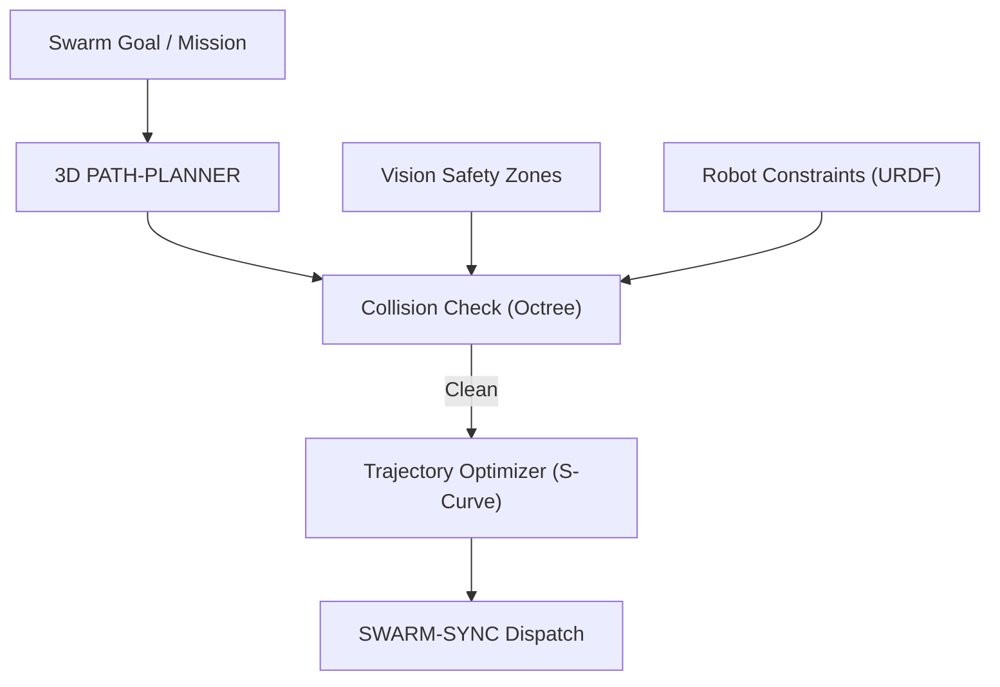

<p align="center">
  
</p>

# 🗺️ HYDRA-UMC-PATH-PLANNER-3D

<p align="center"><a href="README.md">🇺🇸 English</a> | <a href="README_spa.md">🇪🇸 Español</a> | <a href="README_fra.md">🇫🇷 Français</a> | <a href="README_ita.md">🇮🇹 Italiano</a> | <a href="README_deu.md">🇩🇪 Deutsch</a> | <a href="README_zho.md">🇨🇳 简体中文</a> | 🇯🇵 <b>日本語</b></p>

### 📐 マルチロボット 3D パスオプティマイザー & 衝突回避エンジン

<p align="left">
  
  
  
</p>

---

## 1. 🛠️ 技術概要

**HYDRA-UMC-PATH-PLANNER-3D** は、ロボットスウォームのための集中型
ナビゲーションインテリジェンスです。同一の作業空間を共有する複数の
アーム向けに衝突のない軌道を計算し、速度、エネルギー効率、そして
スムーズな動作のために最適化します。

ビジョンノードからのリアルタイム占有データと、デジタルツインからの
運動学的制約を統合し、計画されたパスが物理的に実現可能で安全であること
を保証します。

### 主な機能：
* 📐 **スウォームパス最適化：** 最大 32 台以上のロボットを同時に同期計画。
* 🛡️ **動的衝突回避：** 新しい障害物が検知された際のリアルタイム再計画。
* ⚡ **パフォーマンス最適化：** 高度に並列化された C++/Rust 実装により、サブ 50ms でのパス生成。
* 🔄 **G-Code と URDF のネイティブ対応：** 産業用モーションコマンドとロボットモデルを直接解析。

---

## 2. 🔄 プランニングワークフロー



---

## 3. 🧱 アーキテクチャと設計上の決定

* **3D の衝突のないプランニングが独自のサービスである理由。** ライブの 3D シーン（セル内のすべてのロボット、工具、障害物）に対するパス探索は、ジョブスケジューリング自体とは異なる形で CPU 負荷が高く遅延に敏感です——これを分離することで、遅いプランニングクエリが HYDRA-UMC-JOB-DISPATCHER による他の作業の割当てをブロックすることは決してありません。
* **実際の実行の前に HYDRA-UMC-TWIN に対して検証する理由。** 計画されたルートは、まずデジタルツイン自身の物理シミュレーションでチェックされます——幾何学的には有効だが物理的には到達不可能なパス（トルク制限、特異点）を、実際のアームに送信される前に捕捉します。
* **探索が今日は単純な RRT であり、RRT* でもマルチロボットコーディネーターでもない理由。** `src/rrt.rs` は実際の、テスト済みの Rapidly-exploring Random Tree 探索を実装しています——単一エージェント、静的障害物集合、本当に衝突のない結果（返されるすべてのパスは、単にもっともらしく見えるだけではなく、テストで実際に障害物がないことが検証されています）。RRT*（最適性を向上させる再接続パス）と、本当の同期されたマルチロボットプランニング（この README の「最大 32+ ロボットを同時に」）は、実際の、意図的に範囲外とした将来の作業です——単一エージェントの探索を正しいと証明することを先に行った理由は `mejoras_futuras.txt` を参照してください。
* **障害物が任意のメッシュのオクツリーではなく球体である理由。** 球体は、本当で幾何学的に正しい最も単純な 3D 衝突プリミティブです——より詳細な何かの代わりのバウンディングボックスではありません。オクツリー/BVH が重要になるのは、シーン内の衝突体が十分に多くなり、総総當たり的なチェックがボトルネックになった時だけです——今日のスワームセル（一採りのアームと静的な安全ゾーン）はそこまでには至っていません。
* **これが今日はネットワークサービスではなく JSON シナリオファイル上の CLI である理由。** HTTP とエコシステム共通の gRPC 契約（`hydra.common.v1`、`HYDRA-UMC-ORCHESTRATOR/proto/` 参照）のどちらを選ぶかは、HYDRA-UMC-JOB-DISPATCHER が実際にこのサービスを呼び出す準備ができた時点で独自の検討に値する本当のプロトコル決定です——`mejoras_futuras.txt` を参照してください。CLI は今日すでに本当に使えます（`run.bat scenarios/example.json`）。単にまだネットワークに接続されていないだけです。
* **エコシステムの他の部分との関係。** HYDRA-UMC-ORCHESTRATOR の下の兄弟サービスです——HYDRA-UMC-JOB-DISPATCHER が割り当てたジョブが実際に従うルートを計画し、実際に何かが動く前に HYDRA-UMC-TWIN と照合されます。

---

## 📂 リポジトリ構成

```text
HYDRA-UMC-PATH-PLANNER-3D/
├── src/
│   ├── main.rs       # CLI エントリポイント：シナリオを読み込み、計画し、JSON を出力
│   ├── geometry.rs   # Vec3 - 必要最小限の 3D ベクトル演算
│   ├── obstacle.rs   # 球形障害物 + 衝突判定
│   ├── rng.rs        # 依存関係のない決定論的 PRNG(xorshift64*)
│   └── rrt.rs        # 実際のプランナー：RRT 探索、Workspace、PlannerConfig
├── scenarios/        # サンプル JSON シナリオ(下記「ビルドと実行」参照)
├── build/            # コンパイル済みバイナリ（build.sh/build.bat の出力）
├── Cargo.toml        # Rust パッケージマニフェスト（名前、バージョン、依存関係）
├── bump_version.py   # オドメーター式バージョンインクリメント、build.sh/.bat が実行
├── build.sh/.bat     # バージョンを増加させ、その後 `cargo build --release` を実行
├── run.sh/.bat       # コンパイル済みバイナリを実行
└── README.md
```

元のテンプレートから省略：`hardware/`、`firmware/`、`os/`、`docs/`、
`images/`、`scripts/` —— これは純粋なソフトウェアサービス(Rust バイナリ)
であり、専用のハードウェアやファームウェア、維持すべき
オペレーティングシステムイメージもなく、専用フォルダを正当化する
ほどのドキュメント/メディア/ユーティリティスクリプトの内容もまだ
ありません。

---

## 🔧 ビルドと実行

コンパイルできるだけの骨組みではなく、本物の衝突のないパス探索です：
JSON シナリオファイルからルートを計画し、結果を出力します。

```bash
# Windows
build.bat
run.bat scenarios/example.json

# Linux / macOS
./build.sh
./run.sh scenarios/example.json
```

`build.sh`/`build.bat` は `Cargo.toml` のバージョンを増加させ（エコ
システム全体で統一されたオドメーター規則、`bump_version.py` を参照）、
その後 `cargo build --release` を実行します。`run.sh`/`run.bat` は
生成されたバイナリを直接実行し、引数（シナリオのパス）をそのまま
渡します。

シナリオは `start`、`goal`、`obstacles`(`{center, radius}` の球体の
リスト)、`workspace`(`min`/`max` の境界)を持つ JSON ファイルで、
オプションで `seed`(探索はシード値ごとに完全に決定論的)と
`config`(`max_iterations`、`step_size`、`goal_bias`、
`goal_threshold`、`robot_radius` - すべて省略可能で、省略時は
妥当なデフォルト値が使われます)を指定できます。結果は JSON として
出力されます：`{"status": "ok", "path": [...]}` または
`{"status": "error", "reason": "..."}`(`start_inside_obstacle`、
`goal_outside_workspace`、`no_path_found` など - 完全で正直な一覧は
`src/rrt.rs` の `PlanError` を参照。探索が時間内に見つけられなかった
だけでなく、そもそも経路が存在しないケースも含まれます)。

```bash
cargo test   # 幾何学 + 障害物の衝突判定、PRNG、そして RRT プランナー
             # 自体 - 返されたすべての経路セグメントが本当に障害物を
             # 回避していることを検証するテストと、本当に到達不可能な
             # ゴールがそのように報告されることを検証するテストを含む
```

---

## 🚀 ロードマップ
* **フェーズ 1：** TSN による決定論的スウォーム同期とサブミリ秒ジッタの低減。
* **フェーズ 2：** マルチロボットセルにおける動的障害物回避を伴う 3D パスプランニング。
* **フェーズ 3：** リアルタイムのリソース可用性を用いたマルチロボットジョブディスパッチの最適化。
* **フェーズ 4：** 非ホロノミック移動ベース（JuanenBOT）のパスプランニングのサポートと異種フリートの統合。

---

## 🔗 関連プロジェクト

本プロジェクトは、同一著者（JuanenRac / Electro Hobby 3D）による、
ファームウェア、制御ソフトウェア、AI ノード、フリート管理ツールにまたがる、
より大きなロボティクスエコシステムの一部です。ご要望が実際にはこれらの
プロジェクトのいずれかに関するものであり、本リポジトリのものではない
可能性もあるため、知っておく価値があります。

### プロジェクトファミリー

**親プロジェクト：** **[HYDRA-UMC-ORCHESTRATOR](https://github.com/JuanenRac/HYDRA-UMC-ORCHESTRATOR)** —— 本プランナーが仕える統合親プロジェクト。

**兄弟プロジェクト：**
- **[HYDRA-UMC-SWARM-SYNC](https://github.com/JuanenRac/HYDRA-UMC-SWARM-SYNC)** —— 同じ親プロジェクトを持つ兄弟オーケストレーションサービス。
- **[HYDRA-UMC-JOB-DISPATCHER](https://github.com/JuanenRac/HYDRA-UMC-JOB-DISPATCHER)** —— 同じ親プロジェクトを持つ兄弟オーケストレーションサービス。
- **[HYDRA-UMC-NODE-HEALING](https://github.com/JuanenRac/HYDRA-UMC-NODE-HEALING)** —— 同じ親プロジェクトを持つ兄弟オーケストレーションサービス。

### 直接関連（ファミリー外）

- **[HYDRA-UMC-TWIN](https://github.com/JuanenRac/HYDRA-UMC-TWIN)** —— 計画されたルートを実行する前に、デジタルツイン内でそれを検証します。

### エコシステムのその他のプロジェクト

**HYDRA-UMC プラットフォーム** — マルチロボット・マイクロファクトリーセル
- **[HYDRA-UMC](https://github.com/JuanenRac/HYDRA-UMC)** — 最大 8 台のロボットアームを統括する CM5 + STM32H745 マザーボード。
- **[HYDRA-UMC-SERVER](https://github.com/JuanenRac/HYDRA-UMC-SERVER)** — すべての制御クライアントが接続する Express/WebSocket バックエンド。
- **[HYDRA-UMC-STUDIO](https://github.com/JuanenRac/HYDRA-UMC-STUDIO)** — Web ベースの制御ダッシュボード、マルチロボット 3D 可視化。
- **[HYDRA-UMC-ANDROID-CONTROL](https://github.com/JuanenRac/HYDRA-UMC-ANDROID-CONTROL)** — Wi-Fi/Bluetooth 経由の Android 制御アプリ。
- **[HYDRA-UMC-IOS-CONTROL](https://github.com/JuanenRac/HYDRA-UMC-IOS-CONTROL)** — Flutter で構築された iOS/iPadOS 制御アプリ。
- **[HYDRA-UMC-SUITE](https://github.com/JuanenRac/HYDRA-UMC-SUITE)** — デスクトップ版群制御コマンドセンター（Python/PySide6）。
- **[HYDRA-UMC-EDITOR-URDF](https://github.com/JuanenRac/HYDRA-UMC-EDITOR-URDF)** — ロボットカタログ向けのデスクトップ版 URDF モデルエディター。
- **[HYDRA-UMC-DSI](https://github.com/JuanenRac/HYDRA-UMC-DSI)** — 機載 DSI タッチスクリーン用のネイティブタッチ UI。

**URTC プラットフォーム** — すべての HYDRA-UMC ロボットアームが搭載するツールヘッドコントローラー
- **[URTC](https://github.com/JuanenRac/URTC)** — CAN バスツールヘッドコントローラー、25 種類のツールプロファイル。
- **[URTC-FLASHER](https://github.com/JuanenRac/URTC-FLASHER)** — デスクトップ版 CAN-OTA + SWD/JTAG フラッシュツール。
- **[URTC-TESTER](https://github.com/JuanenRac/URTC-TESTER)** — デスクトップ版ライブ CAN バス診断ツール。
- **[URTC-WEB-STUDIO](https://github.com/JuanenRac/URTC-WEB-STUDIO)** — Web Serial API によるブラウザベースの代替版。

**🎥 ビジョン AI ノード（Hailo-8）**
- [HYDRA-UMC-VISION-NODE](https://github.com/JuanenRac/HYDRA-UMC-VISION-NODE)
- [HYDRA-UMC-VISION-STREAMER](https://github.com/JuanenRac/HYDRA-UMC-VISION-STREAMER)
- [HYDRA-UMC-DETECTION-HEF](https://github.com/JuanenRac/HYDRA-UMC-DETECTION-HEF)
- [HYDRA-UMC-SAFETY-ZONES](https://github.com/JuanenRac/HYDRA-UMC-SAFETY-ZONES)
- [HYDRA-UMC-VISUAL-SERVOING-API](https://github.com/JuanenRac/HYDRA-UMC-VISUAL-SERVOING-API)

**🧠 認知 AI ノード（Hailo-10）**
- [HYDRA-UMC-COGNITIVE-NODE](https://github.com/JuanenRac/HYDRA-UMC-COGNITIVE-NODE)
- [HYDRA-UMC-VLA-ENGINE](https://github.com/JuanenRac/HYDRA-UMC-VLA-ENGINE)
- [HYDRA-UMC-VOICE-UI](https://github.com/JuanenRac/HYDRA-UMC-VOICE-UI)
- [HYDRA-UMC-SEMANTIC-PLANNER](https://github.com/JuanenRac/HYDRA-UMC-SEMANTIC-PLANNER)
- [HYDRA-UMC-DOCS-QA](https://github.com/JuanenRac/HYDRA-UMC-DOCS-QA)

**🎮 デジタルツインとシミュレーション**
- [HYDRA-UMC-TWIN](https://github.com/JuanenRac/HYDRA-UMC-TWIN)
- [HYDRA-UMC-PHYSICS-REPLICA](https://github.com/JuanenRac/HYDRA-UMC-PHYSICS-REPLICA)
- [HYDRA-UMC-HIL-BRIDGE](https://github.com/JuanenRac/HYDRA-UMC-HIL-BRIDGE)
- [HYDRA-UMC-SYNTHETIC-DATA-GEN](https://github.com/JuanenRac/HYDRA-UMC-SYNTHETIC-DATA-GEN)

**📊 データと分析**
- [HYDRA-UMC-DATALAKE](https://github.com/JuanenRac/HYDRA-UMC-DATALAKE)
- [HYDRA-UMC-TELEMETRY-COLLECTOR](https://github.com/JuanenRac/HYDRA-UMC-TELEMETRY-COLLECTOR)
- [HYDRA-UMC-ANOMALY-DETECTOR](https://github.com/JuanenRac/HYDRA-UMC-ANOMALY-DETECTOR)
- [HYDRA-UMC-PRODUCTION-REPORTS](https://github.com/JuanenRac/HYDRA-UMC-PRODUCTION-REPORTS)

**🏭 産業用ゲートウェイ**
- [HYDRA-UMC-GATEWAY-INDUSTRIAL](https://github.com/JuanenRac/HYDRA-UMC-GATEWAY-INDUSTRIAL)
- [HYDRA-UMC-OPCUA-SERVER](https://github.com/JuanenRac/HYDRA-UMC-OPCUA-SERVER)
- [HYDRA-UMC-MQTT-BROKER](https://github.com/JuanenRac/HYDRA-UMC-MQTT-BROKER)
- [HYDRA-UMC-MTCONNECT-ADAPTER](https://github.com/JuanenRac/HYDRA-UMC-MTCONNECT-ADAPTER)

**🛠️ 補完ツール**
- [URTC-SMART-RACK](https://github.com/JuanenRac/URTC-SMART-RACK)
- [URTC-VISION-TOOL](https://github.com/JuanenRac/URTC-VISION-TOOL)
- [HYDRA-UMC-WATCH](https://github.com/JuanenRac/HYDRA-UMC-WATCH)
- [HYDRA-UMC-TOOL-CLI](https://github.com/JuanenRac/HYDRA-UMC-TOOL-CLI)
- [HYDRA-UMC-DASHBOARD-AI](https://github.com/JuanenRac/HYDRA-UMC-DASHBOARD-AI)


## 👤 作者
**JuanenRac**（Electro Hobby 3D）
📧 electrohobby3d@gmail.com

## 📜 ライセンス
GPL-3.0 —— 詳細は LICENSE を参照してください。

## 関連プロジェクト

> Canonical public ecosystem relationship map.

**Direct integrations:**
[HYDRA-UMC-OS](https://github.com/JuanenRac/HYDRA-UMC-OS) · [HYDRA-UMC-SDK](https://github.com/JuanenRac/HYDRA-UMC-SDK) · [HYDRA-UMC-SERVER](https://github.com/JuanenRac/HYDRA-UMC-SERVER) · [URTC](https://github.com/JuanenRac/URTC) · [HYDRA-UMC-COGNITIVE-NODE](https://github.com/JuanenRac/HYDRA-UMC-COGNITIVE-NODE) · [HYDRA-UMC-VLA-ENGINE](https://github.com/JuanenRac/HYDRA-UMC-VLA-ENGINE) · [HYDRA-UMC-SEMANTIC-PLANNER](https://github.com/JuanenRac/HYDRA-UMC-SEMANTIC-PLANNER)

**Platform and contracts:**
[HYDRA-UMC-OS](https://github.com/JuanenRac/HYDRA-UMC-OS) · [HYDRA-UMC-SDK](https://github.com/JuanenRac/HYDRA-UMC-SDK)

**Rest of the ecosystem:**
All remaining public repositories are grouped by the seven ecosystem layers in the [JuanenRac ecosystem dashboard](https://juanenrac.github.io/JuanenRac/).
