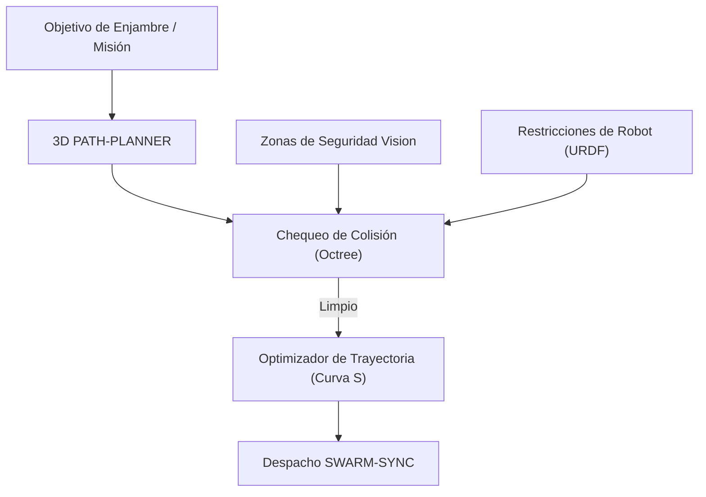

<p align="center">
  
</p>

# 🗺️ HYDRA-UMC-PATH-PLANNER-3D

<p align="center"><a href="README.md">🇺🇸 English</a> | 🇪🇸 <b>Español</b> | <a href="README_fra.md">🇫🇷 Français</a> | <a href="README_ita.md">🇮🇹 Italiano</a> | <a href="README_deu.md">🇩🇪 Deutsch</a> | <a href="README_zho.md">🇨🇳 简体中文</a> | <a href="README_jpn.md">🇯🇵 日本語</a></p>

### 📐 Optimizador de Trayectorias 3D Multi-Robot y Motor de Evitación de Colisiones

<p align="left">
  
  
  
</p>

---

## 1. 🛠️ VISIÓN GENERAL TÉCNICA

**HYDRA-UMC-PATH-PLANNER-3D** es la inteligencia de navegación centralizada para el enjambre de robots. Calcula trayectorias libres de colisiones para múltiples brazos que comparten el mismo espacio de trabajo, optimizando la velocidad, la eficiencia energética y la suavidad del movimiento.

Integra datos de ocupación en tiempo real de los Nodos Vision y restricciones cinemáticas del Digital Twin para asegurar que las rutas planificadas sean físicamente viables y seguras.

### Características Clave:
* 📐 **Optimización de Rutas de Enjambre:** Planificación síncrona para hasta 32+ robots simultáneamente.
* 🛡️ **Evitación de Colisiones Dinámica:** Re-planificación en tiempo real cuando se detectan nuevos obstáculos.
* ⚡ **Optimizado para el Rendimiento:** Implementación C++/Rust altamente paralelizada para generación de rutas en menos de 50ms.
* 🔄 **Nativo G-Code y URDF:** Parsea directamente comandos de movimiento industriales y modelos de robot.

---

## 2. 🔄 FLUJO DE TRABAJO DE PLANIFICACIÓN



---

## 3. 🧱 ARQUITECTURA Y DECISIONES DE DISEÑO

* **Por qué la planificación 3D sin colisiones es un servicio propio.** La búsqueda de rutas sobre una escena 3D en vivo (cada robot, herramienta y obstáculo de la célula) es intensiva en CPU y sensible a la latencia de una forma distinta a la propia planificación de tareas - aislarla significa que una consulta de planificación lenta nunca bloquea a HYDRA-UMC-JOB-DISPATCHER a la hora de asignar otro trabajo.
* **Por qué valida contra HYDRA-UMC-TWIN antes de la ejecución real.** Una ruta planificada se comprueba primero en la propia simulación física del gemelo digital - detectando una ruta geométricamente válida pero físicamente inalcanzable (límites de par, singularidades) antes de que llegue jamás a un brazo real.
* **Por qué la búsqueda es un RRT plano hoy, no RRT\* ni un coordinador multi-robot.** `src/rrt.rs` implementa una búsqueda real y probada de Rapidly-exploring Random Tree - un solo agente, un conjunto estático de obstáculos, un resultado genuinamente libre de colisiones (cada ruta devuelta se verifica libre de obstáculos en los tests, no solo parece plausible). RRT\* (una pasada de re-cableado que mejora la optimalidad) y la planificación multi-robot sincronizada real (los "hasta 32+ robots simultáneamente" de este README) son trabajo futuro real, deliberadamente fuera de alcance - ver `mejoras_futuras.txt` para el motivo de probar primero la búsqueda de un solo agente, en vez de construir las tres cosas a la vez y depurarlas juntas.
* **Por qué los obstáculos son esferas, no un octree de mallas arbitrarias.** Una esfera es el primitivo de colisión 3D más simple que sigue siendo real y geométricamente correcto - no un sustituto tipo caja delimitadora de algo más detallado. Un octree/BVH solo empieza a importar cuando una escena tiene suficientes colisionadores como para que la comprobación por fuerza bruta sea el cuello de botella - la célula del enjambre de hoy (un puñado de brazos y zonas de seguridad estáticas) no lo tiene.
* **Por qué esto es una CLI sobre un archivo de escenario JSON hoy, no un servicio de red.** Elegir entre HTTP y el contrato gRPC compartido del ecosistema (`hydra.common.v1`, ver `HYDRA-UMC-ORCHESTRATOR/proto/`) es una decisión de protocolo real que merece su propia pasada en cuanto HYDRA-UMC-JOB-DISPATCHER esté realmente listo para llamar a este servicio - ver `mejoras_futuras.txt`. La CLI ya es genuinamente usable hoy (`run.bat scenarios/example.json`), solo que todavía no está conectada a la red.
* **Cómo encaja en el resto del ecosistema.** Un servicio hermano bajo HYDRA-UMC-ORCHESTRATOR - planifica las rutas que realmente sigue el trabajo asignado por HYDRA-UMC-JOB-DISPATCHER, contrastadas con HYDRA-UMC-TWIN antes de que nada se mueva de verdad.

---

## 📂 ESTRUCTURA DE DIRECTORIOS

```text
HYDRA-UMC-PATH-PLANNER-3D/
├── src/
│   ├── main.rs       # Punto de entrada CLI: carga un escenario, planifica, imprime JSON
│   ├── geometry.rs   # Vec3 - el algebra vectorial 3D minima que hace falta
│   ├── obstacle.rs   # Obstaculos esfericos + comprobaciones de colision
│   ├── rng.rs        # PRNG determinista sin dependencias (xorshift64*)
│   └── rrt.rs        # El planificador real: busqueda RRT, Workspace, PlannerConfig
├── scenarios/        # Escenarios JSON de ejemplo (ver BUILD & RUN abajo)
├── build/            # Binarios compilados (salida de build.sh/build.bat)
├── Cargo.toml        # Manifiesto del paquete Rust (nombre, versión, deps)
├── bump_version.py   # Bump de versión tipo cuentakilómetros
├── build.sh/.bat     # Sube la versión y ejecuta `cargo build --release`
├── run.sh/.bat       # Ejecuta el binario compilado
└── README.md
```

Podado de la plantilla original: `hardware/`, `firmware/`, `os/`, `docs/`,
`images/` y `scripts/` — es un servicio de software puro (binario Rust)
sin hardware ni firmware propios, sin imagen de sistema operativo que
mantener, y sin contenido de documentación/medios/scripts de utilidad
todavía suficiente para justificar sus propias carpetas.

---

## 🔧 BUILD & RUN

Una búsqueda real de rutas libres de colisiones, no solo un esqueleto que
compila: planifica una ruta a partir de un archivo de escenario JSON e
imprime el resultado.

```bash
# Windows
build.bat
run.bat scenarios/example.json

# Linux / macOS
./build.sh
./run.sh scenarios/example.json
```

`build.sh`/`build.bat` suben la versión en `Cargo.toml` (regla cuentakilómetros
del ecosistema, ver `bump_version.py`) y luego ejecutan
`cargo build --release`. `run.sh`/`run.bat` ejecutan directamente el binario
resultante, reenviando cualquier argumento (la ruta del escenario).

Un escenario es un archivo JSON con `start`, `goal`, `obstacles` (una
lista de esferas `{center, radius}`), un `workspace` (límites
`min`/`max`), y opcionalmente `seed` (la búsqueda es totalmente
determinista por semilla) y `config` (`max_iterations`, `step_size`,
`goal_bias`, `goal_threshold`, `robot_radius` - todos opcionales, con
valores por defecto razonables). El resultado se imprime como JSON:
`{"status": "ok", "path": [...]}` o
`{"status": "error", "reason": "..."}` (`start_inside_obstacle`,
`goal_outside_workspace`, `no_path_found`, etc. - ver el `PlanError` de
`src/rrt.rs` para la lista completa y honesta, incluyendo el caso en que
directamente no existe ninguna ruta, no solo una que la búsqueda no
encontró a tiempo).

```bash
cargo test   # geometria + colision de obstaculos, el PRNG, y el
             # planificador RRT en si - incluyendo un test que verifica
             # que cada segmento de ruta devuelto esta genuinamente libre
             # de obstaculos, y otro que verifica que un objetivo
             # realmente inalcanzable se reporta como tal
```

---

## 🚀 HOJA DE RUTA
* **Fase 1:** Sincronización determinista de enjambre sobre TSN y reducción de jitter sub-ms.
* **Fase 2:** Planificación de trayectorias 3D con evitación dinámica de obstáculos en celdas multi-robot.
* **Fase 3:** Optimización del despacho de trabajos multi-robot utilizando disponibilidad de recursos en tiempo real.
* **Fase 4:** Soporte para planificación de rutas de bases móviles no holonómicas (JuanenBOT) e integración de flotas heterogéneas.

---

## 🔗 Proyectos Relacionados

Este proyecto forma parte de un ecosistema de robótica más amplio del mismo autor (JuanenRac / Electro Hobby 3D), que abarca firmware, software de control, nodos de IA y herramientas de flota. Vale la pena conocerlo, ya que una petición podría en realidad ser sobre uno de estos proyectos en vez de sobre este repositorio.

### Familia

**Padre:** **[HYDRA-UMC-ORCHESTRATOR](https://github.com/JuanenRac/HYDRA-UMC-ORCHESTRATOR)** — el padre de integración al que sirve este planificador.

**Hermanos:**
- **[HYDRA-UMC-SWARM-SYNC](https://github.com/JuanenRac/HYDRA-UMC-SWARM-SYNC)** — servicio de orquestación hermano, mismo padre.
- **[HYDRA-UMC-JOB-DISPATCHER](https://github.com/JuanenRac/HYDRA-UMC-JOB-DISPATCHER)** — servicio de orquestación hermano, mismo padre.
- **[HYDRA-UMC-NODE-HEALING](https://github.com/JuanenRac/HYDRA-UMC-NODE-HEALING)** — servicio de orquestación hermano, mismo padre.

### Relación Directa (fuera de la familia)

- **[HYDRA-UMC-TWIN](https://github.com/JuanenRac/HYDRA-UMC-TWIN)** — valida las rutas planificadas en el gemelo digital antes de ejecutarlas.

### Resto del Ecosistema

**Plataforma HYDRA-UMC** — la célula de micro-fábrica multi-robot
- **[HYDRA-UMC](https://github.com/JuanenRac/HYDRA-UMC)** — la placa base CM5 + STM32H745 que orquesta hasta 8 brazos robóticos.
- **[HYDRA-UMC-SERVER](https://github.com/JuanenRac/HYDRA-UMC-SERVER)** — el backend Express/WebSocket con el que habla cada cliente de control.
- **[HYDRA-UMC-STUDIO](https://github.com/JuanenRac/HYDRA-UMC-STUDIO)** — panel de control web, visualización 3D multi-robot.
- **[HYDRA-UMC-ANDROID-CONTROL](https://github.com/JuanenRac/HYDRA-UMC-ANDROID-CONTROL)** — app de control Android por Wi-Fi/Bluetooth.
- **[HYDRA-UMC-IOS-CONTROL](https://github.com/JuanenRac/HYDRA-UMC-IOS-CONTROL)** — app de control iOS/iPadOS construida en Flutter.
- **[HYDRA-UMC-SUITE](https://github.com/JuanenRac/HYDRA-UMC-SUITE)** — centro de mando de enjambre de escritorio (Python/PySide6).
- **[HYDRA-UMC-EDITOR-URDF](https://github.com/JuanenRac/HYDRA-UMC-EDITOR-URDF)** — editor de modelos URDF de escritorio para el catálogo de robots.
- **[HYDRA-UMC-DSI](https://github.com/JuanenRac/HYDRA-UMC-DSI)** — interfaz táctil nativa para la pantalla DSI integrada.

**Plataforma URTC** — el controlador de cabezal de herramienta que lleva cada brazo HYDRA-UMC
- **[URTC](https://github.com/JuanenRac/URTC)** — controlador de cabezal de herramienta CAN, 25 perfiles de herramienta.
- **[URTC-FLASHER](https://github.com/JuanenRac/URTC-FLASHER)** — herramienta de escritorio de flasheo CAN-OTA + SWD/JTAG.
- **[URTC-TESTER](https://github.com/JuanenRac/URTC-TESTER)** — herramienta de escritorio de diagnóstico CAN en vivo.
- **[URTC-WEB-STUDIO](https://github.com/JuanenRac/URTC-WEB-STUDIO)** — alternativa basada en navegador vía Web Serial API.

**🎥 Vision AI Node (Hailo-8)**
- [HYDRA-UMC-VISION-NODE](https://github.com/JuanenRac/HYDRA-UMC-VISION-NODE)
- [HYDRA-UMC-VISION-STREAMER](https://github.com/JuanenRac/HYDRA-UMC-VISION-STREAMER)
- [HYDRA-UMC-DETECTION-HEF](https://github.com/JuanenRac/HYDRA-UMC-DETECTION-HEF)
- [HYDRA-UMC-SAFETY-ZONES](https://github.com/JuanenRac/HYDRA-UMC-SAFETY-ZONES)
- [HYDRA-UMC-VISUAL-SERVOING-API](https://github.com/JuanenRac/HYDRA-UMC-VISUAL-SERVOING-API)

**🧠 Cognitive AI Node (Hailo-10)**
- [HYDRA-UMC-COGNITIVE-NODE](https://github.com/JuanenRac/HYDRA-UMC-COGNITIVE-NODE)
- [HYDRA-UMC-VLA-ENGINE](https://github.com/JuanenRac/HYDRA-UMC-VLA-ENGINE)
- [HYDRA-UMC-VOICE-UI](https://github.com/JuanenRac/HYDRA-UMC-VOICE-UI)
- [HYDRA-UMC-SEMANTIC-PLANNER](https://github.com/JuanenRac/HYDRA-UMC-SEMANTIC-PLANNER)
- [HYDRA-UMC-DOCS-QA](https://github.com/JuanenRac/HYDRA-UMC-DOCS-QA)

**🎮 Digital Twin & Simulation**
- [HYDRA-UMC-TWIN](https://github.com/JuanenRac/HYDRA-UMC-TWIN)
- [HYDRA-UMC-PHYSICS-REPLICA](https://github.com/JuanenRac/HYDRA-UMC-PHYSICS-REPLICA)
- [HYDRA-UMC-HIL-BRIDGE](https://github.com/JuanenRac/HYDRA-UMC-HIL-BRIDGE)
- [HYDRA-UMC-SYNTHETIC-DATA-GEN](https://github.com/JuanenRac/HYDRA-UMC-SYNTHETIC-DATA-GEN)

**📊 Data & Analytics**
- [HYDRA-UMC-DATALAKE](https://github.com/JuanenRac/HYDRA-UMC-DATALAKE)
- [HYDRA-UMC-TELEMETRY-COLLECTOR](https://github.com/JuanenRac/HYDRA-UMC-TELEMETRY-COLLECTOR)
- [HYDRA-UMC-ANOMALY-DETECTOR](https://github.com/JuanenRac/HYDRA-UMC-ANOMALY-DETECTOR)
- [HYDRA-UMC-PRODUCTION-REPORTS](https://github.com/JuanenRac/HYDRA-UMC-PRODUCTION-REPORTS)

**🏭 Industrial Gateway**
- [HYDRA-UMC-GATEWAY-INDUSTRIAL](https://github.com/JuanenRac/HYDRA-UMC-GATEWAY-INDUSTRIAL)
- [HYDRA-UMC-OPCUA-SERVER](https://github.com/JuanenRac/HYDRA-UMC-OPCUA-SERVER)
- [HYDRA-UMC-MQTT-BROKER](https://github.com/JuanenRac/HYDRA-UMC-MQTT-BROKER)
- [HYDRA-UMC-MTCONNECT-ADAPTER](https://github.com/JuanenRac/HYDRA-UMC-MTCONNECT-ADAPTER)

**🛠️ Complementary Tools**
- [URTC-SMART-RACK](https://github.com/JuanenRac/URTC-SMART-RACK)
- [URTC-VISION-TOOL](https://github.com/JuanenRac/URTC-VISION-TOOL)
- [HYDRA-UMC-WATCH](https://github.com/JuanenRac/HYDRA-UMC-WATCH)
- [HYDRA-UMC-TOOL-CLI](https://github.com/JuanenRac/HYDRA-UMC-TOOL-CLI)
- [HYDRA-UMC-DASHBOARD-AI](https://github.com/JuanenRac/HYDRA-UMC-DASHBOARD-AI)


## 👤 AUTOR
**JuanenRac** (Electro Hobby 3D)
📧 electrohobby3d@gmail.com

## 📜 LICENCIA
GPL-3.0 - Ver archivo LICENSE para más detalles.
