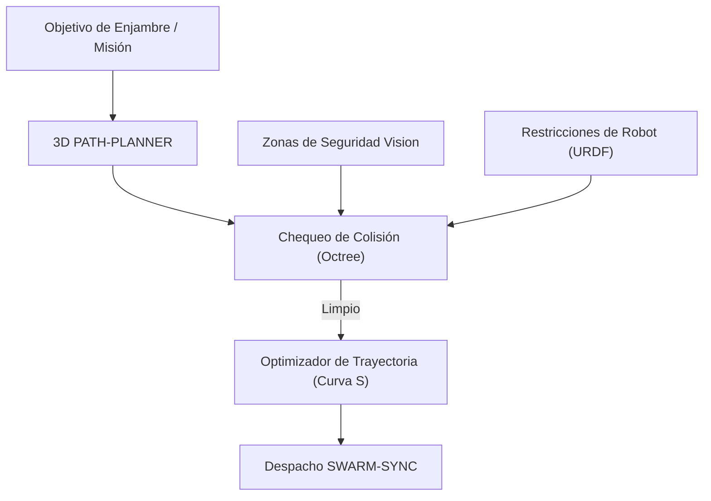

<p align="center">
  
</p>

# 🗺️ HYDRA-UMC-PATH-PLANNER-3D

<p align="center"><a href="README.md">🇺🇸 English</a> | 🇪🇸 <b>Español</b> | <a href="README_fra.md">🇫🇷 Français</a> | <a href="README_ita.md">🇮🇹 Italiano</a> | <a href="README_deu.md">🇩🇪 Deutsch</a> | <a href="README_zho.md">🇨🇳 简体中文</a> | <a href="README_jpn.md">🇯🇵 日本語</a></p>

### 📐 Optimizador de Trayectorias 3D Multi-Robot y Motor de Evitación de Colisiones

<p align="left">
  
  
  
</p>

---

## 1. 🛠️ VISIÓN GENERAL TÉCNICA

**HYDRA-UMC-PATH-PLANNER-3D** es la inteligencia de navegación centralizada para el enjambre de robots. Calcula trayectorias libres de colisiones para múltiples brazos que comparten el mismo espacio de trabajo, optimizando la velocidad, la eficiencia energética y la suavidad del movimiento.

Integra datos de ocupación en tiempo real de los Nodos Vision y restricciones cinemáticas del Digital Twin para asegurar que las rutas planificadas sean físicamente viables y seguras.

### Características Clave:
* 📐 **Optimización de Rutas de Enjambre:** Planificación síncrona para hasta 32+ robots simultáneamente.
* 🛡️ **Evitación de Colisiones Dinámica:** Re-planificación en tiempo real cuando se detectan nuevos obstáculos.
* ⚡ **Optimizado para el Rendimiento:** Implementación C++/Rust altamente paralelizada para generación de rutas en menos de 50ms.
* 🔄 **Nativo G-Code y URDF:** Parsea directamente comandos de movimiento industriales y modelos de robot.
* ⏱️ **Límite de Tiempo Real y Validación de Trayectoria (v0):** `PlannerConfig.max_duration_ms` acota el tiempo de búsqueda por reloj real, independiente de `max_iterations`. Un nuevo subcomando `validate` revisa una trayectoria ya calculada (cacheada, reproducida o editada a mano) contra los obstáculos/workspace actuales antes de confiar en ella para ejecución real.

---

## 2. 🔄 FLUJO DE TRABAJO DE PLANIFICACIÓN



---

## 3. 🧱 ARQUITECTURA Y DECISIONES DE DISEÑO

* **Por qué la planificación 3D sin colisiones es un servicio propio.** La búsqueda de rutas sobre una escena 3D en vivo (cada robot, herramienta y obstáculo de la célula) es intensiva en CPU y sensible a la latencia de una forma distinta a la propia planificación de tareas - aislarla significa que una consulta de planificación lenta nunca bloquea a HYDRA-UMC-JOB-DISPATCHER a la hora de asignar otro trabajo.
* **Por qué valida contra HYDRA-UMC-TWIN antes de la ejecución real.** Una ruta planificada se comprueba primero en la propia simulación física del gemelo digital - detectando una ruta geométricamente válida pero físicamente inalcanzable (límites de par, singularidades) antes de que llegue jamás a un brazo real.
* **Por qué la búsqueda es un RRT plano hoy, no RRT\* ni un coordinador multi-robot.** `src/rrt.rs` implementa una búsqueda real y probada de Rapidly-exploring Random Tree - un solo agente, un conjunto estático de obstáculos, un resultado genuinamente libre de colisiones (cada ruta devuelta se verifica libre de obstáculos en los tests, no solo parece plausible). RRT\* (una pasada de re-cableado que mejora la optimalidad) y la planificación multi-robot sincronizada real (los "hasta 32+ robots simultáneamente" de este README) son trabajo futuro real, deliberadamente fuera de alcance - ver `mejoras_futuras.txt` para el motivo de probar primero la búsqueda de un solo agente, en vez de construir las tres cosas a la vez y depurarlas juntas.
* **Por qué los obstáculos son esferas, no un octree de mallas arbitrarias.** Una esfera es el primitivo de colisión 3D más simple que sigue siendo real y geométricamente correcto - no un sustituto tipo caja delimitadora de algo más detallado. Un octree/BVH solo empieza a importar cuando una escena tiene suficientes colisionadores como para que la comprobación por fuerza bruta sea el cuello de botella - la célula del enjambre de hoy (un puñado de brazos y zonas de seguridad estáticas) no lo tiene.
* **Por qué esto es una CLI sobre un archivo de escenario JSON hoy, no un servicio de red.** Elegir entre HTTP y el contrato gRPC compartido del ecosistema (`hydra.common.v1`, ver `HYDRA-UMC-ORCHESTRATOR/proto/`) es una decisión de protocolo real que merece su propia pasada en cuanto HYDRA-UMC-JOB-DISPATCHER esté realmente listo para llamar a este servicio - ver `mejoras_futuras.txt`. La CLI ya es genuinamente usable hoy (`run.bat scenarios/example.json`), solo que todavía no está conectada a la red.
* **Cómo encaja en el resto del ecosistema.** Un servicio hermano bajo HYDRA-UMC-ORCHESTRATOR - planifica las rutas que realmente sigue el trabajo asignado por HYDRA-UMC-JOB-DISPATCHER, contrastadas con HYDRA-UMC-TWIN antes de que nada se mueva de verdad.
* **Por qué `max_duration_ms` es una comprobación de reloj real y no solo un `max_iterations` más bajo.** El número de iteraciones por sí solo no puede acotar el tiempo real: una escena con obstáculos más densos hace que las comprobaciones de colisión de cada iteración sean proporcionalmente más lentas, así que el mismo presupuesto de iteraciones puede tardar un tiempo real muy distinto en una escena patológica frente a una abierta. Una llamada al planificador dentro de un bucle de control en tiempo real necesita un presupuesto de tiempo real, no un sustituto.
* **Por qué `validate` es un subcomando nuevo en vez de cambiar lo que devuelve `plan()`.** `rrt::plan()` ya solo devuelve rutas libres de colision por construccion - no hay hueco que cerrar ahi. `validate_path()`/el subcomando `validate` existe para rutas que NO vinieron de una llamada fresca a `plan()` en este proceso: una ruta cacheada/reproducida, una recibida de otro proceso, un escenario editado a mano - donde el conjunto de obstaculos puede haber cambiado desde que se calculo la ruta. El mismo patron usado en todo el ecosistema: un punto de entrada nuevo con verja añadido junto a una primitiva de bajo nivel sin tocar.

---

## 📂 ESTRUCTURA DE DIRECTORIOS

```text
HYDRA-UMC-PATH-PLANNER-3D/
├── src/
│   ├── main.rs       # Punto de entrada CLI: carga un escenario, planifica, imprime JSON
│   ├── geometry.rs   # Vec3 - el algebra vectorial 3D minima que hace falta
│   ├── obstacle.rs   # Obstaculos esfericos + comprobaciones de colision
│   ├── rng.rs        # PRNG determinista sin dependencias (xorshift64*)
│   ├── rrt.rs        # El planificador real: busqueda RRT, Workspace, PlannerConfig
│   ├── validate.rs   # Revalidacion real de seguridad de una ruta ya calculada
│   └── corpus.rs     # Solo para tests: fixtures reutilizables de escenarios
│                        obstaculo/workspace compartidos por los tests de rrt.rs y validate.rs
├── scenarios/        # Escenarios JSON de ejemplo (ver BUILD Y EJECUCIÓN abajo)
├── docs/
│   └── CLI_REFERENCE.md  # Referencia de flags de línea de comandos
├── images/           # Medios y diagramas
├── tools/
│   └── ci_validate.py   # Validación de manifest/CHANGELOG/docs usada por la CI
├── build/            # Binarios compilados (salida de build.sh/build.bat)
├── Cargo.toml        # Manifiesto del paquete Rust (nombre, versión, deps)
├── bump_version.py   # Bump de versión tipo cuentakilómetros
├── bump_manifest_version.py  # Sincroniza la versión de hydra-umc.project.json con la nativa (--sync)
├── build.sh/.bat     # Sube la versión y ejecuta `cargo build --release`
├── run.sh/.bat       # Ejecuta el binario compilado
└── README.md
```

Podado de la plantilla original: `hardware/`, `firmware/` y `os/` — es un
servicio de software puro (binario Rust) sin hardware ni firmware propios
y sin imagen de sistema operativo que mantener.

---

## 🔧 BUILD Y EJECUCIÓN

Una búsqueda real de rutas libres de colisiones, no solo un esqueleto que
compila: planifica una ruta a partir de un archivo de escenario JSON e
imprime el resultado.

```bash
# Windows
build.bat
run.bat scenarios/example.json

# Linux / macOS
./build.sh
./run.sh scenarios/example.json
```

`build.sh`/`build.bat` suben la versión en `Cargo.toml` (regla cuentakilómetros
del ecosistema, ver `bump_version.py`) y luego ejecutan
`cargo build --release`. `run.sh`/`run.bat` ejecutan directamente el binario
resultante, reenviando cualquier argumento (la ruta del escenario).

Un escenario es un archivo JSON con `start`, `goal`, `obstacles` (una
lista de esferas `{center, radius}`), un `workspace` (límites
`min`/`max`), y opcionalmente `seed` (la búsqueda es totalmente
determinista por semilla) y `config` (`max_iterations`, `step_size`,
`goal_bias`, `goal_threshold`, `robot_radius`, `max_duration_ms` - todos
opcionales, con valores por defecto razonables; `max_duration_ms` acota
el tiempo de búsqueda por reloj real, independiente de `max_iterations`).
El resultado se imprime como JSON:
`{"status": "ok", "path": [...]}` o
`{"status": "error", "reason": "..."}` (`start_inside_obstacle`,
`goal_outside_workspace`, `no_path_found`, `time_limit_exceeded`, etc. -
ver el `PlanError` de `src/rrt.rs` para la lista completa y honesta,
incluyendo el caso en que directamente no existe ninguna ruta, no solo
una que la búsqueda no encontró a tiempo).

Un segundo subcomando real revalida una ruta ya calculada (un array JSON
plano de waypoints `{x, y, z}`) contra los obstáculos/workspace actuales
de un escenario, sin correr una búsqueda nueva:

```bash
./run.sh validate scenarios/example.json path.json
# {"status": "safe"}
# o: {"status": "unsafe", "issues": [{"SegmentIntersectsObstacle": {"from_index": 0, "to_index": 1}}]}
```

```bash
cargo test   # geometria + colision de obstaculos, el PRNG, el
             # planificador RRT (incluyendo su limite real de tiempo por
             # reloj) y la revalidacion de seguridad de validate.rs -
             # 28 tests en total
```

---

## 🚀 HOJA DE RUTA
* **Fase 1:** Sincronización determinista de enjambre sobre TSN y reducción de jitter sub-ms.
* **Fase 2:** Planificación de trayectorias 3D con evitación dinámica de obstáculos en celdas multi-robot.
* **Fase 3:** Optimización del despacho de trabajos multi-robot utilizando disponibilidad de recursos en tiempo real.
* **Fase 4:** Soporte para planificación de rutas de bases móviles no holonómicas (JuanenBOT) e integración de flotas heterogéneas.

---

## 🔗 Proyectos Relacionados

Este proyecto es parte del ecosistema de robótica HYDRA-UMC del mismo autor (JuanenRac / Electro Hobby 3D). Vale la pena conocerlo, ya que una petición podría en realidad ser sobre alguno de estos en vez de sobre este repositorio.

**Proyecto Padre**
- **[HYDRA-UMC-ORCHESTRATOR](https://github.com/JuanenRac/HYDRA-UMC-ORCHESTRATOR)** — nodo de integración con un contrato real de informe de salud gRPC/Protobuf y una máquina de estados de misión; el padre del que este repositorio es un servicio de orquestación específico, dentro de su propia capa de coordinación de enjambre.

**Proyectos Hermanos** — los demás servicios de orquestación de la propia capa de coordinación de enjambre de HYDRA-UMC-ORCHESTRATOR
- **[HYDRA-UMC-SWARM-SYNC](https://github.com/JuanenRac/HYDRA-UMC-SWARM-SYNC)** — sincronización de estado real mediante CRDT LWW-Element-Map, con pruebas de propiedades para convergencia multi-celda.
- **[HYDRA-UMC-JOB-DISPATCHER](https://github.com/JuanenRac/HYDRA-UMC-JOB-DISPATCHER)** — cola de trabajos real basada en prioridad con deduplicación, sobre una API HTTP real.
- **[HYDRA-UMC-NODE-HEALING](https://github.com/JuanenRac/HYDRA-UMC-NODE-HEALING)** — watchdog de salud de flota real basado en gRPC, con reintento/backoff y detección de discrepancia de identidad.

**Directamente Relacionados**
- **[HYDRA-UMC-TWIN](https://github.com/JuanenRac/HYDRA-UMC-TWIN)** — nodo de integración para el motor de gemelo digital, con un contrato real de sincronización por compatibilidad de versión — valida las propias rutas planificadas por este planificador en el gemelo digital antes de ejecutarlas.

**También Forma Parte del Ecosistema**

*Hardware y Plataforma Base*
- **[HYDRA-UMC](https://github.com/JuanenRac/HYDRA-UMC)** — la placa madre física del brazo robótico: host CM5 + coprocesador STM32H745 de doble núcleo, coordinando hasta 8 brazos herramienta por CAN-OTA/SPI-OTA.
- **[HYDRA-UMC-OS](https://github.com/JuanenRac/HYDRA-UMC-OS)** — capa de producto reproducible sobre Raspberry Pi OS para el CM5: agente de solo lectura, config/perfiles validados, aprovisionamiento WiFi de primer contacto.
- **[HYDRA-UMC-SDK](https://github.com/JuanenRac/HYDRA-UMC-SDK)** — el contrato JSON-Schema compartido y la barrera de seguridad contra la que cada bridge valida sus comandos.

*Backend Central y Clientes*
- **[HYDRA-UMC-SERVER](https://github.com/JuanenRac/HYDRA-UMC-SERVER)** — el backend headless real (REST/WebSocket) con el que habla de verdad cada cliente de control.
- **[HYDRA-UMC-STUDIO](https://github.com/JuanenRac/HYDRA-UMC-STUDIO)** — panel de control web con visualización 3D multi-robot en tiempo real.
- **[HYDRA-UMC-SUITE](https://github.com/JuanenRac/HYDRA-UMC-SUITE)** — centro de mando de enjambre de escritorio (PySide6) para varios servidores a la vez, empaquetado como ejecutable independiente.
- **[HYDRA-UMC-ANDROID-CONTROL](https://github.com/JuanenRac/HYDRA-UMC-ANDROID-CONTROL)** — app nativa de control para Android con inicio de sesión biométrico y un compañero Wear OS emparejado.
- **[HYDRA-UMC-IOS-CONTROL](https://github.com/JuanenRac/HYDRA-UMC-IOS-CONTROL)** — app de control para iOS/iPadOS (Flutter) con sincronización en tiempo real por WebSocket.
- **[HYDRA-UMC-DSI](https://github.com/JuanenRac/HYDRA-UMC-DSI)** — interfaz táctil nativa para la pantalla táctil DSI de 7" a bordo, embebida en el propio CM5.
- **[HYDRA-UMC-EDITOR-URDF](https://github.com/JuanenRac/HYDRA-UMC-EDITOR-URDF)** — creador/editor gráfico de URDF de escritorio que envía los modelos terminados al propio catálogo de STUDIO.
- **[HYDRA-UMC-BRIDGE-AMR](https://github.com/JuanenRac/HYDRA-UMC-BRIDGE-AMR)** — barrera de coordinación para flotas AGV/AMR mediante un publicador MQTT VDA 5050 real.
- **[HYDRA-UMC-BRIDGE-CNC](https://github.com/JuanenRac/HYDRA-UMC-BRIDGE-CNC)** — coordinador de alto nivel para celdas CNC con acceso real a estado/bytes de control GRBL.
- **[HYDRA-UMC-BRIDGE-DROIDS](https://github.com/JuanenRac/HYDRA-UMC-BRIDGE-DROIDS)** — barrera de coordinación para droides con patas/humanoides, con un emisor de comandos real para Boston Dynamics Spot.
- **[HYDRA-UMC-BRIDGE-LASER](https://github.com/JuanenRac/HYDRA-UMC-BRIDGE-LASER)** — coordinador de seguridad para celdas láser que lee 3 salvaguardas GPIO reales de llave/carcasa/enclavamiento.
- **[HYDRA-UMC-BRIDGE-OPENPNP](https://github.com/JuanenRac/HYDRA-UMC-BRIDGE-OPENPNP)** — coordinador de alto nivel seguro para el flujo de placas de pick-and-place OpenPnP.
- **[HYDRA-UMC-BRIDGE-PRINTER3D](https://github.com/JuanenRac/HYDRA-UMC-BRIDGE-PRINTER3D)** — barrera de coordinación segura para impresoras 3D Moonraker/Klipper, con comandos de trabajo reales y controlados.
- **[HYDRA-UMC-BRIDGE-ROS2](https://github.com/JuanenRac/HYDRA-UMC-BRIDGE-ROS2)** — coordinador de seguridad con un transporte ROS 2 rclpy real, importado de forma perezosa.
- **[HYDRA-UMC-BRIDGE-UAV](https://github.com/JuanenRac/HYDRA-UMC-BRIDGE-UAV)** — barrera de coordinación para UAV equipados con cámara, con un emisor de comandos MAVLink real.

*Plataforma de Herramientas URTC*
- **[URTC](https://github.com/JuanenRac/URTC)** — firmware para la placa física del Universal Robot Tool Controller, más de 25 perfiles de herramienta por bus CAN.
- **[URTC-FLASHER](https://github.com/JuanenRac/URTC-FLASHER)** — herramienta de escritorio con GUI para flashear placas URTC, CAN-OTA más SWD/JTAG de chip completo.
- **[URTC-TESTER](https://github.com/JuanenRac/URTC-TESTER)** — herramienta de escritorio de diagnóstico CAN-bus en vivo para placas URTC, un panel por perfil de herramienta.
- **[URTC-WEB-STUDIO](https://github.com/JuanenRac/URTC-WEB-STUDIO)** — alternativa basada en navegador a URTC-TESTER mediante la Web Serial API, sin instalación local.

*Nodo IA de Visión (Hailo-8)*
- **[HYDRA-UMC-VISION-NODE](https://github.com/JuanenRac/HYDRA-UMC-VISION-NODE)** — nodo de integración para el pipeline de visión Hailo-8, con una comprobación real de disponibilidad de hardware por etapa.
- **[HYDRA-UMC-DETECTION-HEF](https://github.com/JuanenRac/HYDRA-UMC-DETECTION-HEF)** — registro real de modelos compilados con verificación de carga segura por arquitectura Hailo/checksum.
- **[HYDRA-UMC-VISION-STREAMER](https://github.com/JuanenRac/HYDRA-UMC-VISION-STREAMER)** — generador real de pipeline GStreamer + config MediaMTX, con una frontera de integración HailoRT real.
- **[HYDRA-UMC-VISUAL-SERVOING-API](https://github.com/JuanenRac/HYDRA-UMC-VISUAL-SERVOING-API)** — ley de corrección real de Position-Based Visual Servoing, con puerta de seguridad según el estado de zona previo.
- **[HYDRA-UMC-SAFETY-ZONES](https://github.com/JuanenRac/HYDRA-UMC-SAFETY-ZONES)** — comprobación real de invasión de zona y solicitud de E-STOP, con exigencia de vigencia de calibración.

*Nodo IA Cognitivo (Hailo-10)*
- **[HYDRA-UMC-COGNITIVE-NODE](https://github.com/JuanenRac/HYDRA-UMC-COGNITIVE-NODE)** — nodo de integración para el pipeline cognitivo Hailo-10 (orquestación de LLM/VLA/voz).
- **[HYDRA-UMC-VLA-ENGINE](https://github.com/JuanenRac/HYDRA-UMC-VLA-ENGINE)** — codificación/decodificación real de tokens de acción y generación de trayectoria para un modelo Vision-Language-Action.
- **[HYDRA-UMC-VOICE-UI](https://github.com/JuanenRac/HYDRA-UMC-VOICE-UI)** — front-end de voz real (VAD + analizador de intención) con un relé a Watch acotado y con confirmación.
- **[HYDRA-UMC-SEMANTIC-PLANNER](https://github.com/JuanenRac/HYDRA-UMC-SEMANTIC-PLANNER)** — descomposición real de tareas basada en reglas y recuperación semántica de errores sobre códigos de error del MCU.
- **[HYDRA-UMC-DOCS-QA](https://github.com/JuanenRac/HYDRA-UMC-DOCS-QA)** — búsqueda real de documentos TF-IDF (solo librería estándar) sobre los propios documentos Markdown de este ecosistema.

*Gemelo Digital y Simulación*
- **[HYDRA-UMC-HIL-BRIDGE](https://github.com/JuanenRac/HYDRA-UMC-HIL-BRIDGE)** — enclavamiento de seguridad real hardware-in-the-loop que enruta comandos entre simulación y hardware real.
- **[HYDRA-UMC-PHYSICS-REPLICA](https://github.com/JuanenRac/HYDRA-UMC-PHYSICS-REPLICA)** — cinemática directa real y validación de límites articulares sobre un subconjunto real de URDF.
- **[HYDRA-UMC-SYNTHETIC-DATA-GEN](https://github.com/JuanenRac/HYDRA-UMC-SYNTHETIC-DATA-GEN)** — generador real de escenas 2D procedurales con exportación de anotaciones YOLO/COCO.

*Datos y Analítica*
- **[HYDRA-UMC-DATALAKE](https://github.com/JuanenRac/HYDRA-UMC-DATALAKE)** — almacén de series temporales real respaldado por sqlite3, con una API HTTP real de ingesta/consulta.
- **[HYDRA-UMC-ANOMALY-DETECTOR](https://github.com/JuanenRac/HYDRA-UMC-ANOMALY-DETECTOR)** — detector de anomalías real basado en FFT + línea base estadística, con monitorización de deriva.
- **[HYDRA-UMC-PRODUCTION-REPORTS](https://github.com/JuanenRac/HYDRA-UMC-PRODUCTION-REPORTS)** — cálculo real de OEE/disponibilidad sobre el histórico de DATALAKE, con exportación CSV reproducible.
- **[HYDRA-UMC-TELEMETRY-COLLECTOR](https://github.com/JuanenRac/HYDRA-UMC-TELEMETRY-COLLECTOR)** — pipeline real de ingesta CAN/WebSocket hacia DATALAKE, con deduplicación por secuencia.

*Pasarela Industrial*
- **[HYDRA-UMC-GATEWAY-INDUSTRIAL](https://github.com/JuanenRac/HYDRA-UMC-GATEWAY-INDUSTRIAL)** — nodo de integración que retransmite a protocolos industriales, con una capa real de lista blanca de comandos/contrapresión.
- **[HYDRA-UMC-OPCUA-SERVER](https://github.com/JuanenRac/HYDRA-UMC-OPCUA-SERVER)** — espacio de direcciones OPC-UA real, verificado con una sesión de cliente real del protocolo binario.
- **[HYDRA-UMC-MQTT-BROKER](https://github.com/JuanenRac/HYDRA-UMC-MQTT-BROKER)** — broker MQTT real con autenticación por cliente opcional y ACL de tópicos.
- **[HYDRA-UMC-MTCONNECT-ADAPTER](https://github.com/JuanenRac/HYDRA-UMC-MTCONNECT-ADAPTER)** — endpoints XML reales `/probe` y `/current` de MTConnect, con salida en modo degradado.

*Herramientas Complementarias y Operaciones del Ecosistema*
- **[HYDRA-UMC-DASHBOARD-AI](https://github.com/JuanenRac/HYDRA-UMC-DASHBOARD-AI)** — paneles de Resúmenes Inteligentes y Resaltado de Anomalías sobre DATALAKE/ANOMALY-DETECTOR, con un respaldo estadístico honesto.
- **[HYDRA-UMC-TOOL-CLI](https://github.com/JuanenRac/HYDRA-UMC-TOOL-CLI)** — CLI de flota con un contrato real y estable de códigos de salida, cliente real y en vivo de la propia API de HYDRA-UMC-SERVER.
- **[HYDRA-UMC-WATCH](https://github.com/JuanenRac/HYDRA-UMC-WATCH)** — app compañera de WearOS con alertas hápticas reales y un relé de voz al teléfono emparejado.
- **[URTC-SMART-RACK](https://github.com/JuanenRac/URTC-SMART-RACK)** — firmware para un rack de montaje de placas con decodificación real de ID de herramienta y lógica de precalentamiento Smart Idle.
- **[URTC-VISION-TOOL](https://github.com/JuanenRac/URTC-VISION-TOOL)** — firmware más un compañero de visión real en Python para un cabezal de inspección térmica/RGB.
- **[HYDRA-UMC-UPDATER](https://github.com/JuanenRac/HYDRA-UMC-UPDATER)** — herramienta administrativa de escritorio que descubre, clona y actualiza cada repositorio de este ecosistema.


---

## 📚 Documentación y Comunidad

- **[CONTRIBUTING.md](CONTRIBUTING.md)** — stack tecnológico y pautas de codificación para un pull request.
- **[CODE_OF_CONDUCT.md](CODE_OF_CONDUCT.md)** — los estándares de comportamiento esperados en esta comunidad.
- **[SECURITY.md](SECURITY.md)** — cómo reportar una vulnerabilidad, y las áreas reales de enfoque en seguridad de este proyecto.
- **[SUPPORT.md](SUPPORT.md)** — dónde hacer preguntas y reportar errores.
- **[LICENSE.md](LICENSE.md)** — la licencia propia de este proyecto.

## 👤 AUTOR
**JuanenRac** (Electro Hobby 3D)
📧 electrohobby3d@gmail.com
📺 [youtube.com/@electrohobby3d](https://youtube.com/@electrohobby3d)

## 📜 LICENCIA
GPL-3.0 - Ver archivo LICENSE para más detalles.
