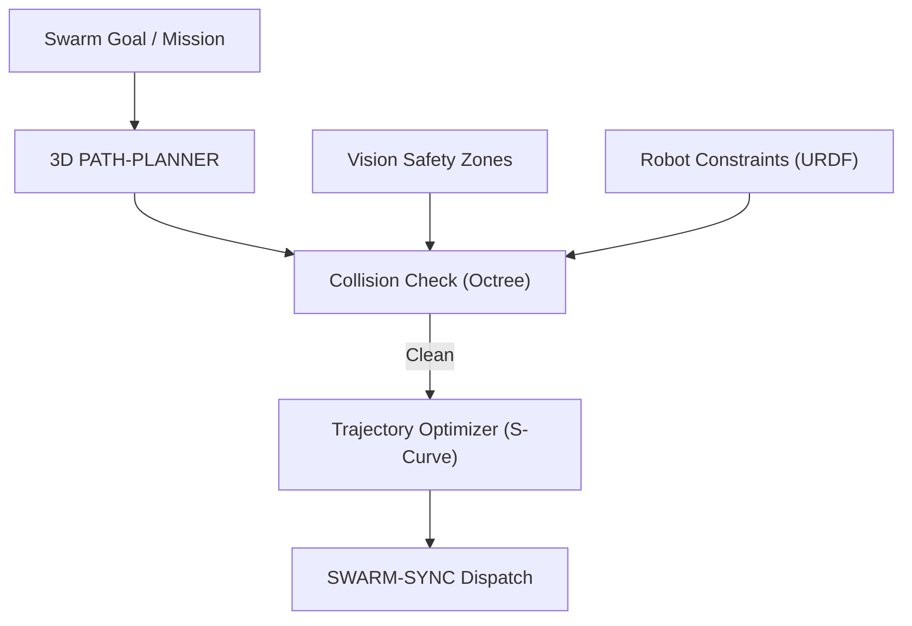

<p align="center">
  
</p>

# 🗺️ HYDRA-UMC-PATH-PLANNER-3D

<p align="center"><a href="README.md">🇺🇸 English</a> | <a href="README_spa.md">🇪🇸 Español</a> | <a href="README_fra.md">🇫🇷 Français</a> | <a href="README_ita.md">🇮🇹 Italiano</a> | <a href="README_deu.md">🇩🇪 Deutsch</a> | 🇨🇳 <b>简体中文</b> | <a href="README_jpn.md">🇯🇵 日本語</a></p>

### 📐 多机器人 3D 路径优化与避碰引擎

<p align="left">
  
  
  
</p>

---

## 1. 🛠️ 技术概述

**HYDRA-UMC-PATH-PLANNER-3D** 是机器人集群的集中式导航智能。它为共享同一
工作空间的多条机械臂计算无碰撞轨迹，并针对速度、能效和平滑运动进行优化。

它集成了来自视觉节点的实时占用数据以及来自数字孪生系统的运动学约束，
以确保规划的路径在物理上是可行且安全的。

### 关键特性：
* 📐 **集群路径优化：** 可同时为最多 32+ 台机器人进行同步规划。
* 🛡️ **动态避碰：** 检测到新障碍物时进行实时重新规划。
* ⚡ **性能优化：** 高度并行化的 C++/Rust 实现，实现亚 50ms 的路径生成。
* 🔄 **原生 G-Code 与 URDF 支持：** 直接解析工业运动指令和机器人模型。
* ⏱️ **真实时间限制与轨迹验证（v0）：** `PlannerConfig.max_duration_ms` 按真实时钟限制搜索时间，独立于 `max_iterations`。新的 `validate` 子命令会在信任一条已计算出的路径（缓存的、重放的或手工编辑过的）用于真实执行之前，将其对照当前的障碍物/工作空间重新检查。

---

## 2. 🔄 规划工作流



---

## 3. 🧱 架构与设计决策

* **为何 3D 无碰撞规划是独立的服务。** 在实时 3D 场景（单元内的每个机器人、工具和障碍物）上进行路径搜索，其对 CPU 的消耗和对延迟的敏感度与任务调度本身截然不同——将其隔离出来，意味着一次缓慢的规划查询永远不会阻塞 HYDRA-UMC-JOB-DISPATCHER 分配其他工作。
* **为何在真实执行之前会先对照 HYDRA-UMC-TWIN 进行验证。** 一条规划好的路线会首先在数字孪生系统自身的物理仿真中接受检验——在其被发送到真实机械臂之前，捕获那些几何上有效但物理上不可达的路径（扭矩限制、奇异点）。
* **为何搜索算法今天是一个普通的 RRT，而非 RRT* 或多机器人协调器。** `src/rrt.rs` 实现了一个真实、经过测试的 Rapidly-exploring Random Tree 搜索——单一代理、静态障碍物集合、真正无碰撞的结果（每条返回的路径都在测试中验证为真实无障碍物，而不仅仅是看起来合理）。RRT*（一个提升最优性的重连环节）和真正的多机器人同步规划（本 README 中描述的“同时最多 32+ 台机器人”）是真实、故意留待后续的工作——具体原因参见 `mejoras_futuras.txt`，为什么先证明单一代理搜索的正确性，而不是一次性构建三者并一起调试。
* **为何障碍物是球体，而非任意网格的八叉树。** 球体是最简单且仍然真实、在几何上正确的 3D 碰撞基本图形——而非用包围盒来代替更详细的形状。只有当场景中的碰撞体够多、到使得暴力检测成为瓶颈时，八叉树/BVH 才开始变得重要——今天的集群单元（少量机器臂和静态安全区）还远未达到那个规模。
* **为何这个项目今天是在 JSON 场景文件上运行的 CLI，而非网络服务。** 在 HTTP 和生态系统共享的 gRPC 契约（`hydra.common.v1`，见 `HYDRA-UMC-ORCHESTRATOR/proto/`）之间选择，是一个真实的协议决策，值得在 HYDRA-UMC-JOB-DISPATCHER 真正准备调用该服务时再单独处理——见 `mejoras_futuras.txt`。这个 CLI 今天已经真正可用（`run.bat scenarios/example.json`），只是还未接入网络。
* **这如何融入生态系统的其余部分。** 作为 HYDRA-UMC-ORCHESTRATOR 下的同级服务——为 HYDRA-UMC-JOB-DISPATCHER 分配的任务规划其实际遵循的路线，并在任何真实移动发生之前与 HYDRA-UMC-TWIN 进行交叉验证。
* **为何 `max_duration_ms` 是一次真实时钟检查，而不仅仅是更低的 `max_iterations`。** 单靠迭代次数无法限制真实时间：障碍物更密集的场景会让每次迭代的碰撞检测成比例地变慢，因此同样的迭代预算在一个病态场景和一个开阔场景上耗费的真实时间可能天差地别。处于实时控制循环中的规划器调用需要一个真正的时间预算，而不是它的替代品。
* **为何 `validate` 是一个新的子命令，而不是修改 `plan()` 的返回值。** `rrt::plan()` 已经只会返回按构造就无碰撞的路径——那里没有需要弥补的缺口。`validate_path()`/`validate` 子命令是为了处理并非来自本进程内一次全新 `plan()` 调用的路径：一条缓存/重放的路径、一条从另一个进程转发来的路径、一个手工编辑过的场景——这些情况下障碍物集合可能在路径计算完成后发生了变化。这与整个生态系统中使用的模式相同：在不变的底层原语旁边添加一个受保护的新入口点。

---

## 📂 目录结构

```text
HYDRA-UMC-PATH-PLANNER-3D/
├── src/
│   ├── main.rs       # CLI 入口点：加载场景、规划、打印 JSON
│   ├── geometry.rs   # Vec3——所需的最小 3D 向量数学
│   ├── obstacle.rs   # 球形障碍物 + 线段/点碰撞检测
│   ├── rng.rs        # 无依赖的确定性 PRNG（xorshift64*）
│   ├── rrt.rs        # 真正的规划器：RRT 搜索、Workspace、PlannerConfig
│   ├── validate.rs   # 对已计算路径的真实安全性复核
│   └── corpus.rs     # 仅用于测试：rrt.rs 和 validate.rs 自身测试共享的
│                        可复用障碍物/工作空间场景集
├── scenarios/        # 示例 JSON 场景（见下方"构建与运行"）
├── docs/
│   └── CLI_REFERENCE.md  # 命令行参数参考
├── images/           # 媒体与图示
├── tools/
│   └── ci_validate.py   # CI 使用的 manifest/CHANGELOG/docs 校验
├── build/            # 编译后的二进制文件（build.sh/build.bat 的输出）
├── Cargo.toml        # Rust 包清单（名称、版本、依赖项）
├── bump_version.py   # 里程表式版本递增，由 build.sh/.bat 运行
├── bump_manifest_version.py  # 将 hydra-umc.project.json 的版本与原生版本同步（--sync）
├── build.sh/.bat     # 递增版本号，然后执行 `cargo build --release`
├── run.sh/.bat       # 运行编译后的二进制文件
└── README.md
```

从原始模板中省略：`hardware/`、`firmware/`、`os/`——这是一个纯软件
服务（Rust 二进制文件），没有专属硬件或固件，也没有需要维护的操作系统
镜像。

---

## 🔧 构建与运行

真正的无碰撞路径搜索，而不只是一个能编译的骨架：它会根据 JSON
场景文件规划一条路线并打印结果。

```bash
# Windows
build.bat
run.bat scenarios/example.json

# Linux / macOS
./build.sh
./run.sh scenarios/example.json
```

`build.sh`/`build.bat` 会递增 `Cargo.toml` 中的版本号（生态系统统一的
里程表规则，见 `bump_version.py`），然后执行 `cargo build --release`。
`run.sh`/`run.bat` 直接执行生成的二进制文件，并将任何参数（场景路径）
转发给它。

场景是一个 JSON 文件，包含 `start`、`goal`、`obstacles`（一组
`{center, radius}` 球体）、一个 `workspace`（`min`/`max` 边界），以及
可选的 `seed`（搜索按种子完全确定）和 `config`（`max_iterations`、
`step_size`、`goal_bias`、`goal_threshold`、`robot_radius`、
`max_duration_ms`——均为可选，否则使用合理的默认值；`max_duration_ms`
按真实时钟限制搜索时间，独立于 `max_iterations`）。结果以 JSON 打印：
`{"status": "ok", "path": [...]}` 或
`{"status": "error", "reason": "..."}`（`start_inside_obstacle`、
`goal_outside_workspace`、`no_path_found`、`time_limit_exceeded` 等——
完整、诚实的列表见 `src/rrt.rs` 的 `PlanError`，包括根本不存在任何路径
的情况，而不仅仅是搜索未能及时找到的情况）。

第二个真实子命令会对照场景当前的障碍物/工作空间，重新检查一条已计算出的
路径（一个纯粹的 `{x, y, z}` 路点 JSON 数组）的安全性，而不运行新的搜索：

```bash
./run.sh validate scenarios/example.json path.json
# {"status": "safe"}
# 或：{"status": "unsafe", "issues": [{"SegmentIntersectsObstacle": {"from_index": 0, "to_index": 1}}]}
```

```bash
cargo test   # 几何学 + 障碍物碰撞数学、PRNG、RRT 规划器本身
             #（包括其真实的时钟时间限制），以及 validate.rs 的
             # 安全性复核——共 28 个测试
```

---

## 🚀 路线图
* **第一阶段：** 基于 TSN 的确定性集群同步与亚毫秒级抖动降低。
* **第二阶段：** 多机器人单元中带动态避障的 3D 路径规划。
* **第三阶段：** 利用实时资源可用性进行多机器人任务分发优化。
* **第四阶段：** 支持非完整约束移动底盘（JuanenBOT）的路径规划以及异构车队集成。

---

## 🔗 相关项目

本项目是同一作者（JuanenRac / Electro Hobby 3D）打造的更大规模机器人生态
系统的一部分，涵盖固件、控制软件、AI 节点和车队工具。值得了解，因为某个
需求实际上可能是关于这些项目之一，而非本仓库。

### 项目族

**父项目：** **[HYDRA-UMC-ORCHESTRATOR](https://github.com/JuanenRac/HYDRA-UMC-ORCHESTRATOR)** —— 本规划器所服务的集成父项目。

**同族项目：**
- **[HYDRA-UMC-SWARM-SYNC](https://github.com/JuanenRac/HYDRA-UMC-SWARM-SYNC)** —— 同级编排服务，同一父项目。
- **[HYDRA-UMC-JOB-DISPATCHER](https://github.com/JuanenRac/HYDRA-UMC-JOB-DISPATCHER)** —— 同级编排服务，同一父项目。
- **[HYDRA-UMC-NODE-HEALING](https://github.com/JuanenRac/HYDRA-UMC-NODE-HEALING)** —— 同级编排服务，同一父项目。

### 直接相关（项目族之外）

- **[HYDRA-UMC-TWIN](https://github.com/JuanenRac/HYDRA-UMC-TWIN)** —— 在执行规划路线之前先在数字孪生系统中对其进行验证。

### 生态系统的其余部分

**HYDRA-UMC 平台** —— 多机器人微工厂单元
- **[HYDRA-UMC](https://github.com/JuanenRac/HYDRA-UMC)** —— 协调最多 8 条机械臂的 CM5 + STM32H745 主板。
- **[HYDRA-UMC-SERVER](https://github.com/JuanenRac/HYDRA-UMC-SERVER)** —— 每个控制客户端所对接的 Express/WebSocket 后端。
- **[HYDRA-UMC-STUDIO](https://github.com/JuanenRac/HYDRA-UMC-STUDIO)** —— 基于 Web 的控制仪表盘，多机器人 3D 可视化。
- **[HYDRA-UMC-ANDROID-CONTROL](https://github.com/JuanenRac/HYDRA-UMC-ANDROID-CONTROL)** —— 通过 Wi-Fi/蓝牙的 Android 控制应用。
- **[HYDRA-UMC-IOS-CONTROL](https://github.com/JuanenRac/HYDRA-UMC-IOS-CONTROL)** —— 基于 Flutter 构建的 iOS/iPadOS 控制应用。
- **[HYDRA-UMC-SUITE](https://github.com/JuanenRac/HYDRA-UMC-SUITE)** —— 桌面端集群指挥中心（Python/PySide6）。
- **[HYDRA-UMC-EDITOR-URDF](https://github.com/JuanenRac/HYDRA-UMC-EDITOR-URDF)** —— 用于机器人目录的桌面端 URDF 模型编辑器。
- **[HYDRA-UMC-DSI](https://github.com/JuanenRac/HYDRA-UMC-DSI)** —— 机载 DSI 触摸屏的原生触控 UI。

**URTC 平台** —— 每台 HYDRA-UMC 机械臂搭载的工具头控制器
- **[URTC](https://github.com/JuanenRac/URTC)** —— CAN 总线工具头控制器，25 种工具配置。
- **[URTC-FLASHER](https://github.com/JuanenRac/URTC-FLASHER)** —— 桌面端 CAN-OTA + SWD/JTAG 刷写工具。
- **[URTC-TESTER](https://github.com/JuanenRac/URTC-TESTER)** —— 桌面端实时 CAN 总线诊断工具。
- **[URTC-WEB-STUDIO](https://github.com/JuanenRac/URTC-WEB-STUDIO)** —— 通过 Web Serial API 的浏览器端替代方案。

**🎥 视觉 AI 节点（Hailo-8）**
- [HYDRA-UMC-VISION-NODE](https://github.com/JuanenRac/HYDRA-UMC-VISION-NODE)
- [HYDRA-UMC-VISION-STREAMER](https://github.com/JuanenRac/HYDRA-UMC-VISION-STREAMER)
- [HYDRA-UMC-DETECTION-HEF](https://github.com/JuanenRac/HYDRA-UMC-DETECTION-HEF)
- [HYDRA-UMC-SAFETY-ZONES](https://github.com/JuanenRac/HYDRA-UMC-SAFETY-ZONES)
- [HYDRA-UMC-VISUAL-SERVOING-API](https://github.com/JuanenRac/HYDRA-UMC-VISUAL-SERVOING-API)

**🧠 认知 AI 节点（Hailo-10）**
- [HYDRA-UMC-COGNITIVE-NODE](https://github.com/JuanenRac/HYDRA-UMC-COGNITIVE-NODE)
- [HYDRA-UMC-VLA-ENGINE](https://github.com/JuanenRac/HYDRA-UMC-VLA-ENGINE)
- [HYDRA-UMC-VOICE-UI](https://github.com/JuanenRac/HYDRA-UMC-VOICE-UI)
- [HYDRA-UMC-SEMANTIC-PLANNER](https://github.com/JuanenRac/HYDRA-UMC-SEMANTIC-PLANNER)
- [HYDRA-UMC-DOCS-QA](https://github.com/JuanenRac/HYDRA-UMC-DOCS-QA)

**🎮 数字孪生与仿真**
- [HYDRA-UMC-TWIN](https://github.com/JuanenRac/HYDRA-UMC-TWIN)
- [HYDRA-UMC-PHYSICS-REPLICA](https://github.com/JuanenRac/HYDRA-UMC-PHYSICS-REPLICA)
- [HYDRA-UMC-HIL-BRIDGE](https://github.com/JuanenRac/HYDRA-UMC-HIL-BRIDGE)
- [HYDRA-UMC-SYNTHETIC-DATA-GEN](https://github.com/JuanenRac/HYDRA-UMC-SYNTHETIC-DATA-GEN)

**📊 数据与分析**
- [HYDRA-UMC-DATALAKE](https://github.com/JuanenRac/HYDRA-UMC-DATALAKE)
- [HYDRA-UMC-TELEMETRY-COLLECTOR](https://github.com/JuanenRac/HYDRA-UMC-TELEMETRY-COLLECTOR)
- [HYDRA-UMC-ANOMALY-DETECTOR](https://github.com/JuanenRac/HYDRA-UMC-ANOMALY-DETECTOR)
- [HYDRA-UMC-PRODUCTION-REPORTS](https://github.com/JuanenRac/HYDRA-UMC-PRODUCTION-REPORTS)

**🏭 工业网关**
- [HYDRA-UMC-GATEWAY-INDUSTRIAL](https://github.com/JuanenRac/HYDRA-UMC-GATEWAY-INDUSTRIAL)
- [HYDRA-UMC-OPCUA-SERVER](https://github.com/JuanenRac/HYDRA-UMC-OPCUA-SERVER)
- [HYDRA-UMC-MQTT-BROKER](https://github.com/JuanenRac/HYDRA-UMC-MQTT-BROKER)
- [HYDRA-UMC-MTCONNECT-ADAPTER](https://github.com/JuanenRac/HYDRA-UMC-MTCONNECT-ADAPTER)

**🛠️ 配套工具**
- [URTC-SMART-RACK](https://github.com/JuanenRac/URTC-SMART-RACK)
- [URTC-VISION-TOOL](https://github.com/JuanenRac/URTC-VISION-TOOL)
- [HYDRA-UMC-WATCH](https://github.com/JuanenRac/HYDRA-UMC-WATCH)
- [HYDRA-UMC-TOOL-CLI](https://github.com/JuanenRac/HYDRA-UMC-TOOL-CLI)
- [HYDRA-UMC-DASHBOARD-AI](https://github.com/JuanenRac/HYDRA-UMC-DASHBOARD-AI)


## 👤 作者
**JuanenRac** (Electro Hobby 3D)
📧 electrohobby3d@gmail.com
📺 [youtube.com/@electrohobby3d](https://youtube.com/@electrohobby3d)

## 📜 许可证
GPL-3.0 —— 详见 LICENSE。
